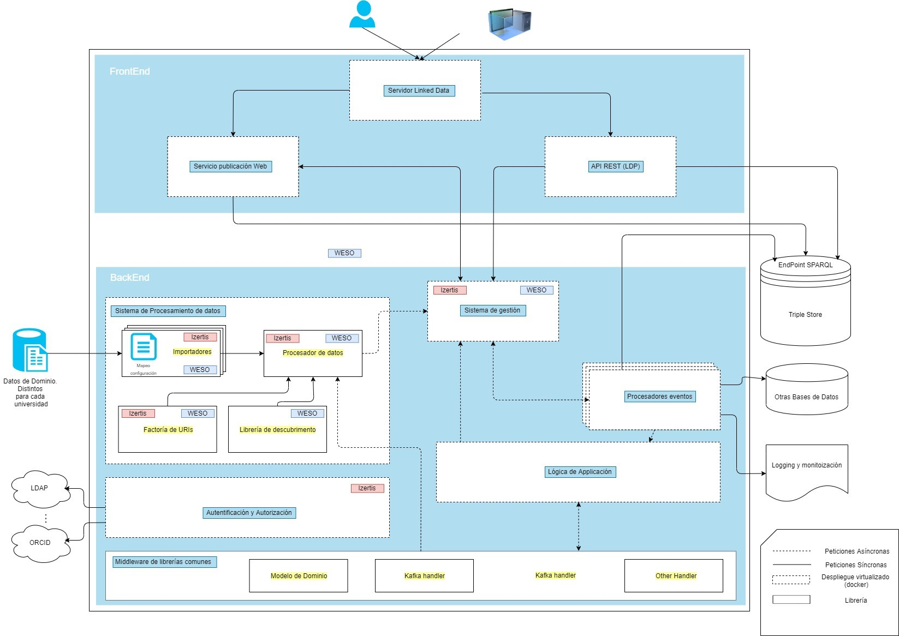
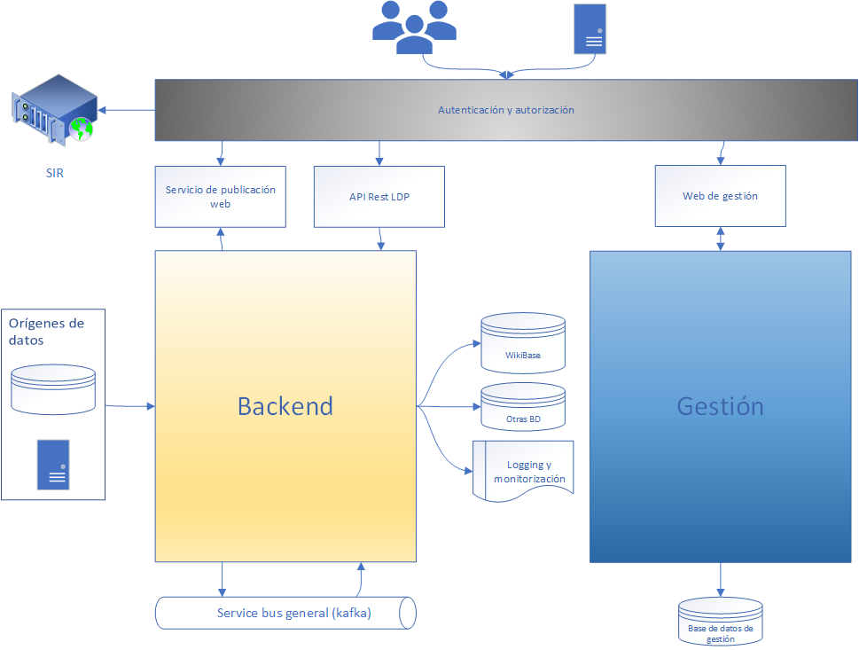
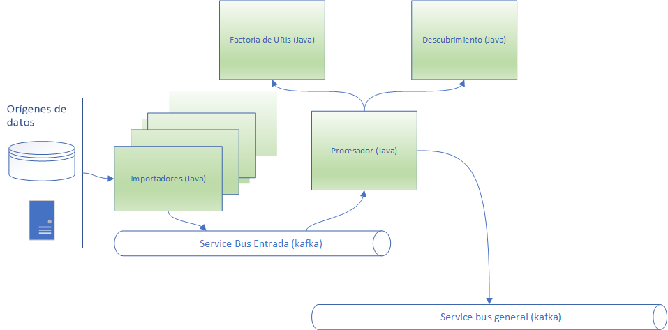
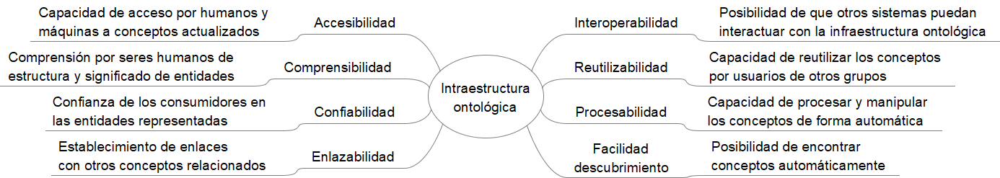

**Acerca de arc42**

arc42, La plantilla de documentación para arquitectura de sistemas y de
software.

Por Dr. Gernot Starke, Dr. Peter Hruschka y otros contribuyentes.

Revisión de la plantilla: 7.0 ES (basada en asciidoc), Enero 2017

© Reconocemos que este documento utiliza material de la plantilla de
arquitectura arc 42, <http://www.arc42.de>. Creada por Dr. Peter
Hruschka y Dr. Gernot Starke.

# Introducción y Metas

El presente documento corresponde al Análisis de Requisitos para la Red de Ontologías Hércules (ROH) de acuerdo al pliego de condiciones del proyecto: Servicio de I+D consistente en el desarrollo de soluciones innovadoras para la Universidad de Murcia en relación al reto de Arquitectura semántica e Infraestructura ontológica. 
En dicho pliego se indica: "El adjudicatario hará un análisis sobre el dominio GI, extrayendo los requisitos para crear la ROH. Estos requisitos se reflejarán en el documento Análisis de Requisitos. Este análisis será lo más exhaustivo posible, intentando capturar el dominio con la granularidad adecuada, ya que sentará la base de los demás desarrollos."

El documento seguirá la estructura de documentación Arc42  para arquitecturas del software, dado que permite cubrir las principales necesidades de este tipo de proyectos. Dado que en este caso, se trata de los requisitos de la infraestructura ontológica, se ha suprimido el apartado "Vista de ejecución" que suele ser habitual cuando se desarrolla software que va a ejecutarse. De la misma forma, el apartado "Vista de despliegue" se ha renombrado como "Vista de implementación y despliegue" para tratar los aspectos de desarrollo de la infraestructura ontológica.

## Vista de Requerimientos

### Requisitos generales

El principal requisito es definir una Red de Ontologías Hércules para la Gestión de la Investigación en el caso particular de la Universidad de Murcia que también pueda ser extrapolable a otras universidades españolas e internacionales. En la obtención de la lista de requisitos se ha hecho especial hincapié en que estos se encuentren alineados con los principios FAIR para garantizar la interoperabilidad de los datos. Consecuencia de ello se ha establecido las siguientes tablas de requisitos, separadas en no funcionales y funcionales:

#### Requisitos funcionales

| Código | Requisito |
| ------ | --------- |
| RF1    | Los datos dispondrán de un identificador único y persistente |
| RF2    | Los datos deben ser descritos con metadatos descriptivos |
| RF3    | Los metadatos incluyen clara y explícitamente el identificador de los datos que describen. |
| RF4    | Los datos se registran o indexan en un recurso con capacidad búsqueda |
| RF5    | El protocolo a usar será abierto |
| RF6    | El protocolo permitirá autenticación y autorización |
| RF7    | Los metadatos serán accesibles incluso cuando los datos ya no se encuentren disponibles |
| RF8    | Los (Meta) datos usan un lenguaje formal, accesible, compartido y ampliamente aplicable para la representación del conocimiento. |
| RF9    | Los (Meta) datos usan vocabularios que siguen los principios FAIR |
| RF10   | Los (Meta) datos incluyen referencias calificadas a otros (Meta) datos. |
| RF11   | Los (meta) datos se publican con una licencia de uso de datos clara y accesible. |
| RF12   | Los (Meta) datos están asociados con información detallada sobre procedencia. |
| RF13   | Los (Meta) datos cumplen con los estándares de la comunidad relevantes para el dominio. |
| RF14   | Se dispondrá de un Triple-store para almacenar y consultar la información de forma semántica |
| RF15   | Control de usuarios: el acceso a los datos del triple-store estará restringido y solamente se podrá realizar a través del componente gestor de datos, el cual contiene una gestión de usuarios y control de acceso |
| RF16   | Logging: el software ofrecerá herramientas para detectar anomalías en el funcionamiento del sistema |
| RF17   | El sistema desarrollado debe ser multilingüe |

#### Requisitos no funcionales

| Código | Requisito |
| ------ | --------- |
| RNF1 | El software debe garantizar el acceso al sistema de las personas autorizadas en cada parte. |
| RNF2 | El software estará preparado para su recuperación ante fallos de conexión. |
| RNF3 | El software estará codificado de manera limpia y clara para garantizar su comprensibilidad. |
| RNF4 | Se dotará al producto de la documentación necesaria para facilitar el mantenimiento y actualización. |
| RNF5 | El interfaz del software debe encajar con el aspecto y grado de accesibilidad y usabilidad del resto de herramientas software desplegadas en el framework de la Universidad de Murcia. |
| RNF6 | Compatibilidad: el software debe ser compatible con el framework y stack tecnológico de la Universidad de Murcia. |
| RNF7 | Estabilidad: el desarrollo debe mantenerse estable ante un incremento en el número de usuarios simultáneos |
| RNF8 | Escalabilidad de los datos: el sistema debe garantizar que los datos a manejar pueden alcanzar volúmenes importantes y deben ser soportados por la arquitectura prevista. Se debe plantear arquitecturas escalables. |
| RNF9 | Facilidad para integración de nuevas fuentes de datos: el software debe estar preparado para incorporar nuevas fuentes de datos no contempladas en este punto. Debe ser sencilla la incorporación de nuevos módulos que permitan la comunicación con otros sistemas |
| RNF10 | El interfaz de usuario del sistema gestor de datos será lo más usable y ligero posible, y estará orientado a que los expertos del dominio GI puedan realizar la gestión y publicación de datos.|

## Metas de Calidad

A continuación, se indican los principales objetivos de calidad que se consideran respecto a la red de ontologías. Este apartado contiene los atributos más importantes que se han considerado. El resto de atributos se desglosarán en el árbol de calidad de la sección 8.:

- Interoperabilidad
- Reusabilidad
- Multilingüismo

## Partes interesadas (Stakeholders)

| Rol/Nombre     | Expectativas              |
| -------------- | ------------------------- |
| Gestor investigación – Universidad de Murcia | Disponer de una mejor documentación del sistema universitario |
| Investigador – Universidad de Murcia| Conocer flujos de trabajo de investigación ya establecidos. Poder identificar conceptos comunes o relacionados en el ámbito de la investigación |
| Experto de dominio | Disponer de una herramienta fácil para representar su conocimiento en el dominio que evite la pérdida semántica |
| Desarrolladores | Disponer de un conjunto de ontologías que puedan adaptarse fácilmente al código de la aplicación de gestión de la investigación |
| Investigador – otra Universidad | Conocer y poder comparar las idiosincrasias del sistema de gestión de investigación de la Universidad de Murcia para poder compararlo con el suyo y poder mapear ambos sistemas en caso de que disponga de otra infraestructura ontológica. |

# Restricciones de la Arquitectura

Las principales restricciones que pueden extraerse del pliego de condiciones son:

- Utilización de estándares W3C para la definición de ontologías: RDFS, OWL
- Control de versiones 
- Multilingüismo

# Alcance y Contexto del Sistema

La Red de Ontologías Hércules captura el dominio de Gestión de la Investigación por lo que las ontologías definirán fundamentalmente los aspectos relevantes en este ámbito. Se enumeran a continuación los principales aspectos que deberán ser modelados:

- Investigadores y producción científica individual: identidad del investigador, publicaciones, participación en proyectos de investigación, docencia, estancias en centros de investigación, y redes sociales de investigadores, entre otros.
- Proyectos de investigación: entidad financiadora, presupuesto, y participantes, entre otros.
- Financiación: fuentes (gobiernos, ministerios, entidades supranacionales, etc.), convocatorias, y proyectos, entre otros.
- Modalidades de ingresos y gastos en proyectos de investigación.
- Recursos humanos: contratos, candidatos, y financiación de investigadores, entre otros.
- Resultados científicos: artículos científicos y ponencias en congresos, software, patentes, y artículos de divulgación científica, entre otros.
- Áreas de conocimiento.
- Grupos de investigación e instituciones.
- Indicadores de investigación: métricas de producción científica, y recursos humanos, entre otros.
- Metadatos sobre la Gestión de Investigación

En la figura siguiente se representa un diagrama de los principales elementos identificados en el dominio. Se representa al investigador como elemento central del dominio, a partir del cual se relacionan el resto de elementos. De esta forma, son los investigadores los que perteneces grupos de investigación, genera resultados científicos, participan en proyectos de investigación, producen resultados científicos, etc.

## Contexto de Negocio

El sistema a modelar se enmarca en un contexto universitario, en la cual existen otros aspectos como puede ser la oferta académica, los estudiantes, las actividades de extensión universitaria, etc. que también podrían modelarse. No obstante, la solución que se podrían ser incluidos en un futuro y se tendrá en cuenta para la solución ofertada que dichos aspectos puedan incorporarse, pero para el presente documento no serán tratados.

## Contexto Técnico

<**Diagrama o Tabla**>

<**Opcional: Explicación de las interfases técnicas**>

<**Mapeo de Entrada/Salida a canales**>

# Estrategia de solución

La estrategia adoptada consiste en identificar los principales elementos del dominio, así como las relaciones entre dichos elementos. 
Además, se estudiarán ontologías o modelos de datos ya existentes en este ámbito con el fin de poder reutilizarlos o chequear si hay aspectos que no se hayan tenido en cuenta.

# Vista de Bloques

## Sistema General de Caja Blanca

Se proponen los siguientes componentes.

Los principales componentes son:

- Editor de ontologías/shapes. Se recomienda la utilización de un editor de ontologías que se integre con el sistema de control de versiones. Un aspecto importante a tener en cuenta es que el editor almacene los axiomas, clases y propiedades, así como los identificadores de nodos anónimos en un orden determinista que facilite el chequeo de diferencias entre las diferentes versiones. Las últimas versiones de Protégé permiten solventar este problema . Respecto a la edición de Shapes, Protégé ha incluido recientemente un plugin que da soporte a SHACL
- Sistema control de versiones. Se utilizará un sistema de control de versiones convencional tipo github, bitbucket o gitlab de acuerdo con la Universidad de Murcia.
- Servidor de integración continua. El servidor de integración continua estará integrado con el sistema de control de versiones para que cuando se realicen cambios, se invoque al servidor de integración continua para realizar pruebas sobre las mismas. Las pruebas pueden consistir en validación sintáctica basada en shapes, pero también se pueden incorporar validaciones semánticas utilizando ejemplos de datos RDF de prueba. En caso de que las pruebas pasen, el sistema podrá invocar el módulo de exportación.
- Sincronización. Tomará las ontologías y shapes desarrolladas y las integrará en el Triple-store. De esta forma, la comunicación con el backend-SGI se realizará únicamente a través del Triple-store. Además, la publicación de las ontologías en el triple-store, permitirá que las clases y propiedades de la ontología sean dereferenciables y visibles a través del backend-SGI. 
- Importadores/conversores. En caso de que se considere necesario la creación de ontologías o shapes a partir de recursos externos, se desarrollarán sistemas de importación. A modo de ejemplo, los formatos CERIF que están descritos mediante XML Schema podrían transformarse a Shape Expressions mediante el sistema XMLSchema2ShEx.

## Arquitectura preliminar

Se recomienda construir cada bloque funcional, de acuerdo con una arquitectura orientada a microservicios, ya que esto ofrece las siguientes ventajas:

* Proporciona Flexibilidad, en la implementación, siendo la solución global agnóstica a la implementación, lo que permite desarrollar cada bloque funcional usando el lenguaje de programación, librerías o framework que más convenga para su resolución.
* Facilita el escalado, pudiendo replicar un bloque funcional tantas veces como sea necesario para optimizar la tarea.
* Facilita el mantenimiento, pudiendo cambiar la lógica en un bloque funcional, sin afectar al resto.
* El desarrollo independiente de los microservicios, proporciona capacidad para desarrollarlos de forma concurrente.

Dentro de cada microservicio, se recomienda siempre que sea posible una el patrón de diseño clean arquitecture, de forma que:

* Aumenta la mantenibilidad
* Aumenta la testeabilidad
* Facilita el mantenimiento

Como lenguaje base para el desarrollo de microservicios (puede cambiar en algún microservicio, por razones de idoneidad del lenguaje, framework o librería a la función que se desea realizar), se recomiendan lenguajes basados en Java Virtual Machine, bien Java, bien Scala, por los siguientes motivos:

* Existen múltiples librerías desarrolladas en Java, en el contexto de la Web Semántica (Apache Jena, Shaclex, ShEx for Java), que pueden facilitar en gran medida el desarrollo de funcionalidades
* Lenguajes propicios para el desarrollo de microservicios.
* Lenguajes fuertemente tipados, que favorecen la detección de fallos en fase de compilación, frente a fallos en fase de ejecución.
* Fácil de encontrar expertise en dichos lenguajes, por lo tanto, fácil de mantener.

## Arquitectura alto nivel

Con el fin de facilitar la visión de cómo está planteada la aplicación, es recomendable visualizar desde un punto de vista de alto nivel, los principales módulos que la forman, sin entrar en el detalle.

A alto nivel, la arquitectura se divide en varias partes:

* Backend: Módulo encargado de la ingesta de datos desde un origen, procesando la información e insertándola en los diferentes almacenamientos
* Gestión: Módulo backoffice encargado de la gestión del sistema
* Servicio de publicación web: Servicio encargado de la consulta de datos por parte de los usuarios / máquinas
* API Rest LDP
* Autorización y autenticación

También formarán parte de esta visión general:

* Orígenes de datos
* Almacenamientos de datos RDF
* Sistema de logging y monitorización
* Bus de servicio general de la aplicación
* Base de datos de gestión

## Arquitectura Backend

El módulo de backend es el encargado de la ingesta de datos desde un origen, procesando la información e insertándola en los diferentes almacenamientos.

Este módulo estará formado por varias piezas:

* Entrada de datos: módulo encargado de obtener los datos de una entrada de datos (fuentes externas), haciendo las adaptaciones necesarias para que conciliarlos con entides internas e ingesta en bus de servicio general
* Sistema de gestión: servicio encargado de consumir los eventos del bus de servicio y decidir si deben ir al módulo de gestión de eventos
* Gestión de eventos: módulo encargado de procesar los eventos generados por el módulo de entrada, permitiendo almacenar los datos en los diferntes sistemas de almacenamiento
* Bus de servicio general (kafka): cola de mensajes utilizada para la comunicación asíncrona entre los módulos

### Entrada de datos

El sistema de entrada de datos, tiene como función, procesar los datos de fuentes externas (Bases de datos, Repositorios de ficheros, …), conciliarlos con entidades internas, e introducirlos al sistema.

**Implementación:** Para su implementación se desarrollarán una serie de microservicios. Potencialmente hay servicios que estarán muy acoplados a cliente (importadores) y otros menos, por lo que será conveniente que cada componente realice las operaciones de la forma más atómica y desacoplada posible.

**Lenguaje:** Para la implementación de los microservicios involucrados en este módulo se recomienda lenguaje de la JVM, por compatibilidad con librerías, principalmente Java o Scala.

#### Importadores

Se trata de N microservicios, uno por cada fuente de datos, que se encargarán de procesar las fuentes externas y adaptar los datos recuperados al formato establecido en la aplicación.

Por ejemplo, en el caso de una fuentes de datos vía FTP, el importador correspondientes se encargaría de recuperar los ficheros vía FTP, procesar los ficheros y extraer los datos. 

**Implementación:** Existen librerías que podrían facilitar la implementación: 

* ShExML : Librería desarrollada por WESO, que permite mapear datos.
* RML : Lenguaje que permite definir el mapeo de forma escalable y reutilizable con distintas fuentes, orientado a generar documentos RDFs.

**Input:** Fuente de datos externa
**Output:** Evento publicado en Service Bus interno del módulo de entrada

#### Procesador

Obtiene los datos desde el importador y realiza tareas de conciliación y descubrimiento de entidades de otras fuentes de datos enlazados y genera las URIs de los recursos de acuerdo con la política establecida.

**Implementación:** Se apoyará en las siguientes librerías:
* Factoría de URIs
* Librería de descubrimiento.

**Input:** Evento recibido desde el service bus interno del módulo de entrada
**Output:** Evento publicado en Service Bus general

#### Service bus interno del módulo de entrada

Se trata de una cola Kafka para garantizar que el procesamiento de los datos de entrada de forma asíncrona, para evitar sobrecargas del procesador.

### Gestión de eventos

El módulo de gestión de eventos se encargará de recoger los eventos generados por el sistema de entrada y procesarlos, hasta su guardado en los diferentes sistemas de almacenamiento que se definan.

**Implementación:** Para su implementación se desarrollarán una serie de microservicios. Se debería disponer de unos servicios lo más atómico posible, sobre todo en el caso de los microservicios dedicados a interacturar con los sistemas de almacenamiento, los cuales van a estar muy ligados a las APIs provistas por estos.

**Lenguaje:** Para la implementación de los microservicios involucrados en este módulo se recomienda lenguaje de la JVM, por compatibilidad con librerías, principalmente Java o Scala.

#### Sisstema de gestión

El sistema de gestión se encargará de decidir qué eventos enviar a los procesadores de datos y bajo qué condiciones. Se encargará de consumir los eventos del bus de servicio general del sistema e ingestar en el bus de servicio de gestión aquellos eventos que se deban procesar.

**Input:** Evento recibido desde el service bus general del sistema
**Output:** Evento publicado en Service Bus de gestión

#### 

### APIs / Web

## Arquitectura aplicación de gestión

## <*Autenticación y autorización*>

### <*SIR*>

# Vista de Ejecución

## <Escenario de ejecución 1>

-   <*Inserte un diagrama de ejecución o la descripción del escenario*>

-   <*Inserte la descripción de aspectos notables de las interacciones entre los bloques de construcción mostrados en este diagrama.*>

## <Escenario de ejecución 2>

## ...

## <Escenario de ejecución n>

# Vista de Despliegue

### <*Microservicios*>

### <*Entorno docker*>

### <*Kubernetes*>

### <*Service Mesh*>

#### <*Istio*>

## Nivel de infraestructura 1

<***Diagrama General***>

**Motivación**

<*Explicación en forma textual*>

**Características de Calidad/Rendimiento**

<*Explicación en forma textual*>

**Mapeo de los Bloques de Construcción a Infraestructura**

<*Descripción del mapeo*>

## Nivel de Infraestructura 2

### <*Elemento de Infraestructura 1*>

<*diagrama + explicación*>

### <*Elemento de Infraestructura 2*>

<*diagrama + explicación*>

...

### <*Elemento de Infraestructura n*>

<*diagrama + explicación*>

# Conceptos Transversales (Cross-cutting)

## Modelo de dominio

La creación del modelo de dominio del proyecto se considera un entregable de la segunda fase que estará sujeto a cambios y versiones durante el desarrollo del mismo. El objetivo es que estos modelos de dominio sean parámetros del sistema, el cual deberá adaptarse al modelo. A continuación, se detallan algunas entidades del dominio de la investigación, junto con clases relacionadas ya existentes en algunas de las ontologías que se mencionan en el anexo II . Se han seleccionado algunas clases que se han considerado interesantes como muestra del tipo de entidades que se podrían modelar:

- **Investigador**: persona que lleva a cabo una investigación. Al tratarse de una persona, contiene los atributos habituales de las personas (dirección, fecha/lugar de nacimiento, DNI, etc.). Algunos de esos atributos podrán ser opcionales y dependerán de los datos requeridos por el sistema de gestión de investigación. Además, tendrá una serie de atributos específicos de investigación como son los identificadores globales de investigación como: ORCID, ScopusId, ResearcherId, WebId, etc.
    - Algunas clases en ontologías ya existentes: lsc:Researcher, schema:Researcher, foaf:Person

    Dentro del modelo de dominio, se podrán distinguir diferentes clases de investigadores como profesores, colaboradores, etc. Algunas clases que reflejan estos roles pueden ser: vivo:FacultyMember.

    En la ontología VIVO, investigador también se representa como un rol mediante la clase: vivo:ResearcherRole

- **Proyecto**: Se trata de la clase que representa proyectos de investigación. Tendrá asociados una seria de metadatos sobre el comienzo, la concesión, el desarrollo y la finalización, así como sobre la organización que lo financia, la organización que lo desarrolla, incluida la o las personas que participan en él, así como el/los investigadores principales del mismo. Las clases cerif:Project y vivo:Project podrían servir de referencia.
- **Equipamento**: Se trata de un recurso relacionado con la investigación. Podría tratarse de un dato simple de investigación o un conjunto de datos, pero también cosas tangibles como material de investigación. Las clases vivo:Equipment o cerif:Equipment podrían ser útiles para representar equipos de investigación. También existen las clases cerif:Facility y cerif:InfrastructureEntity.
- **Fuente de financiación**: Se refiere a un organismo que proporciona financiación. Algunas clases posibles serían vivo:FundingOrganization, frapo:FundingAgency.
- **Institución**: Existen varias instituciones de investigación como universidades. institutos, agencias gubernamentales, etc. 

    La ontología VIVO contiene algunas clases que podrían utilizarse como: vivo:ResearchOrganization, vivo:Department, vivo:School, vivo:GovernmentAgency, vivo:University. En otras ontologías también existe cerif:Organization, frapo:University, schema:EducationalOrganization, schema:CollegeOrUniversity, etc.

- **Gestor de investigación**: Persona encargada de gestionar la investigación. Algunas clases podrían ser: semcerif:Administrator o semcerif:Auditor. En VIVO, estas clases se representan como subclases de roles: vivo:OrganizerRole, vivo:AdministratorRole, vivo:LeaderRole, etc.
- **Grupos de investigación**: Representa un conjunto de investigadores con unos intereses comunes. Algunas clases que se podrían usar son: vivo:Team o vivo:Committee.
- **Resultado de investigación**: que engloba a los resultados de una determinada investigación, como pueden ser publicaciones, patentes. etc. Las clases de CERIF: cerif:ResultEntity, cerif:Publication, cerif:Product, cerif:Patent pueden ser útiles para esta representación.

    Para la representación de publicaciones existen múltiples clases en la ontología BIBO como: bibo:Book, bibo:Report, bibo:Thesis, vivo:Manuscript, etc. y en la ontología VIVO: vivo:ResearchProposal, vivo:WorkingPaper, vivo:ConferencePoster, etc.

- **Becas y premios**: Becas de investigación y premios. Algunas clases pueden ser: vivo:Grant, vivo:AwardOfHonorReceipt, vivo:Award, cerif:PriceAward, etc.
- **Grados académicos**: como puede ser grado de Doctor, licenciado, ingeniero, etc. La clase vivo:AcademicDegree podría servir para representar grados académicos, uno de los cuales sería el de doctor, que puede representarse mediante bibo:ThesisDegree.
- **Procesos**: Los flujos de trabajo y procesos de investigación también pueden ser representados con clases como: vivo:PresentingProcess, vivo:Meeting, vivo:Presentation, etc. Existen ontologías especializadas en la representación de flujos de trabajo con clases como wfdesc:Workflow, wfdesc:Process, etc.
- **Curriculum**: Actividades realizadas por una persona. Para la representación del curriculum también existen múltiples ontologías. En España se desarrolló el proyecto CVN (Curriculum Vitae Normalizado) que estaba basado en XML Schema. Un subproyecto de la presente propuesta podría ser la conversión de los conceptos del curriculum vitae normalizado mediante tecnologías semánticas. Algunas clases en otros vocabularios para representar información curricular serían: cerif:CurriculumVitae, cerif:Qualification, etc.
- **Presupuestos**: Entidades que representan aspectos relacionados con el presupuesto de un proyecto o investigación. Algunas clases podrían ser: frapo:Budget, frapo:BudgetInformation, 
- **Instalaciones y lugares geográficos**: Lugares en los que se lleva a cabo la labor investigadora. Ejemplos de clases: vivo:Campus, vivo:Building, vivo:GeographicRegion, vivo:Country, etc.

En la siguiente figura se muestra una representación gráfica de las clases anteriores:

## Multilingüismo

Todas las ontologías que se desarrollen estarán planteadas con un modelo de multilingüismo. Algunas de las reglas de este modelo son:
- Preferencia por la utilización de URIs opacas , especialmente para identificadores. Las URIs opacas permiten separar el identificador de la representación en lenguaje natural del recurso. Esta separación se considera una mejor práctica en entornos multilingües dado que las representaciones textuales deberían obtenerse a partir de las etiquetas multilingües (rdfs:label) en lugar del identificador del recurso. 
- Utilización de etiquetas rdfs:label para todas las URIs (patrón label everything ) y con un valor literal en al menos 2 idiomas: español e inglés (patrón multilingual labels ).
- Utilización de etiquetas skos:altLabel para identificar alias o nombres alternativos.
- Utilización de otras representaciones en lenguaje natural del recurso mediante las propiedades rdfs:comment, dc:description, etc. 
- Utilización de metadatos lingüísticos cuando sea necesario (patrón linguistic metadata ). Aunque para muchos recursos, puede ser suficiente disponer de una representación en lenguaje natural ligera con etiquetas como rdfs:label, rdfs:comment, etc. En algunos vocabularios puede ser interesante utilizar representaciones lingüísticas más ricas como puede ser el modelo Lemon , que permite representar aspectos léxicos de forma semántica. Sin embargo, Lemon puede no ser suficiente para representar todo el conocimiento léxico de forma semántica y este tipo de representaciones es una línea de investigación activa. A modo de ejemplo, en el proyecto europeo Prét-á-LLOD  se está actualmente trabajando en la creación y representación de datos enlazados multilingües.
- A la hora de seleccionar vocabularios para reutilizar, elegir vocabularios multilingües en la medida que sea posible

## <*Procesamiento asíncrono*>

# Decisiones de Diseño

- El análisis de dominio se centrará en aspectos de investigación, dejando fuera de ámbito otros aspectos de la vida universitaria para el presente proyecto.
- Creación de una librería de Shapes para crear el modelo de dominio. Se considera que las shapes pueden ser útiles para representar el modelo de dominio con el nivel de abstracción adecuado. Una shape (definida en ShEx o SHACL) puede considerarse una agrupación de propiedades con restricciones sobre los valores de dichas propiedades que en algunos casos pueden representar relaciones con otras shapes. 
- Utilizar ShEx (Shape Expressions) para los modelos de datos iniciales debido a que es más intuitivo y legible que SHACL. En la mayoría de los casos es posible convertir a SHACL las expresiones ShEx y el equipo licitador está desarrollando librerías para realizar dicha conversión automáticamente.
- Utilizar ontologías ligeras para evitar el exceso de ontologías. En caso de definir una ontología, asegurarse de cumplir los siguientes aspectos:
    - Utilizar ontologías fundacionales como la BFO (Basic Formal Ontology) utilizada en el proyecto VIVO
    - Tratar de reutilizar clases y propiedades de otras ontologías de referencia en la medida que sea posible. En el anexo II se indican las principales ontologías de referencia que se podrían reusar en la presente propuesta
    - Definir un mapa de infraestructura ontológica que permita coexistir todas las ontologías entre sí, sin que se produzcan inconsistencias. En ese sentido, el conjunto de ontologías SPAR  para publicaciones tiene una estructura que podría seguirse, de la misma forma que el repositorio de ontologías OBO Foundry

# Requerimientos de Calidad

## Árbol de Calidad

A continuación, se plantean los principales atributos de calidad de la infraestructura ontológica. Para ello se representan mediante un diagrama tipo MindMap. Los atributos de calidad se inspiran en los beneficios de publicación de datos en la Web identificados por el grupo W3C Data on the Web Best Practices.

## Escenarios de calidad

Los escenarios de calidad consisten en identificar para cada atributo de calidad un estímulo y una respuesta esperada. A continuación, se identifican algunos escenarios de calidad a modo de muestra. Esta lista de escenarios de calidad se podrá aumentar en caso de que el proyecto sea concedido tomando en consideración las aportaciones del personal de la Universidad de Murcia:

| Código | Estímulo | Respuesta esperada |
| ------ | -------- | ------------------ |
| ECO1 | Un sistema quiera acceder a información sobre un investigador | La información es encontrable accediendo a una URI |
| ECO2 | Un sistema quiere obtener información sobre todos los investigadores | Esa información puede descargarse a través de una URI |
| ECO3 | Una persona puede comparar información entre varios investigadores | Es posible visualizar información de varios investigadores en la misma pantalla |
| ECO4 | Una vez encontrado un investigador, se pueden encontrar fácilmente todas sus aportaciones, así como las aportaciones de sus colaboradores. | La información deberá estar enlazada y ser accesible siguiendo los enlaces. |
| ECO5 | Un experto del dominio puede realizar sugerencias o proponer entidades nuevas de forma fácil | Las ontologías deberán tener asociado un mecanismo de feedback accesible desde la documentación de las mismas |
| ECO6 | Un usuario puede visualizar las clases principales de cada ontología desarrollada | Las ontologías dispondrán de documentación para humanos en HTML con diagramas de clases y apartados específicos que incluyan el listado de todas las clases |
| ... | ...otros escenarios de calidad se irán definiendo en la fase 2 en consenso con la Universidad de Murcia... | ... |

# Riesgos y deuda técnica

- Existe la posibilidad de que el modelo representado no se ajuste de forma perfecta a todas las áreas de conocimiento de la Universidad de Murcia. Para paliar este riesgo, se intentará realizar un modelo general que sirve como una plantilla común, pero que pueda especializarse en ámbitos concretos.
- La creación de ontologías y modelos de dominio, pueden resultar complicadas si los expertos del dominio no colaboran o participan en el proceso. Para paliar este riesgo, se propone la creación de talleres y seminarios de formación en los que se definan diagramas conceptuales con los expertos del dominio. Aunque lo ideal es que sean los expertos del dominio los que puedan editar directamente las ontologías con editores tipo Protégé, hay que tener en cuenta que este tipo de herramientas puede encontrar resistencias entre personal administrativo que no desea añadir una herramienta más a la lista de herramientas que ya manejan. En algunos casos, se podrán utilizar herramientas más cercanas a estas personas, como pueden ser hojas de datos Excel, que posteriormente serán convertidas a shapes u ontologías. Un ejemplo de esta técnica son las hojas Excel utilizadas en el proyectode validador ELI .  
- Se considera un aspecto relevante la sincronización entre las shapes y el modelo de dominio utilizado en el backendSGI para cumplir con el planteamiento de diseño guiado por modelos. Lo ideal es que esta sincronización se realice de forma automática, pero no existen actualmente herramientas para ello, por lo que en las primeras fases del proyecto podría realizarse una sincronización manual a la par que se desarrollasen las herramientas de sincronización correspondientes (actualmente el grupo WESO está trabajando en esta línea). Mientras tanto, aunque podrían producirse problemas puntuales de inconsistencia, se considera que los beneficios de un modelo limpio del dominio mejorarán las posibles inconsistencias que ocurran y que podrían repararse de forma manual hasta que la herramienta esté en producción.

# Glosario

| Término                           | Definición                        |
| --------------------------------- | --------------------------------- |
| <Término-1>                       | <definicion-1>                    |
| <Término-2>                       | <definicion-2>                    |
