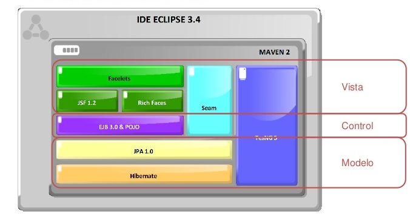
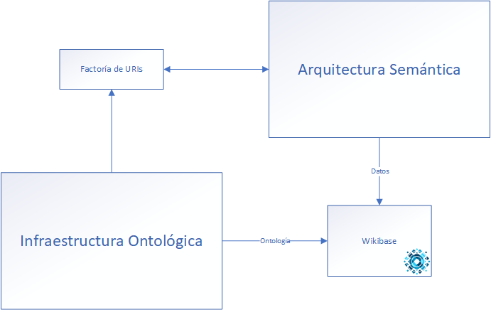
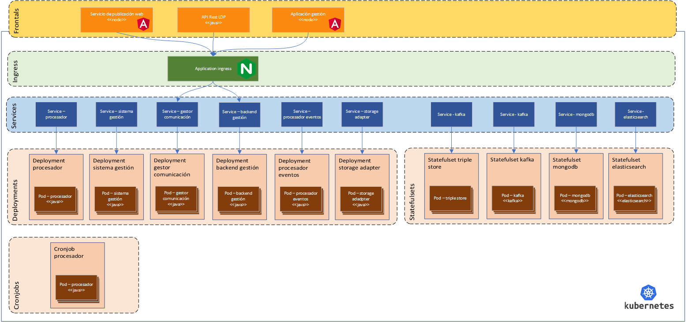

**Acerca de arc42**

arc42, La plantilla de documentación para arquitectura de sistemas y de
software.

Por Dr. Gernot Starke, Dr. Peter Hruschka y otros contribuyentes.

Revisión de la plantilla: 7.0 ES (basada en asciidoc), Enero 2017

© Reconocemos que este documento utiliza material de la plantilla de
arquitectura arc 42, <http://www.arc42.de>. Creada por Dr. Peter
Hruschka y Dr. Gernot Starke.

# Introducción y Metas

El presente documento parte de la arquitectura descrita en los documentos Estudio de viabilidad y especialmente el anexo anex3_AnyDisBackendSGI.docx.

Define la arquitectura de la parte semántica de la solución así como la integración y puntos de unión con la infraestructura ontológica. Se propone esta arquitectura como base sobre la que iterar, incorporando a la misma, necesidades que pudiesen surgir bien en la fase de implementación, bien en base a las necesidades del equipo de WESO. 

El documento utiliza el esquema Arc42 que define una estructura general homogénea y ágil para la documentación de arquitecturas del Software.

## Vista de Requerimientos

### Requisitos generales

Tal y como se indica en el Pliego de Condiciones, se trata de una plataforma Web con dos interfaces:

- Un interfaz interno de administración (backend), que permitirá actualizar y subir datos del dominio de gestión de la investigación
- Un interfaz público (frontend) que permitirá a clientes externos explorar la información almacenada. Se indica en el pliego que se permitirá que los clientes externos puedan ser seres humanos a través de una interfaz gráfica o agentes automáticos.

## Metas de Calidad

A continuación, se desglosan los principales objetivos de calidad identificados, atendiendo a lo que se indica en el propio pliego de condiciones.

- Descentralización. La plataforma Web permitirá que cada Universidad pueda disponer de su propio sistema Backend SGI que se sincronizarán con los demás.
- Interoperabilidad. 
- Eficiencia
- Usabilidad
- Reusabilidad: principios FAIR
- Calidad de datos
- Replicabilidad: Aunque la primera versión se instalará en la Universidad de Murcia, se espera que pueda instalarse en más universidades y que haya una interconexión entre Backends SGI

## Partes interesadas (Stakeholders)

| Rol/Nombre     | Expectativas              |
| -------------- | ------------------------- |
| Personal administrativo | Disponer de un sistema que facilite las tareas de administración del sistema como subir datos de investigación, actualizar o borrar datos de investigación existentes. |
| Usuarios externos humanos | Personas interesadas en navegar o visualizar los datos de investigación públicos. |
| Usuarios clientes externos | Personas que desarrollan aplicaciones de terceras partes para interactuar de forma automática con los datos del Backend SGI.  |
| Investigadores | Personas que desean disponer de una herramienta que les permita gestionar sus recursos de investigación: proyectos, conjuntos de datos, publicaciones, etc. de una forma sencilla y fácil de usar |
| Gestores de investigación | Personas interesadas en gestionar las políticas de investigación de una institución. Pueden estar interesadas en visualizar indicadores de investigación o tendencias. |

# Restricciones de la Arquitectura

La Universidad de Murcia cuenta con un entorno y framework para el desarrollo de aplicaciones J2EE con el fin de disponer de un único entorno de desarrollo, aumento de la calidad y productividad compartir conocimiento entre distintos desarrolladores. Técnicamente, se está basado en estándares actuales que facilitan la incorporación de nuevas tecnologías y la automatización de pruebas de código. Sigue un patrón MVC (Modelo/Vista/Control).



Para la VISTA se basa en JSF1.2, Facelets y Rich Faces.

Para el MODELO/CONTROL: se basa en JPA 1.0 y EJB 3.0 (Hibernate).

Otras tecnologías incluidas son BIRT para generación de informes, TestNG 5 para pruebas unitarias, Hudson como servidor de integración continua, servidor Archiva de repositorios Maven, Apache CSF para la SOA y Chckstyle, Findbug y EMMA como pluggins de Eclipse para la mejora de la calidad del software. Estas tecnologías serán completadas con otras herramientas que propone Izertis para garantizar la calidad de la solución planteada.

Dadas las características y naturaleza de la aplicacion que se va a desarrollar se opta por no seguir las indicaciones del Framework, debido a las siguientes circunstancias:

- Arquitectura basada en microservicios y teniendo en cuanta que el Framework de la Universidad de Murcia no está totalmente preparado para dar soporte a este tipo de aplicaciones
- Utilización de sistemas de almacenamiento adecuados para Ontologías

Dentro de este contexto, algunas restricciones que debe cumplir la arquitectura son las siguientes:

- Integración con otros sistemas: para la intercomunicación con otros sistemas se plantea el desarrollo de APIs que hagan de interfaz entre ambos.
- El código será abierto para garantizar su replicabilidad por parte de otras universidades e integración con desarrollos futuros.
- Se llevará a cabo documentación detallada para facilitar la trasferencia de la información a la Universidad de Murcia permitiendo la adquisición de conocimiento del sistema y haciendo más accesible la integración de nuevos desarrollos.
- Utilización de sistema de control de versiones git y plataforma github para seguimiento de todos los artefactos computacionales: código fuente, ontologías, documentación, datasets de referencia, etc.). No obstante, en este sentido, la empresa desarrollará el software bajo su propio sistema de control de versiones Git, realizando subidas periódicas a la plataforma GitHub
- Utilización de herramientas de integración continua: se usarán herramientas que garanticen la integración continua y faciliten su control y seguimiento. En este sentido se utilizarán las propias herramientas de Izertis
- Herramientas para diseño y realización de pruebas: las pruebas son fundamentales en un sistema de estas características, por lo que deben ser bien diseñadas, planificadas y exhaustivas.

# Alcance y Contexto del Sistema

## Visión de contexto


Los principales componentes son:

- **Usuarios externos:** personas que interactúan con el sistema. Pueden ser gestores de investigación, administradores del sistema, investigadores, usuarios externos, etc. 
- **Otras aplicaciones:** El Backend SGI se desarrollará teniendo en cuenta que su información pueda ser consultada automáticamente por otros agentes automáticos o aplicaciones.
- **Triple Store:** Una restricción del Backend SGI será la disposición de un TripleStore para almacenar y consultar la información de forma semántica.
- Logging y monitorización. El Backend SGI ofrecerá sistemas que permitan monitorizar el estado del sistema por parte del personal especializado, que permitirán detectar y depurar anomalías en el funcionamiento del sistema.
- **Datos externos:** El Backend SGI se comunicará con fuentes de datos externas cuyos datos serán procesados y convertidos internamente.

## Contexto de Negocio

El sistema a modelar se enmarca en un contexto universitario, en la cual existen otros aspectos como puede ser la oferta académica, los estudiantes, las actividades de extensión universitaria, etc. que también podrían modelarse. No obstante, la solución que se podrían ser incluidos en un futuro y se tendrá en cuenta para la solución ofertada que dichos aspectos puedan incorporarse, pero para el presente documento no serán tratados.


# Estrategia de solución

Atendiendo a los atributos de calidad y las restricciones identificadas se plantea una estrategia basada en tecnologías de código abierto, que sea fácilmente reutilizable. Se propone utilizar una solución basada en la creación de arquitecturas limpias de software y diseño basado en dominio, con el objetivo que pueda evolucionar fácilmente en un futuro.

# Vista de Bloques

## Arquitectura preliminar


Se recomienda construir cada bloque funcional, de acuerdo con una arquitectura orientada a microservicios, ya que esto ofrece las siguientes ventajas:

- Proporciona Flexibilidad, en la implementación, siendo la solución global agnóstica a la implementación, lo que permite desarrollar cada bloque funcional usando el lenguaje de programación, librerías o framework que más convenga para su resolución.
- Facilita el escalado, pudiendo replicar un bloque funcional tantas veces como sea necesario para optimizar la tarea.
- Facilita el mantenimiento, pudiendo cambiar la lógica en un bloque funcional, sin afectar al resto.
- El desarrollo independiente de los microservicios, proporciona capacidad para desarrollarlos de forma concurrente.

Dentro de cada microservicio, se recomienda siempre que sea posible una el patrón de diseño clean arquitecture, de forma que:

- Aumenta la mantenibilidad
- Aumenta la testeabilidad
- Facilita el mantenimiento

Como lenguaje base para el desarrollo de microservicios (puede cambiar en algún microservicio, por razones de idoneidad del lenguaje, framework o librería a la función que se desea realizar), se recomiendan lenguajes basados en Java Virtual Machine, bien Java, bien Scala, por los siguientes motivos:

- Existen múltiples librerías desarrolladas en Java, en el contexto de la Web Semántica (Apache Jena, Shaclex, ShEx for Java), que pueden facilitar en gran medida el desarrollo de funcionalidades
- Lenguajes propicios para el desarrollo de microservicios.
- Lenguajes fuertemente tipados, que favorecen la detección de fallos en fase de compilación, frente a fallos en fase de ejecución.
- Fácil de encontrar expertise en dichos lenguajes, por lo tanto, fácil de mantener.

## Arquitectura alto nivel

Con el fin de facilitar la visión de cómo está planteada la aplicación, es recomendable visualizar desde un punto de vista de alto nivel, los principales módulos que la forman, sin entrar en el detalle.


A alto nivel, la arquitectura se divide en varias partes:

- Backend: Módulo encargado de la ingesta de datos desde un origen, procesando la información e insertándola en los diferentes almacenamientos
- Gestión: Módulo backoffice encargado de la gestión del sistema
- Servicio de publicación web: Servicio web encargado de la consulta de datos por parte de los usuarios
- API Rest LDP: plataforma conforme a la especificación [Linked Data Platform del W3C](https://www.w3.org/TR/ldp/)
- Endpoint SPARQL: Endpoint SPARQL indicado para la conexión con el sistema a través de este protocolo
- Autorización y autenticación: Módulo de autorización encargado de gestionar la autenticación y autorización haciendo la conexión entre la solución y el sistema SIR

También formarán parte de esta visión general:

- Orígenes de datos en diferentes formatos (XML, servicio web, API REST, etc.)
- Almacenamientos de datos triplestore
- Sistema de logging y monitorización
- Bus de servicio general de la aplicación
- Base de datos de gestión

## Arquitectura Backend

El módulo de backend es el encargado de la ingesta de datos desde un origen, procesando la información e insertándola finalmente en el triplestore para que esté accesible posteriormente por el servidor LDP.


Este módulo estará formado por varias piezas:

- Entrada de datos: módulo encargado de obtener los datos de diferentes fuentes de datos (fuentes externas), haciendo las adaptaciones necesarias para que conciliarlos con entidades internas (POJOs) e ingesta en bus de servicio general
- Sistema de gestión: servicio encargado de consumir los eventos del bus de servicio y decidir si deben ir al módulo de gestión de eventos
- Gestión de eventos: módulo encargado de procesar los eventos generados por el módulo de entrada, permitiendo almacenar los datos en el triplestore
- Service bus general (kafka): cola de mensajes utilizada para la comunicación asíncrona entre los módulos

### Entrada de datos

El sistema de entrada de datos, tiene como función, procesar los datos de fuentes externas (Bases de datos, Repositorios de ficheros, …), conciliarlos con entidades internas, e introducirlos al sistema.


Estará formado por varios importadores de datos, uno por cada una de las fuentes externas de las que se tome la información. Cada una de estas fuentes dispone de los datos en un formato de entrada, el cual no tiene porque ser el mismo que la estructura de datos con las que vaya a trabajar el sistema, con lo que será preciso realizar una adaptación de los mismos.

**Implementación:** Para su implementación se desarrollarán una serie de microservicios. Potencialmente hay servicios que estarán muy acoplados a cliente (importadores) y otros menos, por lo que será conveniente que cada componente realice las operaciones de la forma más atómica y desacoplada posible.

**Lenguaje:** Para la implementación de los microservicios involucrados en este módulo se recomienda lenguaje de la JVM, por compatibilidad con librerías, principalmente Java o Scala.

#### Importadores

Se trata de N microservicios, uno por cada fuente de datos, que se encargarán de leer los datos de estas fuentes e ingestarlos en el sistema a través de un topic de Kafka. Su única misión será la de leer los datos de diferentes fuentes y no realizarán transformación alguna sobre ellos.

Por ejemplo, en el caso de una fuentes de datos vía FTP, el importador correspondientes se encargaría de recuperar los ficheros vía FTP, procesar los ficheros y extraer los datos. Otra fuente podría ser un servicio web o un API REST.

**Implementación:** Existen librerías que podrían facilitar la implementación: 

- **Input:** Fuentes de datos externas
- **Output:** Evento publicado en Service Bus interno (topic de Kafka) del módulo de entrada
- **Control:** Llamada al API del procesador de datos para conocer la fecha de la última importación

#### Procesador de datos

La tarea del procesamiento de datos se encarga de transformar los datos de entrada en los datos que se precisa para la ontología (POJOs). Dado que el formato de los datos de entrada no coincide con el de los POJOs, incluso existiendo la posibilidad de usar datos de diferentes datos de entrada para componer un único POJO, es necesario realizar este procesamiento en dos pasos.

1. Realizar una importación completa de los datos en una base de datos persistiéndolos en una base de datos intermedia
2. Proceso de conciliación de datos para generar los POJOs

##### Procesador

El procesador será el encargado de ir insertando los datos en una base de datos intermedia. Esta base de datos intermedia dispondrá de los datos en el formato de entrada.

La base de datos elegida es una base de datos NoSQL, en concreto MongoDB, la cual permite introducir datos no estructurado con diferentes campos.

**Implementación:** 

* **Input:** Evento recibido desde el service bus interno del módulo de entrada
* **Output:** Datos introducidos en formato de entrada en la base de datos intermedia del módulo de entrada. Adicionalmente para el primer hito se enviarán los datos también al Service Bus General para que sean tratados como POJOs.
* **Control:** Llamada a API del ETL para indicar el comienzo de la transformación de datos

##### ETL

Una vez se hayan cargado todos los datos de una de las fuentes, el módulo ETL será el encargado de leer los datos de la base de datos intermedia y transformarlos en la estructura de datos definida por la ontología (POJOs).

**Implementación:** 

Para la implementación de la ETL se utilizará Pentaho Data Integration el cual es un software que facilita la extracción, transformación y carga de datos, y por tanto indicado para hacer la transformación de los datos de entrada al formato "POJO".

- **Input:** Datos procedentes de la base de datos intermedia en formato del módulo de entrada
- **Output:** Evento publicado en Service Bus general, en formato POJO

#### Service bus interno del módulo de entrada

Se trata de una cola Kafka para garantizar que el procesamiento de los datos de entrada de forma asíncrona, para evitar sobrecargas del procesador.

### Gestión de eventos

El módulo de gestión de eventos se encargará de recoger los eventos generados por el sistema de entrada y procesarlos, hasta su guardado en el triplestore. 


Dada la arquitectura basada en _event processing_, el sistema es capaz de forma muy sencilla disponer de varios procesadores de eventos que permitan la persistencia de los datos en diferentes sistemas de almacenamiento. Al enviar los datos una vez procesados a una cola Kafka (service bus gestión), es posible tener tantos consumidores como sistemas de almacenamiento se quieran añadir, teniendo todos ellos la posibilidad de recibir todos los elementos enviados a la cola. Estos sistemas de procesamiento delegarán en un storage adaptar adaptado especialmente para cada uno de los sistemas a los que se desee enviar los datos. Actualmente está prevista la integración con Trellis LDP y Wikibase, aunque no sería descartable que en el trascurso del desarrollo del proyecto aparezcan nuevos sistemas a los que enviar los datos (por ejemplo un Elasticsearc o Solr para mejorar las búsquedas o un Neo4J).

**Implementación:** Para su implementación se desarrollarán una serie de microservicios. Se debería disponer de unos servicios lo más atómico posible, sobre todo en el caso de los microservicios dedicados a interactuar con los sistemas de almacenamiento, los cuales van a estar muy ligados a las APIs provistas por estos.

**Lenguaje:** Para la implementación de los microservicios involucrados en este módulo se recomienda lenguaje de la JVM, por compatibilidad con librerías, principalmente Java o Scala.

#### Sistema de gestión

El sistema de gestión será el encargado de recoger los datos en formato POJO del service bus general. Con ellos lo que hará será:

- Utilizar la librería de descubrimiento para validar si se trata de un nuevo recurso, uno ya existente que hay que actualizar o bien es necesario realizar un borrado
- Generación de RDF apoyándose en la factoría de URIs
- Ingesta de RDF en service bus del módulo de gestión, junto con la operación a realizar, lo que permitirá disponer de un log de todas las operaciones realizadas en el sistema, pudiendo ser útil en caso de necesitar restaurar la información.

**Implementación:**

* **ShExML:** Librería desarrollada por WESO, que permite mapear datos.

- **Input:** Evento recibido desde el service bus general del sistema, con datos en formato POJO
- **Output:** Evento publicado en Service Bus de gestión, con el RDF además de la operación a realizar

#### Procesadores de eventos

Cada uno de los procesadores de eventos se encargarán de consumir los mensajes disponibles en el service bus del módulo de gestión y enviarlos al almacenamiento correspondiente de un adaptador. La idea es que exista un procesador de eventos por cada uno de los diferentes almacenamientos / Triple stores (WikiBase, Trellis, etc.), de esta forma es muy sencillo activar o desactivar los sistemas de almacenamiento en un momento dado, simplemente con levantar o parar el microservicio procesador de eventos.

**Implementación:**

- **Input:** Evento recibido desde el service bus de gestión
- **Output:** Invocación a storage adapter para almacenamiento de mensaje

#### Storage adapters

En lugar de añadir la lógica correspondiente a un sistema de almacenamiento, se utilizará un adaptador el cual dispondrá de toda la lógica necesaria para interactuar con el triplestore. Esto permite que en caso que se quiera cambiar de sistema de almacenamiento, solo con cambiar este adaptador es suficiente para poder trabajar con este nueva capa de persistencia.

Estos adaptadores se encargarán también de transformar el RDF recibido para que concuerde con el sistema final, como por ejemplo las URIs, para lo cual se apoyará en la factoría de URIs.

Dentro del transcurso del proyecto se desarrollará un adaptador para la ingesta de datos en el sistema [Trellis](https://www.trellisldp.org/), así como en [Wikibase](https://www.mediawiki.org/wiki/Wikibase/es), aunque no sería descartable generar otros adaptadores en caso que sea necesario.

**Implementación:**

- **Input:** Mensaje recibido mediante invocación desde el procesador de eventos a través de un API Rest
- **Output:** Información enviada a Trellis a través de su API LDP

#### Trellis

Trellis es un servidor LDP Modular que soporta el escalado horizontal y redundancia, el cual soporta diferentes sistemas de almacenamiento, siendo por defecto triplestore y base de datos. Al disponer de una arquitectura modular y también al proveer todas sus librerías subidas a repositorios Maven, permite de forma sencilla utilizarlas para componer un empaquetado "custom". Esto facilitaría también el intercambio de ciertas piezas como puede ser la capa de persistencia para permitir así cumplir con el requisito de que la plataforma sea capaz de soportar el intercambio de triplestore.

**Implementación:**

- **Input:** Datos procedentes del adaptador de Trellis
- **Output:** Datos persistidos en un triplestore

#### Wikibase

Wikibase es las solución de MediaWiki para el manejo de datos. En el siguiente esquema, podemos apreciar la [arquitectura de Wikibase](https://addshore.com/2018/12/wikidata-architecture-overview-diagrams/)


Uno de los problemas de Wikibase es que se aprecia un gran bloque funcional (en azul), el cual soporta la mayor parte de la carga funcional. Uno de los contras con el que nos encontramos con Wikibase es que no se aprecia suficiente como para cubrir los requisitos del sistema en lo referente a al a segurdiad, LDP y SPARQL. Se ha realizado un [estudio detallado sobre el uso Wikibase y Trellis en el proyecto ASIO](./Análisis sobre uso de Wikibase vs Trellis + Fuseki en proyecto ASIO) en el que se ponen sobre la balanza los pros y contras de cada uno de ellos y se muestra más información acerca de este tema.

El uso de Wikibase en el proyecto se valorará como una opción para un perfil de usuario de tipo administración o backoffice, así como para los datos públicos.

#### Logging y monitorización

Con el objetivo de visualizar los eventos que son procesados, existirá un sistema de logging en el que se irán mostrando. Para ello se utilizará Graylog como sistema de monitorización, el cual se conectará directamente al topic Kafka del bus de servicio de gestión como input.

Este sistema permite, además de visualizar los mensajes recibidos, desarrollar dashboards así como gestionar eventos y notificaciones.

Más información: [https://www.graylog.org/](https://www.graylog.org/)

### APIs / Web (Frontend)

El sistema Frontend se encargará de interactuar con los usuarios que intenten acceder al sistema, ya sean personas o máquinas. Se permitirá tanto la consulta de datos como la introducción de nuevos datos en el sistema mediante esta vía.


El sistema dispondrá de los siguientes elementos:

- **API REST LDP:** API REST que cumpla con la recomendación [LDP (Linked Data Platform)](https://www.w3.org/TR/ldp/) en la que cada se definen los conceptos de recursos y contenedores. Los recursos pueden ser recursos con información RDF o recursos no-RDF. Para cada entidad, se define el conjunto de verbos http disponibles: GET, PUT, POST, DELETE, HEAD, PATCH y OPTIONS
- **Servicio e publicación web:** ofrecerá una capa Web de acceso a los diferentes recursos de investigación. El servicio ofrecerá facilidades para la visualización y búsqueda de datos enlazados, así como negociación de contenido para que la información sea útil tanto para humanos como máquinas.
- **Endpoint SPARQL:** endpoint para la realización de consultas SPARQL

Además, todos estos elementos estarán acompañados por una capa de negociación de contenido que permita obtener los datos ya sean del API Rest LDP o bien de alguno de los demás servicios en función de reglas. 

Para el acceso a este módulo existirá una capa de seguridad (autenticación y autorización) que garantizará que cada uno de los usuarios puede ejecutar las acciones que permite su rol.

**Implementación:** Para su implementación se desarrollarán una serie de microservicios. Se debería disponer de unos servicios lo más atómico posible, sobre todo en el caso de los microservicios dedicados a interacturar con los sistemas de almacenamiento, los cuales van a estar muy ligados a las APIs provistas por estos.

**Lenguaje:** Para la implementación de los microservicios involucrados en este módulo se recomienda lenguaje de la JVM, por compatibilidad con librerías, principalmente Java o Scala. En el caso de los frontales se utilizará una tecnología SPA, siendo elegida en este caso Angular

#### Servicio de publicación web

El servicio de publicación web es el encargado de mostrar un frontal HTML para la visualización de los datos. También dispondrá de un editor de consultas SPARQL.

Está formado por dos partes:

- Frontal: Se trata de una aplicación desarrollada mediante la utilización de un framework SPA.
- API: El frontal necesita un API para poder interactuar con el sistema, será necesario definir un API Rest que permita esta comunicación.

#### API Rest LDP

Se propone la creación de un API Rest para la gestión de los diferentes recursos del sistema. En el pliego de condiciones se menciona la posible utilización de Smart-API que facilita el seguimiento de los principios FAIR. 

Smart-API es una especificación basada en OpenAPI que permite añadir metadatos utilizando JSON-LD. De esta forma, en lugar de devolver valores JSON simples, se devuelven valores JSON-LD que encajan con el modelo de datos enlazados. También dispone de un registro de APIs que facilitan el descubrimiento de servicios. 

Se propone que el API REST cumpla con la recomendación LDP (Linked Data Platform)  en la que cada se definen los conceptos de recursos y contenedores. Los recursos pueden ser recursos con información RDF o recursos no-RDF. Para cada entidad, se define el conjunto de verbos http disponibles: GET, PUT, POST, DELETE, HEAD, PATCH y OPTIONS.

Para ello se utilizará el propio API REST LDP proporcionado por Trellis.

#### Endpoint SPARQL

El endpoint SPARQL será el encargado de ofrecer a los usuarios de la plataforma un endpoint SPARQL. Realmente lo que hará será delegar en el endpoint proporcionado por el triplestore para realizar las consultas, haciendo de esta forma transparente para los usuarios el endpoint utilizado internamente. Para ello hará uso de un adaptador para facilitar realizar el cambio de triplestore en caso que sea preciso.

**Implementación:**

- **Input:** Consulta SPARQL procedente desde los usuarios (personas o máquinas)
- **Output:** Datos procedentes de la ejecución de la consulta

### Arquitectura hito 1

En el Anexo [Arquitectura hito 1](./anexo-ASIO_Izertis_Arquitectura_hito1.md) se muestra la adaptación de esta arquitectura de cara al hito 1.

## Arquitectura aplicación de gestión

La aplicación de gestión se utilizará como backoffice de la solución, es decir para la gestión de la propia aplicación.


Este módulo estará formado por las siguientes piezas:

- Frontend: Frontal encargado de la interacción con usuario para permitir la entrada y visualización de información
- Backend: API Rest encargada de ofrecer la lógica de negocio de la aplicación de gestión

### Frontend

El sistema Frontend se encargará de interatuar con los usuarios que utilicen la aplicación de gestión. 

- **Lenguaje:** Para la implementación se utilizará una tecnología SPA, siendo elegida en este caso Angular
- **Input:** Información obtenida de un usuario
- **Output:** Invocacion al API del backend

### Backend

El sistema backend será el encargado de recibir la peticiones del frontal y procesarlas, ya sea obteniendo información del sistema o bien grabando nuevos datos.

Este sistema se apoyará en una base de datos de tipo NoSQL, como lo es MongoDB. Este tipo de bases de datos son apropiadas para sistemas en los que no se requiera una integridad fuerte enetre los datos, permitiendo de esta forma un rendimiento muy superior a una base de datos relacional.

- **Lenguaje:** Para la implementación se utilizará Java por compatibilidad con el resto del sistema
- **Input:** Información obtenida a través el API
- **Output:** Ejecución de consultas en la base de datos de gestión

## Autenticación

La aplicación dispondrá de un sistema de autenticación que permita identificar a los usuarios que van a trabajar con la misma. El sistema de autenticación dará acceso a los usuarios mediante sus credenciales. Para este cometido se utilizará se propone la utilización de un Single Sign On, que permita abstraer a cada uno de los servicios de este cometido, centralizando el proceso de autenticación en un único lugar.

Dado que Backend SGI es previsto que sea utilizado por usuarios de diferentes organizaciones, lo más adecuado es que se utilice un sistema de autenticación federado que permita utilizar la plataforma de autenticación de la organización a la que pertenezca cada uno de ellos. 


En un sistema federado existen los siguientes roles:

- **Proveedor de identidad:** encargado de realizar la autenticación del usuario y emitir las credenciales del mismo, pudiendo incluir información adicional sobre los atributos del usuario
- **Proveedor de servicio:** responsable de validar las credenciales. Es posible que el usuario se haya autenticado pero no sea válido para el servicio en cuestión (por roles por ejemplo), en este caso se denegaría la entrada.

Para este cometido se recomienda federar la aplicación en el sistema SIR.

### SIR

El Servicio de Identidad de RedIRIS (SIR) ofrece un servicio de autenticación federado para los servicios que proveen las entidades asociadas, tanto a nivel nacional como internacional. Tiene las siguientes características:

- La autenticación se realiza en la plataforma local de cada institución, ofreciendo la forma de autenticación a la que está acostumbrado cada usuario
- Ofrece una mayor seguridad, ya que las credenciales no salen del entorno local de la propia institución
- Cada institución aplica los mecanismos de control que estime convenientes

SIR2 sigue un modelo de federación `hub&spoke`. Esto significa que en el centro de la federación hay un hub central que pone en contacto a los proveedores de identidad y proveedores de servicio. Entre el hub y los IdPs, en la federación SIR2 se utiliza el perfil SAML2int.

Como protocolo de funcionamiento, SIR2 proporciona varios, ente los que se encuentran:

- PAPI v1
- SAML 1.1
- SAML 2 (recomendado)
- eduGAIN
- OpenID

#### SAML

SAML es el acrónimo de Security Assertion Markup Language, el cual es un estándar abierto de intercambio de datos de autorización y autenticación entre un proveedor de identidad y un proveedor de servicio. 

El formato que utiliza es basado en el lenguaje de marcado XML.

El caso de uso más comun es para el intercambio de información en un SSO. 


**1. Realización de la request del recurso al Service Provider (SP)**

Se realiza la petición al service provider:

    https://sp.example.com/myresource

El Service Provideer realizar la verificación de seguridad, si existe un contexto de seguridad válido se retorna el recurso solicitado.

**2. Redirección al servicio SSO (proveedor de identidad)**

El proveedor de servicio redirecciona al usuario al servicio SSO

    https://idp.example.org/SAML2/SSO/Redirect?SAMLRequest=request

El valor del parámetro `SAMLRequest` está codificado en Base64 y contiene el valor del elemento `<samlp:AuthnRequest>`.

**3. Realizar petición al servicio SSO**

El usuario realiza una reques a la URL obtenida del paso anterior. El servicio SSO procesa el parámetro `AuthRequest` y realiza la verifiación de seguridad. En caso que el usuario no disponga de una autenticación, lo identifica. 

**4. Respuesta vía formulario XHTML**

El servicio SSO valida la petición y responde vía un formulario XHTML:

```html
<form method="post" action="https://sp.example.com/SAML2/SSO/POST" ...>
    <input type="hidden" name="SAMLResponse" value="response" />
    ...
    <input type="submit" value="Submit" />
</form>
```

El valor del parámetro `SAMLResponse`es la codificación en Base64 del elemento `<samlp:Response>`.

**5. Request al servicio de validación de aserciones del Service Provider**

El usuario invoca vía POST al servicio de validación de aserciones del service provider.

**6. Redirección al recurso del SP**

El servicio de validación de aserciones procesa la respuesta, crea el contexto de seguridad y redirecciona al recurso solicitado en el paso 1.

**7. Solicitar el recurso del SP de nuevo**

Se realiza nuevamente la petición del recurso del service provider:

    https://sp.example.com/myresource

**8. Respuesta con el recurso solicitado**

Dado que existe un contexto de seguridad que permite acceder al recurso, finalmente se retorna al usuario.

## Autorización

Que el usuario esté identificado en el sistema no es suficiente para que el sistema de seguridad. Para ello es preciso que cada usuario pueda acceder a los recursos que se le permitan por su rol. A este es a lo que se entiende como autorización.

El sistema de autorización tiene que conseguir una serie de objetivos:

- Identificar el rol del usuario
- Realizar la autorización entre los difrentes módulos del sistema

### Identificación del rol del usuario

Independientemente de si se utiliza como método de autenticación un sistema federado como SIR o bien el SSO propio de la Universidad de Murcia directamente, es necesario que el sistema aporte la información necesaria para poder realizar la autorización correctamente.

Ante esto se plantean 2 posibles escenarios:

- El sistema no ofrece los roles del usuario
- El sistema ofrece los roles del usuario

#### El sistema de autenticación no ofrece información de autorización

En este caso, la primera vez que acceda el usuario a la aplicación tendrá que disponer del nivel más básico de acceso. Esto es debido a que no es posible realizar una sincronización con la base de datos de usuarios (LDAP, AD, etc.) al ser solamente accesible desde el propio SSO.

En este caso, la primera vez que entre el usuario, este se registrará en el sistema y ya en este momento será posible asignar roles dentro de la aplicación.

#### El sistema ofrece los roles del usuario

En este caso, el sistema ofrece los roles, o bien información que permita recomponer la autorización. En este caso, la primera vez que un usuario acceda al sistema, ya se conoce su rol con lo que entrará con los permisos precisos para el mismo de forma automática.

Este es el mecanismo más recomendado al ser el más ágil.

#### Funcionamiento en SIR

En el caso de SIR, a priori es posible recuperar toda aquella información que el IdP esté en condiciones de enviar. En el caso de la Universidad de Murcia, se deberá inclur en el perfil la información de autorizaicón

Vas a poder recuperar de SIR lo que cada IdP esté en condiciones de enviar a SIR. En el caso de la UMU podemos incluir en el perfil la información que os pasé en el perfil de ejemplo.


### Identificación del usuario entre los diferentes módulos del sistema

La solución Backend SGI está planteada mediante una arquitectura de microservicios. En este tipo de arquitecturas se plantea un reto en lo que a la autorización se refiere, ya que no es suficiente con validar los permisos del usuario en el módulo de entrada, si no que es preciso que cada uno de los microservicios tenga visibilidad de los roles del usuario para poder dar el acceso correspondiente a funcionalidades y datos.


En un arquitectura monolítica, al ser una aplicación única no existe este problema, pero en la arquitectura de microservicios es preciso trasladar entre diferentes microservicios el token de acceso para que lo puedan validar. Lo que puede provocar un enorme cuello de botella en la red al tener que para cada una de las invocaciones al sistema, cada uno de los microservicios involucrados en resolver la petición tiene que al servicio de autorización para verificar los accesos.

Como se indicó anteriormente, como servicio de autenticación / autorización se utilizará SIR, el cual funciona bajo el protocolo SAML2. El principal problema de este protocolo no está pensado para trabajar entre microservicios, si no entre un user-agent y un proveedor de servicio, por lo que resulta demasiado pesado al tratarse de un intercambio de información mediante XML.

Como alternativa para la autorización, la recomendacion es la utilización de OAuth2 junto con JWT, el cual se ha convertido en el estándar de facto en el mundo de microservicios.

#### OAuth2

OAuth 2.0 es el protocolo estándar para la autorización. Los elementos lo componen son las siguientes:

- Propietario de recursos: Quien autoriza el acceso a los recursos, puede ser una persona
- Cliente: aplicación (o web) que accede a los recursos protegidos
- Proveedor
    - Servidor de autorización: encargado de validar el usuario y credenciales, generando tokens de acceso
    - Servidor de recursos: encargado de recibir las peticiones de acceso a los recursos protegidos, autorizando acceso solo si el token es válido


Las ventajas que proporciona OAuth son:

- Las credenciales de los usuarios no se ven comprometidas ya que el acceso a su información se hace a través de tokens que deberán ser validados cuando se consumen las APIs. 
- Indicado para el consumo de APIs, tanto por aplicaciones Front SPA como aplicaciones móviles
- Posibilidad de definición de scopes diferenciados para cada una de las aplicaciones, los cuales permiten delimitar el acceso a cada aplicación

##### Scopes

Los scopes de OAuth definen los permisos que tienen los clientes, es decir, permiten qué operaciones pueden realizar con los tokens generados para el cliente en cuestión. Por ejemplo, se puede definir "read", "write", etc., en función del scope cada cliente estará habilitado a realizar unas acciones u otras.
Por ejemplo, en el caso que se quiera utilizar Facebook desde una aplicación, se generará un cliente OAuth en el que se definen los permisos (scopes) para el mismo, como por ejemplo lectura, escribir publicaciones u obtener contactos.

El concepto "Scope" no se debe confundir con roles de usuario, ya que los scopes se definen a nivel de cliente, teniendo en cuenta que un cliente puede ser una aplicación, no sustituye el hecho de que puedan existir diferentes roles para cada usuario de la aplicación.

##### Tokens

OAuth genera 2 tipos de tokens:

- Access token: token que será enviado junto a las llamadas a las APIs para la validación de acceso.
- Refresh token: token de refresco que se encargará de renovar el token de acceso cuando este caduque

Cuando se utiliza cualquiera de estos tokens, se deberán validar previamente. Para ello se almacenan en un repositorio (BBDD, Redis, etc.) que permite la consulta de los mismos en las sucesivas llamadas. Uno de los posibles problemas que presenta, es la aparición de cuellos de botella en esta validación, ya que por cada llamada al API se deberá validar el token mediante consultas a BBDD. Si además estamos en una arquitectura de microservicios, cada microservicio que se vaya encadenando para obtener el resultado de la llamada al API, deberá validar el token. Como posible solución se podrían utilizar tokens JWT, los cuales no es necesario validar contra la BBDD.

En cuanto al propio formato de los tokens, es importante seleccionar el tipo que se va a utilizar. Por defecto, se utiliza el token de tipo `Reference`, el cual implica que este deba ser verificado contra el servidor de recursos por cada una de los microservicios, lo que ya se indicó anteriormente que conlleva un lag en la petición.


En el mundo de microservicios, debido a los problemas que presenta el tipo por defecto, lo más utilizado es JSON Web Tokens, más conocido como JWT. Mediante este sistema la verificación de los tokens se realizan localmente mediante una clave pública.


 #### JWT

 JSON Web Tokens, más conocidos como JWT, es el método estándar RGC 7519 de representación de tokens de seguridad para el intercambio de información. Es un estándar basado en JSON para crear tokens de acceso. Los tokens están firmados mediante una clave privada, teniendo todas las partes la clave pública que permite verificar la validez del token. 

Las ventajas que proporciona este sistema son:

- Posibilidad de creación de aplicaciones Stateless, que no tengan la necesidad de almacenar el estado de la sesión del usuario. El token contiene información de autenticación, expiración y otros datos que se definan
- Portable: el mismo token puede ser utilizado en múltiples backends
- No requiere cookies
- Buen rendimiento: no requiere validación contra ningún sistema de almacenamiento, simplemente con corroborar las firmas del token es suficiente para entender que el token es válido. 
- Muy adecuado para arquitectura de microservicios: se va pasando el token de microservicio en microservicio, sin necesidad de validaciones pesadas
- Desacoplamiento: el token puede ser generado en cualquier otro lugar, la autenticación puede ser realizada en el servidor de recursos o en un lugar totalmente ajeno.

##### Estructura

Un token suele estar formados por tres partes:

- Header: identifica el algoritmo que es utilizado para la firma, por ejemplo, HS256
- Payload: contiene la información de los "claims" del token, en el que se pueden incluir también marcas temporales para indicar el momento en el que el token fue generado
- Signature: encargada de validar el token, generada codificando la cabecera y el contenido utilizando Base64url Encoding

##### Claims

En el cuerpo del token se pueden definir claims o privilegios que pueden servir para definir datos del usuarios que sirvan para realizar la autenticación / autorización. Existen claims públicos que deben seguir el estándar RFC7519 (https://www.iana.org/assignments/jwt/jwt.xhtml), y claims privados que se pueden definir de forma custom.

Mediante una combinación de claims se pueden utilizar para definir los privilegios de acceso que tiene el token en una aplicación en concreto.

#### Integración SAML y OAuth2 + JWT

Como se indicó anteriormente, para la autenticación / autorización se utilizará el sistema SIR el cual utiliza el protocolo SAML. Internamente dentro de el ecosistema de microservicios es mejor opción utilizar OAuth2 junto con JWT. Es por ello que se necesita hacer la integración de ambos sistemas.

Para poder conseguir esta integración es necesario disponer de una pieza que haga de "bridge" haciendo la traducción entre ambos sistemas. 


En este caso existirá un servidor de autenticación que realice este rol. De puertas a fuera se trabajará con SAML, haciendo la integración son SIR, mientras que de puertas a dentro se dispondrá de un token JWT proporcionado por el servidor de autenticación. Para facilitar esta integración, se estudiará la utilización de herramientas como [Keycloak](https://www.keycloak.org/).

#### Integración de autenticación y autorización con servicios LDP y Wikibase

En el anexo [Estudio sobre autenticación y autorización](./anexos/anexo_autenticacion_autorizacion.md) se hace un estudio sobre como integrar la autenticación y autorización en Wikibase y Trellis.

### Integración entre arquitectura semántica e infraestructura ontológica

En la solución existen dos partes, por un lado está la infraestructura semántica que es aquella destinada a la definición de los datos y su ontología y por otro lado se encuentra la arquitectura semántica dirigida a la importación, almacenamiento y explotación de los datos.

La integración de estas dos partes se realizará en diferentes puntos.



#### Wikibase

Por un lado se encuentra la integración a través de Wikibase. La infraestructura ontológica generará toda la estructura de datos en Wikibase. Mediante la ingesta de datos en Wikibase por parte de la Arquitectura semántica se consigue disponer de un repositorio común tanto con ontología como datos.

#### Factoría de URIs

La factoría de URIs será la encargada de generar las URIs tanto para tipo de recursos (clases), atributos como para instancias. En el caso de la Infraestructura ontológica, cuando se cree o actualice la ontología, esta hará uso de la factoría de URIs para realizar el mapeo entre clases y atributos con las URIs correspondientes. Cuando la arquitectura semántica trate de insertar o actualizar un dato, hará uso de la factoría de URIs para resolver la URI correspondiente a la clase de la instancia así como de los atributos. De esta manera la factoría de URIs actuará de pegamento entre las dos partes de la aplicación.

# Vista de Despliegue

El despliegue de la aplicación se realizará en un entorno de contenedores orquestado mediante Kubernetes.

**Diagrama General**


**Motivación**

El despliegue se realizará en Kubernetes con 2 nodos para garantizar la alta disponiblidad del sistema. Por delante tendrá un nginx que hará de API Gateway para dar acceso a la aplicación.

## Arquitectura de Pods, Deployments, Services e Ingress

Se indican a continuación la arquitectura de despliegue dentro de Kubernetes, incluyendo los siguientes elementos:

- Pods, deployments, cronjobs y statefulset
- Services
- Ingress

Asociado a cada uno de los pods se incluye por cada uno la imagen base que se debe utilitzar para la contrucción de la imagen Docker de despliegue. Por norma general se utilitzará la siguiente:

- Pods Java: openjdk:11, la cual es la imagen base para openjdk 11
- Pods Elasticsearch: elasticsearch:6.7, imagen base para la versión 6.7 de Elasticsearch
- Pods Node: node:8, imagen base para la versión 8 de node
- Pods MongoDB: mongodb:4, imagen para la versión 4 de mongodb



En cuanto a la decisión sobre la utilización de deployments o statefulset, la justificación es la siguiente:

- Deployments: por norma general se utilitzará para el despliegue de los microservicios de la aplciación, al ser la forma más estándar de configuar una aplicación con múltiples réplicas en Kubernetes
- Statefulset: se utilitzará para todos aquellos elementos que requieran de ordenamiento y unicidad de los Pods. Este es el caso de los Servicios de almacenamiento de datos o motores de búsqueda
- Cronjob: se utilizará para el despliegue de aquellas tareas que se tengan que ejecutar periódicamente en base a una programación

# Conceptos Transversales (Cross-cutting)

## Modelo de dominio

En esta fase no se tiene el detalle necesario para un modelo de dominio completo. Consideramos que lo ideal es que el modelo de dominio definido para la infraestructura ontológica esté sincronizado con el modelo de dominio utilizado en el backend SGI. De hecho, lo que se propone es un sistema de sincronización entre Shapes e interfaces Java. El modelo de dominio presentado en el anexo I se representa en la siguiente figura:


Para la creación del modelo las principales fuentes utilizadas fueron las ontologías euroCRIS y VIVO, así como el conocimiento propio de las personas que han desarrollado este documento. En él se contemplan algunas de las entidades más significativas, si bien será necesario que el modelo de dominio se vaya desarrollando en la siguiente fase tras reuniones con la Universidad de Murcia y ATICA.

## Esquema de URIs

Para la definición del esquema de URIs se seguirá la propuesta desarrollada para el portal de datos de la biblioteca nacional del congreso de Chile en el año 2011 y que actualmente sigue en producción. De hecho, dicho esquema de URIs se ha mantenido en funcionamiento desde los inicios del sistema y actualmente sirve de enlace entre los diferentes componentes del sistema. Consideramos importante que se realice un diseño del esquema de URIs jerárquico y homogéneo, tratando de que se pueda mantenerse lo más estable posible en el futuro.

Para más información, consultar el entregable de [esquema de URIs](../../entregables_hito_1/08-Esquema_de_URIs_Hércules/ASIO_Izertis_ArquitecturaDeURIs.md).

## Patrones arquitectónicos

La presente propuesta se basa en los siguientes patrones arquitectónicos:

- Layers: separación en capa Frontend y capa Backend. Este estilo viene marcado por el propio pliego de condiciones.
- Clean Architecture promueve la creación de un modelo de dominio como aspecto central de la arquitectura del sistema.
- Event Sourcing en capturar las peticiones de cambios al estado de una aplicación como secuencias de eventos. De esta forma, se facilita la reconstrucción del estado a partir de los eventos almacenados. 
- CQRS es el acrónimo de Command Query Responsability Seggregation y promueve la separación entre los métodos que consultan el estado de una aplicación de los métodos que actualizan dicho estado. 
- Stream processing propone la utilización de streams de eventos 

# Decisiones de Diseño

## Procesamiento de streams

Con el fin de aumentar la **escalabilidad y alta disponibilidad del sistema**, se propone la utilización de un sistema de procesamiento de flujos (streams) de eventos. Este tipo de sistemas están siendo utilizados en proyectos que requieren el procesamiento de grandes cantidades de datos y consisten en utilizar un mecanismo de publicación/suscripción a un log distribuido de sólo lectura. La ventaja es que las operaciones de escritura en el log son más eficientes que las actualizaciones en una base de datos. 


Este estilo arquitectónico se ha denominado arquitectura Kappa y suele materializarse mediante el uso de Apache Kafka . El uso de Kafka permite una serie de ventajas:

- La utilización del log distribuido como fuente de verdad permite desarrollar diferentes vistas de los mismos datos. Una vista puede ser una base de datos RDF o un índice de búsqueda como ElasticSearch. Si algún componente falla, las vistas pueden recomponerse a partir del log distribuido
- Si una aplicación productora de eventos comienza a fallar generando datos incorrectos, es relativamente sencillo modificar los consumidores de eventos para que ignoren los datos erróneos. Por el contrario, si una base de datos se corrompe, su restauración puede ser más complicada y requerir el uso de copias de resguardo.
- La depuración puede ser más sencilla en un log de solo escritura que en una base de datos que se modifica continuamente puesto que los eventos pueden volver a ejecutarse para diagnosticar qué ocurrió en una determinada situación
- Para el modelado de datos, la utilización de un log que solamente permite añadir datos puede ser más sencilla que el uso de transacciones ACID sobre bases de datos tradicionales. El patrón event-sourcing encaja con este estilo arquitectónico. 
- Este estilo puede facilitar el análisis de datos posterior. En muchas ocasiones es más útil entender cómo se ha llegado a un estado de la base de datos, que disponer únicamente del estado final de la base de datos.
- El patrón publicación/suscripción permite desacoplar el sistema de publicación de eventos de los sistemas consumidores. En caso de que un consumidor de eventos falle, puede haber otros consumidores funcionando.

## Elección de almacenamiento RDF

Un aspecto importante de una arquitectura semántica es la disposición de un sistema de representación del conocimiento basado que ofrezca datos RDF al exterior a través de un terminal o endpoint SPARQL. Para implementar dicha solución se han propuesto múltiples alternativas, desde bases de datos relacionales como ORACLE que dan soporte a RDF, hasta bases de datos nativas RDF. De hecho, Wikipedia contiene incluso una página dedicada a comparar las principales implementaciones . 

Con el fin de que la elección de una determinada tecnología de almacenamiento en triple-store no implique el éxito o el fracaso del proyecto, se plantea la utilización del triple-store como un parámetro de la arquitectura. La idea es que el triple-store será un elemento externo a la arquitectura del backend SGI que se comunicará mediante un adaptador con el triple-store, pero que estará separada de la lógica de negocio del sistema. Este estilo arquitectónico, conocido como arquitectura limpia ofrece un desacoplamiento entre el sistema y la solución de un determinado vendedor.

A continuación, se enumeran algunos de los Triple-stores considerados:

- Apache Jena (Fuseki) . Se basa en el framework Jena: web semántico de código abierto para Java. Proporciona una API para extraer datos y escribir en el gráfico RDF. Jena admite la serialización de gráficos RDF para una base de datos relacional RDF/XML, Turtle y Notation 3. Es una interfaz HTTP para datos RDF. Es compatible con SPARQL para consultas y actualizaciones. Fuseki es un subproyecto de Jena y se desarrolla como servlet. También se puede ejecutar en un servidor independiente, ya que se envía preconfigurado con el servidor web Jetty. Una ventaja de Fuseki es que es código abierto con licencia gratuita. 
- Virtuoso . El servidor de bases de datos Virtuoso, desarrollado por la compañía OpenLink,  combina en un solo sistema la funcionalidad de un sistema de gestión de bases de datos tradicional, con bases de datos RDF, XML, de archivos y servidor de aplicaciones web en un solo sistema. Es una de las soluciones convencionales para el almacenamiento de datos RDF que alcanzó su popularidad al ser utilizada en la DBpedia [22]. Los autores de la presente propuesta han utilizado Virtuoso en el portal de datos de la Web Foundation , el portal de datos Landportal  y en el portal de datos de la Biblioteca Nacional del Congreso de Chile . Virtuoso también es utilizado en la Oficina de Publicaciones de la Unión Europea  y recientemente se ha publicado un informe comparando su rendimiento con los sistemas Stardog, GraphDB y Oracle. El precio se encuentra en el intervalo 249,99 - 4999,99 €, dependiendo de las características del proyecto. En este punto aún no se encuentra tan detallado cómo para poder afinar más el coste que podría tener.
- GraphDB , inicialmente denominado OWLIM, es un sistema desarrollado por la compañía búlgara OntoText. 
- StarDog  es una base de datos comercial que comenzó a desarrollarse a partir del año 2012. 
- Blazegraph  es una base de datos RDF desarrollada con el objetivo de crear una solución de alto rendimiento y escalable. Blazegraph es de código abierto y gratuita, y está siendo utilizada como Triple-Store para Wikidata. Los principales desarrolladores de Blazegraph han empezado a trabajar para Amazon Web Services, lo que ha supuesto una discontinuidad en el desarrollo. No obstante, la fundación Wikimedia está localizando recursos para continuar su mantenimiento, dado que es un componente importante de Wikidata. 
- Wikibase  es el nombre que recibe el software con el que se ha desarrollado Wikidata. La fundación Wikimedia ha decidido separar el software de los datos para permitir que se puedan crear otras instancias de Wikibase con un modelo similar al de Wikidata, que puedan apoyarse en las herramientas que se han desarrollado. Actualmente, ya existen varios proyectos de datos enlazados que han sido creados como instancias de Wikibase . De ellos, puede destacarse el proyecto LinguaLibre  o el portal de Rhizome. Los componentes de Wikibase pueden instalarse individualmente o mediante imágenes Docker. Una ventaja de utilizar Wikibase es que se dispone de un conjunto de herramientas de código abierto y gratuitas, que ya están siendo probadas en entornos en producción con un gran rendimiento. 
- Data.world  es una empresa que permite albergar catálogos de datos empresariales. Internamente utilizan HDT para representar RDF de forma eficiente. Los costes dependen del número de miembros que los vayan a utilizar, rondando los 25 $ por miembro y mes.
- Neptune (Amazon Web Services)  es una solución de la compañía Amazon para el almacenamiento de RDF en la nube. Amazon Neptune da soporte SPARQL con una tasa de 0,1$ por GB al mes y 0,2$ por cada millón de peticiones. En un ejemplo base, Amazon sostiene que un coste medio habitual podría ser de unos 300 €/mes.

## Elección de arquitectura semántica

La arquitectura semántica pretende cubrir cómo se va a proceder al guardado de datos, así como a exponer los mismos para la utilización posteror por los distintos tipos de usuarios. Se deberían cubrir los siguientes aspectos:

- Facilitar la generación de RDF a partir de POJOs
- Almacenamiento de la información en triple store
- Endpoint SPARQL
- Linked Data Server

Hay que tener en cuenta que uno de los requisitos que se persigue es que la arquitectura sea capaz de abstraer el triple store utilizado para que en momento dado se pueda intercambiar por otro de forma sencilla.

A groso modo, las alternativas que existirían son las siguientes:

- Implementación ad-hoc utilizando diferentes piezas que den lugar a una arquitectura completa y extensible. Para ello se puede hacer uso de diferentes frameworks
- Utilización de un Linked Data Platform, el cual por si mismo aporta todas las piezas ya montadas y listas para su utilización

En el documento [Elección arquitectura semántica](./eleccion_arquitectura_semantica.md) se hace un análisis sobre cada una de las alternativas disponibles.

## Adecuación de Trellis y Wikibase al proyecto

Se ha confeccionado un [documento para verificar la adecuación de Trellis y Wikibase](./Análisis sobre uso de Wikibase vs Trellis + Fuseki en proyecto ASIO.md) en el proyecto así como su encaje en el mismo.

## Seguimiento de principios Solid

Con el fin de proporcionar a los investigadores una infraestructura de confianza en la que tengan un mayor control sobre los datos privados de sus experimentos y que a su vez puedan compartir algunos de esos datos con otros investigadores con los que quieran colaborar, se propone el seguimiento de los principios SOLID en los que se define el concepto de POD (Personal online datastore) que contiene información privada de un investigador de forma descentralizada, que podrá compartir si lo desea con otros investigadores.

La utilización de esta tecnología, promovida por Tim Berners-Lee, está adquiriendo mucha relevancia en la actualidad como una reacción en contra de la tendencia de algunas redes sociales a almacenar los datos de cada persona en un solo lugar de forma centralizada. El proyecto SOLID, por el contrario, promueve que cada individuo pueda decidir en qué POD almacena sus datos, separando las aplicaciones de los datos. 

## Stack tecnológico

Considerando las tecnologías utilizadas en la Universidad de Murcia , se considera preferible la utilización de tecnologías y librerías que se integren bien con el entorno Java. 

Aunque la arquitectura propuesta utilizará APIs REST y servicios web que podrían integrarse de forma sencilla con soluciones desarrolladas en otros stack tecnológicos como .Net o NodeJs, se considera que la existencia de personal cualificado en la Universidad de Murcia con conocimientos del entorno Java facilitará el mantenimiento posterior del sistema. 

Además, muchas de las librerías de web semántica como Apache Jena ó RDF4J están desarrolladas en Java por lo que esta decisión no incurre en posibles deudas técnicas que se derivarían de utilizar tecnologías que careciesen de las librerías adecuadas.

A pesar de ello, tampoco se descarta la creación de ejemplos o prototipos en otros entornos como NodeJs que pueden servir como prueba de concepto de interoperabilidad, o incluso como desarrollos rápidos de ciertas funcionalidades que sean demandadas por el cliente.

En el documento [Anexo - Stack tecnológico](./anexos/anexo-stack-tecnologico.md) se dispone de una descripción sobre las principales tecnologías propuestas..

# Requerimientos de Calidad

## Árbol de Calidad


## Escenarios de calidad

A continuación, se definen una serie de escenarios de calidad relacionados con los atributos anteriores. Los escenarios definidos pueden considerarse una primera aproximación que posteriormente se ampliarán y refinarán por consenso de las partes interesadas.

| Código | Estímulo | Respuesta esperada |
| ------ | -------- | ------------------ |
| E1 | Un usuario quiere conocer los tipos de gasto realizados por área y tipo de proyecto	La información es encontrable mediante consultas SPARQL |
| E2 | Un usuario o sistema quiere conocer información a de las áreas de investigación, tipología de proyectos, origen de fondos, etc. tanto unidimensionales como multidimensionales.	La estructura jerárquica de las ontologías permitirá modificar el nivel de profundidad de los análisis |
| E3 | Un usuario quiere llevar a cabo búsqueda de socios	Es posible recibir la información de los posibles socios filtrando por las características deseadas |
| E4 | Creación de mapa de conocimiento a nivel nacional	La interoperabilidad entre las distintas instancias hace que sea posible la búsqueda de distintos perfiles de conocimiento |
| E5 | Sólo personas autorizadas tendrán acceso a la gestión de datasets	El sistema cuenta con una gestión de usuarios en la que sólo aquellos con el rol gestor tendrán permitida esas tareas |
| E6 | Un gestor quiere dar de alta/baja usuarios con distintos roles	El gestor tendrá los permisos adecuados en el sistema para poder dar hacer modificaciones con los perfiles de usuarios |
| E7 | Un usuario quiere importar datos csv de otros sistemas	El sistema se adaptará a la incorporación de nuevos datos mediante distintos conversores |
| E8 | Un usuario quiere realizar la sincronización con otras instancias	El backend cuenta con un módulo que permite ejecutar la sincronización con otras instancias. |

# Riesgos y deuda técnica

En este apartado se identifican algunos riesgos detectados en el desarrollo del backend y su posible solución.

## Conocimiento SGI

- Riesgo: falta de conocimiento de todas las complejidades asociadas al SGI y heterogeneidad.
- Plan: Por una parte, al participar la Universidad de Oviedo en este proyecto, no se parte de cero en cuanto a conocimiento de los sistemas de gestión de investigación. Por otra, Izertis trabajará por la formación, asesoramiento en el análisis, selección y desarrollo de los sistemas SGI.

## Esquema de URIS

- Riesgo: incapacidad para realizar un esquema de URIs y API correcto desde el princpio.
- Plan: se establecerán mecanismos que permitan afrontar cambios posteriores y establecer sistema de realimentación. Se planteará que el sistema sea abierto para que sea posible su ampliación, como por ejemplo, a nuevos idiomas.

## Entidades de dominio

- Riesgo: dificultad para llegar a consenso sobre las principales entidades del dominio en términos de volumen, áreas u otros.
- Plan: la reutilización de ontologías es una parte primordial de este proyecto. No se van a crear todas las ontologías, sino que se van a reaprovechar todas las posibles. Como es necesario crear más desde el principio se garantizará un mecanismo que permita añadir las nuevas que se creen para este proyecto y para facilitar la integración de otras en un futuro. Los trabajos de diseño de ontologías permitirán modificar ontologías existentes, dotando al equipo de las herramientas que permitan esta edición de forma sencilla y directa.

## Pérdidas de información

- Riesgo: Desfases y pérdida de información entre versiones de documentación o desarrollos.
- Plan: Izertis está acostumbrado al uso de herramientas que permiten la sincronización y control de versiones y se usarán en este proyecto.

## Integración de datos de terceras partes

- Riesgo: La integración de datos de terceras partes suele ser problemática porque normalmente requiere el conocimiento de modelos de datos diferentes, que muchas veces utilizan tecnologías legacy que dificultan la conversión entre esquemas.
- Plan: La experiencia adquirida en proyectos como el Landportal o SIGINFO (colaborativos de Izertis y WESO) en los que era necesario crear importadores de datos heterogéneos permitirá paliar estos problemas. En general, el uso de esquemas de datos y mapeadores entre esquemas permite ofrecer una visión a un nivel en el que los propios expertos del dominio pueden ayudar a conectar las diferentes entidades.

## Conciliación de entidades

- Riesgo: Un problema habitual cuando se integran datos heterogéneos es la conciliación de entidades que no están identificadas de forma clara. En el dominio de la investigación, desde hace unos años se utilizan identificadores globales para los investigadores (por ejemplo, ORCID), sin embargo, si se desea realizar un SGI completo, es necesario disponer de identificadores para todos los tipos de entidad y sus posibles manifestaciones. Por ejemplo, cada  artículo científico debería disponer de un identificador global, pero la existencia de varias manifestaciones del mismo artículo puede ocasionar situaciones con ambigüedad.
- Plan: El grupo WESO dispone de conocimientos en el desarrollo de algoritmos de conciliación de entidades, habiendo participado en varios proyectos que pueden paliar esta dificultad, como entidades musicales o entidades en el ámbito político o entidades generales que aparecen en sistemas de aprendizaje. 

## Escalabilidad

- Riesgo: Un reto de los sistemas de bases de datos RDF es la escalabilidad y el tratamiento de grandes cantidades de datos, especialmente, si se combinan con sistemas de inferencia y lenguajes SPARQL.
- Plan: En los últimos años, las implementaciones SPARQL han mejorado significativamente su rendimiento y hay proyectos, como Wikidata, que almacenan 4,9 mil millones de tripletas con una alta disponibilidad. Por todos es conocido Wikipedia, que se basa en Wikidata y que dispone de una enorme cantidad de información, un elevado número de usuarios simultáneamente y no sufre problemas de disponibilidad. Los datos del proyecto que aquí se plantea y el volumen de usuarios planteado se estima mucho menor que los de Wikidata, y como la alternativa que se plantea es el uso de una instancia de Wikibase no debería plantear problemas de escalabilidad. 

## Volúmenes de uso

- Riesgo: La arquitectura semántica de datos puede provocar altas latencias del servicio ante volúmenes de uso excesivos.
- Plan: Durante el proyecto se crearán métodos de benchmarking para evaluación de rendimientos y de balanceo de carga y caché que permitan afrontar estas circunstancias no deseadas y obtener un sistema estable y confiable.

## Wikibase y Blazegraph

- Riesgo: Los desarrolladores iniciales del proyecto Blazegraph han dejado de trabajar activamente en el proyecto, lo cual podría suponer un problema en la adopción de Wikibase, al estar basado en blazegraph.
- Plan: Aunque es cierto que ese riesgo existe, el sistema que se propone no depende en exclusivo de Wikibase, y podría adaptarse a utilizar triple-stores más convencionales. De hecho, al utilizar Apache Kafka como fuente de verdad, los datos siempre podrían re-generarse en otra triple-store alternativa. Por otro lado, el equipo que desarrolla esta propuesta ha contactado con algunos de los responsables del proyecto Wikibase y ellos han indicado que están trabajando activamente en la creación de canales de mantenimiento de Blazegraph 

## Trellis

- Riesgo: Trellis parece estar en una versión "prerelease" lo cual podría suponer un problema al poder existir partes poco maduras
- Plan: Anque el riesgo existe, al disponer Trellis de una arquitectura muy mnodular, y también al exponer todos sus módulos a traveés de repositorios públicos, es muy fácil recomponer la aplicación reutilizando los módulos necesarios y sustituyendo aquellos por implementacions propias que lo adapten a la solución

## Apache Kafka

- Riesgo: La utilización de Apache Kafka puede traer complicaciones extras que no son necesarias para este tipo de proyecto.
- Plan: Aunque es cierto que la utilización de un sistema como Apache Kafka puede añadir una complejidad mayor que una comunicación directa entre componentes, se considera que ofrece unas mayores ventajas de escalabilidad y mantenimiento del sistema a largo plazo asociadas a los patrones arquitectónicos Event Sourcing y CQRS. Apache Kafka puede ser configurado fácilmente y trabajar en entornos de integración continua. El equipo que ha creado esta propuesta tiene experiencia en su utilización y se trata de un sistema muy estable, utilizado ampliamente en entornos de producción.

    Como se comenta en la memoria del estudio de viabilidad, como plan de contingencia ante la aparición de circunstancia sobrevenidas, se pondrá en marcha desde el inicio del proyecto de un Comité de Seguimiento, integrado por el investigador principal del grupo WESO y 2 miembros del equipo de investigación, que día a día estarán informados del desarrollo del proyecto, facilitando la resolución de cualquier necesidad de los miembros del equipo y/o IZERTIS. El desarrollo del proyecto se llevará a cabo siguiendo metodología SCRUM para garantizar la flexibilidad del mismo. Además, la realización de reuniones cada quince días hace que se detecten bloqueos con la diligencia debida.

## Integración SAML y JWT

- Riesgo: La traducción entre tokens de SAML y JWT puede traer complicaciones ya que es posible que se pierda cierta información en el proceso
- Plan: aunque es cierto que el riesgo existe, existen documentación disponible que plantea este escenario y resolviendolo de una forma adecuada.
