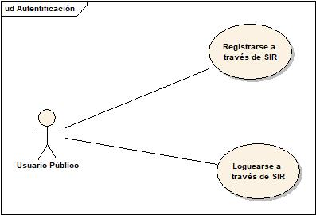
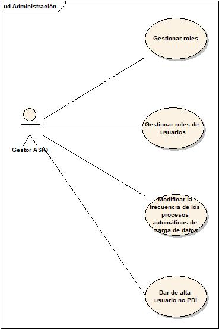
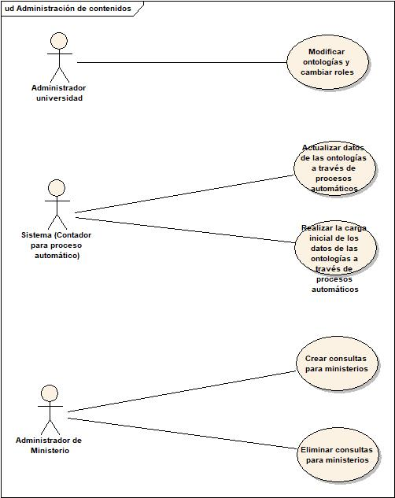
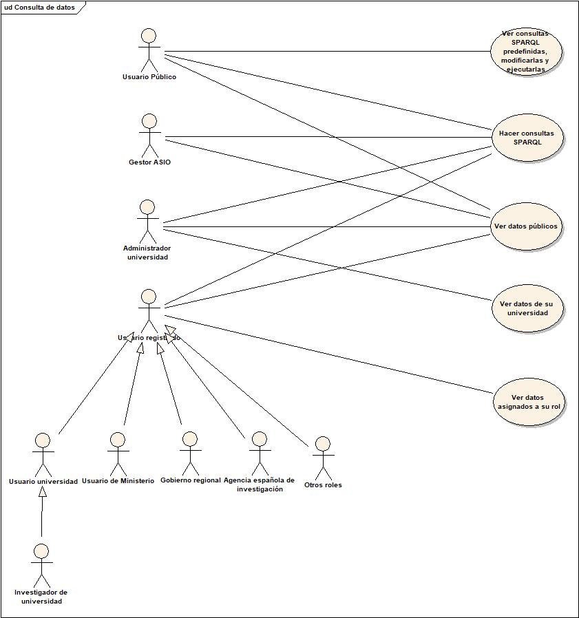
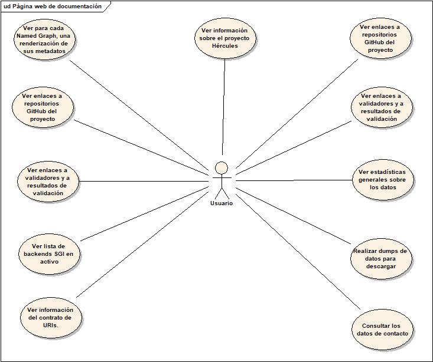

# Casos de uso

## Introducción

Para entender los casos de uso debemos saber que en la aplicación ASIO disponemos de varios actores:

- Gestor ASIO: Son los usuarios con rol de administrador general del sistema.
- Usuarios públicos: Son los usuarios que entran en el portal de forma pública, sin loguearse en él, o usuarios que se loguean a través de SIR pero no tienen ningún rol asociado existente en la aplicación.
- Administradores de las universidades: Son usuarios con rol de administrador de una universidad, podrán modificar datos relativos a esa universidad.
- Sistema: Llamamos sistema a cualquier proceso del servidor que lance una acción. 
- Otros actores: Son usuarios que tienen permisos para ver determinados datos, configurados por los administradores de las universidades. Estos roles, pueden ser creados, modificados y borrados por usuarios con rol Gestor ASIO, y por ahora disponemos de unos predeterminados, que son:
  - Investigador de universidad
  - Usuario para consultas de universidad
  - Ministerio
  - Gobierno regional
  - Agencia Española de investigación

## Casos de uso

### Autentificación

Un usuario público se puede registrar y acceden a través del sistema SIR.

### Administración

Los usuarios con rol Gestor ASIO podrán gestionar roles, gestionar los datos de usuarios y su rol y modificar la frecuencia de carga de datos de forma automática.

### Administración de contenidos

Los usuarios con rol administrador de universidad, podrán: 

- Modificar ontologías y asignarles roles para la visualización de los datos a través de la aplicación web.
- Crear ontologías y cargar datos de estas a través de ficheros CSV, XML y Json a través de la web y Servicios Rest.
- También podrán subir estos ficheros a través de un FTP.

El propio sistema lanzará un proceso con una frecuencia que podrá ser editada por el usuario administrador, que cargará los datos ficheros almacenados en el FTP.

### Visualización de contenidos

Todos los usuarios podrán acceder a la pantalla de consultas y hacer consultas en formato SPARQL, también verán las consultas predeterminadas de su rol y podrán modificarlas. En los resultados de la consulta sólo se mostrarán los datos visibles para su rol (configurado por el usuario administrador de universidad), pero si la consulta es una agregación, si se tendrán en cuenta estos datos.

## Página web de documentación

La aplicación web permitirá ver las diferentes documentaciones disponibles a cualquier usuario.

