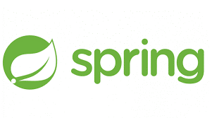

# Anexo - Información básica sobre tecnologías

Este documento pretende recopilar la información básica sobre las tecnologías utilizadas para el desarrollo de la infraestructura semática.

## Spring

Como framework de desarrollo se utilizará Spring el cual es el framework "Open Source" más utilizado para la plataforma J2EE. 



Spring ofrece módulos para proveer diferentes funcionalidades dentro de una aplicación J2EE, como por ejemplo:

- Administración del ciclo de vida de los objetos Java
- Inyección de dependencias (DI)
- Configuración
- Acceso a datos, por sí mismo o en conjunto con otros componentes como Hibernate
- Gestión de transaccionalidad
- Modelo Vista Controlador (MVC)
- Autenticación y autorización
- Aspectos
- Testing

Las ventajas que nos proporcionaría Spring para este tipo de proyectos serían un poco las ya comentadas, aunque si bien es cierto que pueden existir alternativas para la funcionalidad básica de inyección de dependencias y transaccionalidad utilizando CDI (de hecho Spring se podría utilizar como una implementación de CDI), Spring provee otro tipo de herramientas que facilitarían simplificarían de forma sustancial el desarrollo, como por ejemplo:

- Mediante Spring Data se provee una implementación de los Repositories (DAO) con las operaciones más comunes (save, delete, update, findAll, …), por tanto sin necesidad de implementarlos para todas y cada una de las entidades. Además dispone de un mecanismo por el cual, con la definición de un método en la interfaz del repositorio, mediante su nombre es capaz de "autoimplementarlo", como por ejemplo si en la entidad existe una propiedad "name" y en el nombre del método se llama findByName, automáticamente es capaz de realizar la búsqueda sin necesidad de definir una implementación que contenga una named query o un criteria. Más información: https://docs.spring.io/spring-data/jpa/docs/current/reference/html/#reference
- Spring Data también incluye el concepto de Specification, que ayudan a utilizar Criteria API de forma que facilitan la implementación de buscadores
- Spring Security es uno de los mecanismos más potentes para implementar toda la capa de seguridad, dando la posibilidad de utilizar distintos mecanismos de seguridad como CAS, OAuth, etc.
- Spring Boot es capaz de eliminar todos y cada uno de los ficheros de configuración XML, utilizando en sustitución clases Java anotadas con `@Configuration`. Esto da una potencia y flexibilidad enorme a la hora de definir los Beans más complejos. https://www.baeldung.com/spring-bean-annotations
- Spring provee starters que ayudan en la configuración de la aplicación, así como la integración de la misma con servicios externos, siempre que no se salga de los rangos habituales
- Spring Batch, para la generación de procesos desatendidos que se tengan que ejecutar periódicamente
- Spring AOP para la definición de Aspectos y Proxies
- En general, es tan extenso que para cualquier problema que se presente, es muy probable que Spring tenga una solución que ayude a su implementación / configuración

## Docker

Docker es un conjutno de herramientas que se usan para virtualizar a nivel de sistema operativo con el objetivo de distribuir paquetes de software mediante contenedores.


Las ventajas que aporta son las siguientes:

- Los contenedores se encuentran aislados unos de los otros
- Contienen todo el software que es necesario para la correcta ejecución del software
- La plataforma es capaz de ejecutar cualquier tipo de aplicación que corra en un contenedor, independiementemente de como esté desarrollada

## Kubernetes

Kubernetes es una plataforma opensource para orquestar contenedores como por ejemplo Docker. Las aplicaciones de un entorno productivo real puedean abarcar varios contenedores, los cuales hay que alojarlos en varios nodos físicos con varias instancias de cada uno. Kubernetes ofrede la capacidad de organización y gestión necesaria para implementar contenedores para soportar grandes cargas de trabajo. 


Entre las ventajas que aporta Kubernetes:

- Orquestar contenedores en múltiples hosts.
- Hacer un mejor uso del hardware para maximizar los recursos necesarios para ejecutar sus aplicaciones empresariales.
- Controlar y automatizar las implementaciones y actualizaciones de las aplicaciones.
- Montar y añadir almacenamiento para ejecutar aplicaciones con estado.
- Escalar las aplicaciones en contenedores y sus recursos sobre la marcha.
- Administrar servicios de forma declarativa, que garanticen que las aplicaciones implementadas siempre se ejecuten del modo que las implementó.
- Comprobaciones de estado y autorregeneración de sus aplicaciones con ubicación, reinicio, replicación y escalamiento automáticos.

### Pods

La unidad básica de planificación en Kubernetes se denomina pod. Esta agrega un nivel de abstracción más elevado a los componentes en contenedores. Un pod consta de uno o más contenedores en los que se garantiza su ubicación en el mismo equipo anfitrión y pueden compartir recursos. Cada pod en Kubernetes es asignado a una única dirección IP (dentro del clúster) que permite a las aplicaciones utilizar puertos sin riesgos de conflictos. Un pod puede definir un volumen, como puede ser un directorio de disco local o un disco de red, y exponerlo a los contenedores dentro del pod. Los pods pueden ser administrados manualmente a través de la API de Kubernetes, o su administración puede ser delegada a un controlador.

### Controladores

Un controlador es un bucle de reconciliación que lleva al estado real del clúster hacia el estado deseado. Hace esto mediante la administración de un conjunto de pods. Un tipo de controlador es un "Replication Controller", que se encarga de la replicación y escala mediante la ejecución de un número especificado de copias de un pod a través de un clúster. También se encarga de crear pods de reemplazo si un nodo subyacente falla. Otros controladores que forma parte del sistema central de Kubernetes incluye al "DaemonSet Controller" para la ejecución de exactamente un pod en cada máquina (o algún subconjunto de máquinas), y un "Job Controller" para ejecutar pods que ejecutan hasta su finalización, por ejemplo como parte de un trabajo batch. El conjunto de pods que un controlador administra está determinado por los selectores de etiquetas que forman parte de la definición del controlador.

### Servicios

Un servicio Kubernetes es un conjunto de pods que trabajan en conjunto, como una capa de una aplicación multicapas. El conjunto de pods que constituyen un servicio está definido por el selector de etiquetas. Kubernetes provee de un servicio de descubrimiento y enrutamiento de pedidos mediante la asignación de una dirección IP estable y un nombre DNS al servicio, y balancea la carga de tráfico en un estilo round-robin hacia las conexiones de red de las direcciones IP entre los pods que verifican el selector (incluso cuando fallas causan que los pods se muevan de máquina en máquina). Por defecto un servicio es expuesto dentro de un cluster (por ejemplo, pods de un back end pueden ser agrupados en un servicio, con las peticiones de los pods de front end siendo balanceadas entre ellos), pero un servicio también puede ser expuesto hacia afuera del clúster.

## Angular

Para los frontales se propone la utilización de Angular como framework de desarrollo.


Angular es un framework de JavaScript Open Source, mantenido por Google, que se utiliza para crear y mantener aplicaciones web "single page". Una single-page application (SPA), o aplicación de página única es una aplicación web o es un sitio web que cabe en una sola página con el propósito de dar una experiencia más fluida a los usuarios como una aplicación de escritorio.

Angular es un framework muy simple en su uso, con una curva de aprendizaje que lo hace muy fácil de aprender, pero difícil de dominar. Esto hace que tenga un peaje de entrada muy bajo para nuevos desarrolladores.

### Patrones de diseño 

El framework está apoyado en los patrones MVC y MVVM que aportan grandes bondades a la arquitectura del front como son:
- Separación semántica de capas: la aplicación se divide claramente en la capa de controladores, servicios y vista, dando una separación clara de responsabilidades para cada componente.
- Vinculación directa del controlador y la vista a través del patrón MVVM: Como se comentó anteriormente, gracias al patrón dirty-checking no se requiere utilizar un patrón especial y se evita en gran medida la microprogramación, reduciendo en gran medida los errores de programación.
- Actualización directa de la vista por medio de bindings: El patrón MVVM permite actualizar la vista desde la lógica del controlador sin necesidad de microprogramación.
- Inyección de dependencias: El framework incluye un sistema de inyección de dependencias y gestión de espacios de nombres, que evitan el uso de librerías externas como RequireJS.

### Templating

Los templates de Angular se basan 100% en lenguaje HTML, lo cual simplifica las tareas de maquetación y los cambios requeridos en la estructura HTML de la salida deseada. Además, este es un hecho que facilita incluso que un maquetador que no sabe nada de Angular pueda realizar trabajos en la aplicación de manera rápida sin requerir muchas explicaciones o asistencia. Ejemplo:

```html
<ul> 
    <li ng-repeat="framework in frameworks" title="{{framework.description}}">               
                  {{framework.name}} 
    </li> 
</ul>
```

En este sentido los templates se basan en lo que Angular denomina "directivas", que en este entorno se traducen en etiquetas y atributos en el template según se desee.

### Testing

Como parte de Angular se encuentra desarrollado un módulo que permite generar mocks de inyecciones de dependencias y servicios REST de una forma ágil.

Se suele usar en conjunción con Jasmine y Karma para la automatización de tests en entornos de integración continua y la publicación de resultados.

- Karma: Se trata de una librería NodeJS para la inicialización de un servidor web simple que sirva el código de los tests para su ejecución en navegadores de manera automatizada. Por ejemplo, PhantomJS (un navegador headless webkit).
- Jasmine: Herramienta para la creación de tests de comportamiento. 

También posee herramientas para la generación de tests E2E (end-to-end) que simulan la interacción del usuario con la aplicación. Igualmente, los tests utilizan Jasmine para su des-cripción, dando un resultado coherente.

Todo esto está documentado y apoyado por los creadores del framework de manera oficial.

### Documentación

Un aspecto importante de cara al aprendizaje y la mantenibilidad es una buena documentación.

Angular provee un extenso sitio web que contiene la documentación de todas las versiones publicadas: [https://angular.io/docs](https://angular.io/docs)

Además, también se pueden encontrar multitud de tutoriales en internet de diferentes naturalezas que cubren prácticamente todos los aspectos del framework.

### Gestión de dependencias

Aunque no es una característica única de Angular, es compatible con NPM para la gestión dependencias al estilo de cómo se utiliza Maven en entornos Java permitiendo evitar mantener pesados repositorios GIT o SVN con código que no pertenece realmente a la aplicación.

Esta herramienta también ofrece soporte a la coherencia de las versiones instaladas de cada librería para evitar incompatibilidades y también a su actualización.