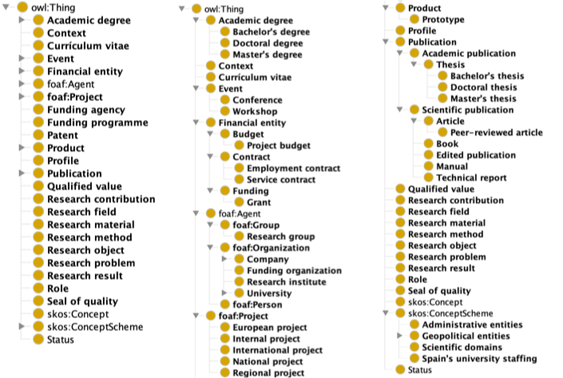

# Ontology specification

## 0. About this document

This document reports the current status of the ASIO ontology files and more specifically it describes *grosso modo* six of the files currently available in our repositories, namely:

- [asio-core.ttl](asio-core.ttl)
- [asio-mappings.ttl](asio-mappings.ttl)
- [asio-vertical-module-geopol.ttl](asio-vertical-module-geopol.ttl)
- [asio-vertical-module-scientificdomains.ttl](asio-vertical-scientificdomains.ttl)
- [asio-vertical-module-subjectareas.ttl](asio-vertical-subjectareas.ttl)
- [asio-vertical-module-universities.ttl](asio-vertical-module-universities.ttl)

The first one is the ***core*** ontology and the second one corresponds to the class-by-class ***alignements*** towards external vocabularies

In addition to these two files, a number of ***vertical modules*** have being released at the moment of this writing. The earliest release was the **geopolitical module** (the third file listed above) including so far the full list of world's countries, the geopolitical entities of Andorra, Spain and Portugal (France is the other country to be taken into account in this vertical module in the next update).

Two other vertical modules, related within each other, are the **scientific domains** and the **subject areas**. Both are controlled vocabularies including scientific domains and fields and used in different requirements by the core ontology.

Finally, the vertical module **universities** included the full list of universities from Spain with a limited sample of university subdivisions (centres, campus, faculties, etc.) corresponding to the Murcia, Oviedo, Santiago de Compostela and Basque country universities.


## 1. Introduction

The ASIO ontologies are standardised data schemas (or "vocabularies") designed to address the Research Management of the particular case of the University of Murcia but by applying an encompassing model capable of addressing too other universities both at the national level and at the international level.

In this brief section we are going to explain the large-scale organization of the ASIO ontology, which is split into a central and peripheral components, loosely inspiring ourselves in Fodor (1983). To do so we need to distinguish between two fundamentally different types of information processing (relying upon information architecture and datasets).

On the one hand, there are highly-specialised information-processing tasks, such as identifying and retrieving data from specific environments. Informational-based tasks in these specific environments should be carried out automatically and should involve only a limited type of information. That is why information retrieval tasks having to do with this first type of information are carried out by dedicated parts of the ontology that we call ***modules***. These modules are *domain-specific* –that is, they are responsible only for tasks falling in particular domains (geopolitical, scientific, administrative, staffing, etc.).

On the other hand, there are central informational tasks that involve much more complex and wide-ranging inferences and to which an indefinite amount of background information is potentially relevant. The information processing involved in carrying out these tasks is *domain-general* (conversely to domain-specific) and it concerns our main *university domain* (our ***core***), because we understand *general* here as our general domain.

On the basis of this distinction, we develop an architecture of the ontological organization as involving both very specialized modules (***vertical modules***) and what we call domain-general, non-modular knowledge (***core ontology***). Two properties of modularity in particular, *informational encapsulation* and *domain specificity*, make it possible to tie together questions of functional architecture with those of knowledge content.


## 2. Core ontology

### 2.1. prolegomena

In any informational system, in this case an ontology, there must be non-modular processing –or what we call central processing, to distinguish it from modular processing, which is peripheral (our vertical modules).

To say that a part of the ontology is core (i.e. involves central processing actions) is, essentially, to say that it is not informationally encapsulated (as the vertical modules). In principle, any part of the system is relevant to confirming any other and we do not draw boundaries within it.


### 2.2. the core ontology at a glance

In this draft doccument due to time limitation, we are just going to show the reader the classes through a screenshot from Protégé and a diagram showing some of the classes and properties in use.

These are the full list of classes (available also in the [LODE](https://essepuntato.it/lode/) generated HTML file accompaning this document), with the miniature on the left shwing just the superclasses and the two in the central and right part of the illustration the whole list of classes:





An example loosely coming from one of competence questions shows how some of these classes, through instances are related:


**DISCLAIMER about the properties**: Properties, from both the object and data type, are still a work in progress and the assignation of domains and ranges are often neglected at this stage of the implementation. Domains and ranges are delicate matter with respect to the ontological commitments of the vocabulary and must be still studied.


### 2.3. imported vocabularies

Two external vocabularies are imported to deal with specific-knowledge domains of relevance for the project:

- [Research object](https://wf4ever.github.io/ro/2016-01-28/)

- [SWEET Ontology Human Technology Readiness](https://esipfed.github.io/stc/sweet_lode/humanTechReadiness.html)

These two vocabularies are used by the ASIO ontology to relate the core ontology and its clases to two  entities that currently are pivotal to university research projects. 

**Research objects** aggregate a number of resources that are used and/or produced in a given scientific research and in the ASIO ontology are linked to the scientific domains described in the eponymous, ad hoc vertical module described later on. The [RO](https://wf4ever.github.io/ro/2016-01-28/) ontology is mapped to the ASIO ontology through the property `asio:hasScientificDomain`.

The **technology readiness levels (TRLs)**, initially developed at NASA during the 1970s and from there included by the European Commission's EU Horizon 2020 program (Mihaly, 2017), are a method for estimating the maturity of technologies during the acquisition phase of a program. They condition therefore any European project proposal and development and are currently a critical factor for research projects. The ASIO ontology takes advantage of this mini-ontology part of the SWEET ontology family by importing it. The SWEET [HTR](https://esipfed.github.io/stc/sweet_lode/humanTechReadiness.html) ontology is mapped to the ASIO ontology through the property `asio:hasTRL`.

We can consider a temporary and sui generis semi-importation the usage of some classes and object properties belonging to the [ORKG ontology](https://gitlab.com/TIBHannover/orkg/orkg-ontology/-/blob/master/orkg-core.ttl) that we included in the core ontology, all of them having to do with research. These entities are included as a first approach in order to enable a collaboration with the people responsible for that vocabulary, with whom we are in contact.


### 2.4. multilingualism in the core ontology

The entire list of classes in the core ontology is enriched multilingually via the data property `rdfs:label` and, besides the two obvious working languages (English, Spanish), three more languages are included: Catalan, French and Portuguese, as corresponding to the three other countries that we take into account in addition to Spain for geographically modelling our domain: Andorra, France and Portugal.

The motivation of this choice is, on the one hand, geopolitical, as Catalan, French and Portuguese are languages in contact with Spanish through land borders (Andorra, France, Portugal) and, on the other hand, practical, as those three languages are more or less mastered by members of the development team, something that ensures a *direct* multilingual treatment. Note that Catalan is also a coofficial language in some Autonomous Communities of Spain.

The Iberian peninsula as a *multilingual* whole, besides English as a *lingua franca* and French as a relevant neighboring language, is taken hence as a *scale model* of the multilingual nature of the European Union, and *exploited* as an intuitive advancement from the ultralocal reality to the global context, something that the British sociologist Roland Robertson coined *glocalization* (Kumaravadivelu, 2008:45).

In that sense, the labels in the Western *killer* *languages*, a concept we take from Anne Pakir (Skutnabb-Kangas, 2000), such as English, French, Portuguese and Spanish, are dealt with specificifying *locales* when necessary and/or applicable (en-GB, en-US, fr-FR, fr-CA, pt-PT, pt-BR, es-ES, es-MX, es-AR, etc).

Let's have a look at one example corresponding to the class **Master's thesis**:

```turtle
###  http://www.asio.es/asioontologies/asio#MastersThesis
asio:MastersThesis rdf:type owl:Class ;
                   rdfs:subClassOf asio:Thesis ;
                   owl:disjointWith asio:PhDThesis ;
                   rdfs:comment "A thesis reporting a research project undertaken as part of an undergraduate course of education to receive a master's degree."@en ;
                   rdfs:label "Dissertação de mestrado"@pt-PT ,
                              "Dissertação de mestrado"@pt-BR ,
                              "Tese de mestrado"@pt-AO ,
                              "Master's thesis"@en ,
                              "Mémoire de maîtrise"@fr-FR ,
                              "Mémoire de maîtrise"@fr-BE ,
                              "Mémoire de maîtrise"@fr-CH ,
                              "Mémoire de maîtrise"@fr-CA ,
                              "Trabajo de fin de máster"@es-ES ,
                              "Tesis de fin de máster"@es-PY ,
                              "Tesis de maestría"@es-MX ,
                              "Tesis de maestría"@es-AR ,
                              "Tesis de maestría"@es-CO ,
                              "Tesis de maestría"@es-CU ,
                              "Tesis de magíster"@es-CL ,
                              "Treball de fi de màster"@ca-ES ,
                              "Treball de fi de màster"@ca-AD .
```

As we can see in the code snippet, for the case of this class, the Portuguese language does not show differences bewteen the Portugal and the Brasil locales (both use *dissertação de mestrado*) but its Angolan locale does distinguish itself (*Tese de mestrado*). In the case of the francophone locales for France, Belgium, Switzerland and Canada (Québec), they all match the *Mémoire de maîtrise* denomination. The same applies to the Anglo-Saxon world, for which we don't specify locale.

In Spanish though the situation varies and we specify the Spain locale, *Trabajo de fin de máste*r, with a sad linguistic calque from English (*máster*), from the locales for Mexico, Argentina, Colombia or Cuba, more genuine linguistically speaking (*maestría*), or the case of Chile (*magíster*), more latinazing.

Obviously, the granularity of detail regarding ***i18n*** and ***L10n*** applied to the core ontology in this release is still far from being concluded and at the time of this writing more candidate labels (preferent and alternative) and locales are being analysed and are expected to be included in the May release of the ontology.


## 3. Alignements with other vocabularies

In addition to reusing specific classes and properties or importing full external vocabularies of interest, as described above, the ASIO ontology also provides mappings to classes considered equivalent to the ones defined in the specification.

To do so, the second file ([asio-mappings.ttl](https://git.izertis.com/universidaddemurcia/semantmurc/asio-docs/blob/master/entregables_hito_1/01-Red_de_Ontologías_Hércules/asio-mappings.ttl)) gathers together a thorough study of equivalent classes belonging to related vocabularies and maps them to the ASIO vocabulary via the OWL property `owl:equivalentClass`. This property is safer than the *risky* property `owl:sameAs`, which logical implications might wreak havoc because of undesired inheritances and collateral damages.

The same applies to relevant properties belonging to concurrent vocabularies, which are being mapped in this file using `owl:equivalentProperty`.

More details about these alignments, carried out following consolidated recommendations (Vandenbussche et al.: 2014), will be provided in more consolidated documentation to be generated soon, but right now it suffices to access the file using a source code editor and have a look at the large list of equivalences, chiefly focusing on concomitant vocabularies such as CERIF, VIVO or the SPAR family of ontologies but also going beyond these ones.


## 4. Vertical modules

As far as the **vertical modules** are concerned another five final candidates are being implemented so far, in particular:

- geopolitical entities
- administrative entities
- scientific domains
- subject areas
- Spanish universities

An extra vertical module, called *Spain's university staffing*, is currently located within the core ontology as instances of the class *asio:Role*, but it is currently being migrated as an independent vertical module, so other equivalent university staffing from other countries can be plugged in an easier way by replicating the provided framework and populating it with the reality of, for instance, Portugal's university staffing or France's.

The vertical modules are the ideal playground for testing multilingualism and multiscriptalism.


### 4.1. geopolitical entities

As we mentioned at the beginning of this document, the more advanced vertical module so far, already released in an early version, is the geopolitical one. It currently covers the full list of countries and the geopolitical subdivisions of:

- Andorra: implementing just the first-level subdivisions (*parròquies*)
- Portugal: implementing both the first (*distritos e regiões*) and the second-level (*municípios*) subdivisions.
- Spain: covering the first (*comunidades autónomas*) and the second (*provincias*). The third-level subdivisions (*municipios*) are already implemented and ready to be plugged in but have not being added yet.

At the moment of this writing France and its subdivisions (*régions* and *départements*) are being transformed and is expected to be released in the next weeks, linked to the other datasets.

SKOS-Core was also chosen to model a clearly hierarchical domain and the dataset is massively enriched multilingually and ponderously linked to relevant national and international vocabularies. 

The main goal of this vertical module, which is in a way also transversal, is to geopolitically *locate* agents, organizations and other resources included in the ASIO ontology with an encompassing granularity.


### 4.2. scientific domains

**Note** that this vertical module is being implemented at the moment and it is not included in this release but, as it is already designed, we include already documentation about it. The transformation of the tabular data will be carried out in the next weeks so to be *plugged in* as vertical module, similarly to the geopoolitical one.

#### 4.2.1 prolegomena

The [Spain's Ministry of Science, Innovation and Universities](http://www.ciencia.gob.es/), through its [State Research Agency](http://www.ciencia.gob.es/portal/site/MICINN/menuitem.8d78849a34f1cd28d0c9d910026041a0/?vgnextoid=664cfb7e04195510VgnVCM1000001d04140aRCRD), published a document featuring a number of [**Scientific domains**](http://www.ciencia.gob.es/stfls/MICINN/Ayudas/PE_2013_2016/PE_Promocion_e_Incorporacion_Talento_y_su_Empleabilidad/FICHEROS/SE_Incorporacion/Ayudas_contratos_RYC_2016/Clasificacion_areas_cientificas_2016_AEI.pdf) which are the basis for several ones among the competence questions provided by the University of Murcia in order to model the ontology.

#### 4.2.2. modelling & transformation

After a thorough analysis of that document, a clear hierarchical structure of domains and subdomains was identified and it was deemed as seamlessly fitting a thesaurus-like structure and hence suitable to be ontologically transformed using the W3C's standard for controlled vocabularies: [SKOS-Core](https://www.w3.org/TR/swbp-skos-core-spec/).

SKOS-Core is not just the most appropriate solution for such a document featuring a level-structure thesaurus-like fully exploiting its classes `skos:Concept` (for *agglutinating* concepts) and `skos:ConceptScheme` (in order to arrange concepts *knitting* them together into schemes of concepts), but it also provides means to include models densely multilingual, as checkable with some European thesauri such as [GEMET]([ttps://www.eionet.europa.eu/gemet/en/about/](https://www.eionet.europa.eu/gemet/en/about/)) or [EuroVoc](https://data.europa.eu/euodp/en/data/dataset/eurovoc).

#### 4.2.3. added value

Hence, besides being able to seamlessly *assimilate* these **Scientific domains** within the ASIO ontology through an *ad hoc*, vertical module, we have improved the Ministry's document in a number of ways:

- processing and transforming it from an only-reading format (PDF), which would be categorised as simply [linked data](https://www.w3.org/DesignIssues/LinkedData.html) of low-quality or 1-star ("Available on the web (whatever format) *but with an open licence, to be Open Data*"), to a high-quality, or [5-star quality](https://www.w3.org/community/webize/2014/01/17/what-is-5-star-linked-data/), linked data format ("non-proprietary format (e.g. CSV instead of excel), open standards from W3C (RDF and SPARQL) to identify things and link your data to other people’s data to provide context").
- exploiting the full possibilities of multiligualism provided by SKOS with the aim of internationalising and localising the dataset, understanding here *internationalising* and *localising* as the processes to design an IT resource as fully adaptable to different languages and regions without later having to reengineering or changing the code. This way, the language labels for the scientific domains, originally just in Spanish, have been adapted to a multilingual context which not only covers English as *lingua franca* but also three languages in contact with Spanish through land borders (Catalan, French and Portuguese) and a number of cooficial regional languages (the aforementioned Catalan but also Basque and Galician) and even some linguistic varieties with a certain recognition at regional level (Aragonese, Asturian, Occitan).

An graphical example of the preprocesse file corresponding to the first-level of the scientific domains can be seen here:


where still in a tabular format we can check out a first column with codes that will be used in the opaque URIs of the concepts and the encompassing multilingual labels in Aragonese, Asturian, Catalan, English, Spanish, Extremaduran, Basque, French, Galician, Occitan, Portuguese, phonetic transcription of Spanish according to the Spain locale, phonetic transcription of English according to the British locale and phonetic transcription of English according to the General American locale.

In addition to the ontological possibilities offered by SKOS (which is itself an ad hoc ontology) with respect to the ASIO core ontology, these mentioned multilingual labels provide idoneous raw materials to carry out extensively testing with respect to multilingualism, as detailed in the previous section and in a complementary deliverable (*ModeloMultilinguismo*).

### 4.3 subject areas


### 4.4. Spain's university staffing

Finally, all the specificities of the teaching-and-research positions in the universities of Spain are dealt with in this vertical module, which is still a **work in progress**.

Following a number of informal interviews with informants directly linked to the domain, we have started to gather together an alluvium of entities:


As a **disclaimer** we must warn the reader that these entities are not at all final candidates to populate the vertical module: they are just a starting point in the modelling and just the result of an initial brainstorm carried out in one specific university. They will be contrasted with equivalent entities in the university of Murcia, other universities and, obviously, with reference documents such as the [Ley Orgánica de Universidades](https://www.boe.es/buscar/pdf/2001/BOE-A-2001-24515-consolidado.pdf
) and the [Estatuto Básico del Empleado Público](https://www.boe.es/buscar/act.php?id=BOE-A-2015-11719
).


### 4.5. administrative entities

Another vertical module being implemented right now but not yet available is designed to encompass all the relevant entities belonging to Spain's *administración autonómica* related to the geopolitical subdivisions of the previous vertical module, to which they are going to be seamlessly linked.

It is, at the moment of this writing, a work in progress but the implementation so far includes the first-level bodies of *administración autonómica* (*conserjerías*), as available at Spain's administration portal [[1]](https://administracion.gob.es/pagFront/espanaAdmon/directorioOrganigramas/comunidadesAutonomas/comunidadesAutonomas.htm?idCCAA=14), and the second-level [[2]](https://administracion.gob.es/pagFront/espanaAdmon/directorioOrganigramas/fichaUnidadOrganica.htm?idUnidOrganica=123276&origenUO=comunidadesAutonomas&volver=comunidadesAutonomas&idCCAA=14), mainly *direcciones generales* and *consorcios*.

The implementation of this vertical module will be also carried out using SKOS-Core.

## 5. References

Fodor, J. A. (1983). *The modularity of mind*. Bradford/MIT Press, Cambride, Mass. 

Kumaravadivelu, B. (2008). *Cultural Globalization and Language Education*. Yale University Press.

Mihaly, Heder (2017). "From NASA to EU: the evolution of the TRL scale in Public Sector Innovation". *The Innovation Journal*. 22: 1–23.

Skutnabb-Kangas, T. (2000). *Linguistic Genocide in Education*. New Jersey: Lawrence Erlbaum Associates Inc.

Vandenbussche, P.; Atemezing, G.; Poveda-Villalón, M.; Vatant, B. (2014). *Pierre-Yves V. et al. / LOV: a gateway to reusable semantic vocabularies on the Web*. (article, IOS Press, 2014), DOI: 8. 437-452. 10.3233/SW-160213, available at [Semantic Web Journal](http://www.semantic-web-journal.net/system/files/swj1127.pdf).


## Annex: competence questions and the ontology

This annex provides a list of the competence questions provided by the University of Murcia and the current responses for them by the ASIO ontology so far. The satisfaction of the questions is still temporary, as it is a work in progress at the moment of this writing, and it is expected to be concluded for the milestone of May.

The status for the competence question can be 'yes', 'no' or 'partially', being the latter a

### General questions

| Competence question                                          | Comment                                                      |
| ------------------------------------------------------------ | ------------------------------------------------------------ |
| CQ01. Como usuario requiero obtener un listado de los centros/estructuras de investigación que trabajan en un área/disciplina específica. | [issue](https://github.com/weso/hercules-ontology/issues/9), [query1](https://github.com/weso/hercules-ontology/blob/master/doc/competency_questions/CQ001_a.sparql) & [query2](https://github.com/weso/hercules-ontology/blob/master/doc/competency_questions/CQ001_b.sparql) |
| CQ02. Como usuario requiero obtener un listado de los investigadores de un centro/estructura de investigación de un área/disciplina específica. Este listado podrá filtrarse según el tipo de investigador ya sea docente, personal investigador en formación, etc. | [issue](https://github.com/weso/hercules-ontology/issues/11) & [query](https://github.com/weso/hercules-ontology/blob/master/doc/competency_questions/CQ002.sparql) |
| CQ03. Como usuario requiero obtener el Top 10 (o el número que se considere relevante pues será parametrizable) de los investigadores de un centro/estructura de investigación ordenados por el número de citas, número de publicaciones, h-index, etc. en un área/disciplina específica. [*As a user I would like to obtain the Top 10 (or any relevant number, as this would be a parameter) research centers/strutures who have quality seals associated, such as the Severo Ochoa seal*.] | [issue](https://github.com/weso/hercules-ontology/issues/10), [query1](https://github.com/weso/hercules-ontology/blob/master/doc/competency_questions/CQ003_a.sparql) & [query2](https://github.com/weso/hercules-ontology/blob/master/doc/competency_questions/CQ003_b.sparql) |
| CQ04. Como usuario requiero obtener el Top 10 (o el número que se considere relevante pues será parametrizable) de centros/estructuras de investigación que posean sellos de calidad asociados, por ejemplo: el sello Severo Ochoa. | [issue](https://github.com/weso/hercules-ontology/issues/16) & [query](https://github.com/weso/hercules-ontology/blob/master/doc/competency_questions/CQ004.sparql) |
| CQ05. Como usuario requiero obtener un listado de los centros/estructuras de investigación que hayan realizado proyectos H2020 y/o proyectos del Plan Estatal. | [issue](https://github.com/weso/hercules-ontology/issues/12) & [query](https://github.com/weso/hercules-ontology/blob/master/doc/competency_questions/CQ005.sparql) |
| CQ06. Como usuario requiero obtener un listado de la producción científica en un determinado rango de fechas de un centro/estructura de investigación en un área/disciplina. Para cada resultado se incluirán algunos metadatos importantes de la producción como, por ejemplo, DOI, año de publicación, etc. | [issue](https://github.com/weso/hercules-ontology/issues/17) & [query](https://github.com/weso/hercules-ontology/blob/master/doc/competency_questions/CQ006.sparql) |
| CQ07. Como usuario requiero obtener una visualización en la que se recoja la distribución de la producción científica española, por ejemplo, de artículos publicados en revistas, según las comunidades autónomas en un rango de años. | [issue](https://github.com/weso/hercules-ontology/issues/13), [query1](https://github.com/weso/hercules-ontology/blob/master/doc/competency_questions/CQ007_a.sparql) & [query2](https://github.com/weso/hercules-ontology/blob/master/doc/competency_questions/CQ007_b.sparql) |
| CQ08. Como usuario requiero comparar comunidades autónomas, universidades, grupos de investigación, etc. en determinados tópicos para identificar cuál es el más competitivo y por qué. | [issue](https://github.com/weso/hercules-ontology/issues/18) & [query](https://github.com/weso/hercules-ontology/blob/master/doc/competency_questions/CQ008.sparql) |
| CQ09. Como usuario requiero obtener un listado de patentes, diseños industriales, etc. de un centro/estructura de investigación en un área/disciplina. | [issue](https://github.com/weso/hercules-ontology/issues/14) & [query](https://github.com/weso/hercules-ontology/blob/master/doc/competency_questions/CQ009.sparql) |
| CQ10. Como investigador y personal no investigador de la universidad requiero obtener un listado de los proyectos adjudicados/desarrollados, de un centro/estructura de investigación, de un área/disciplina, en un determinado año de búsqueda en los que se tenga acceso al detalle de al menos:<br/>○	Nombre del proyecto<br/>○	Palabras claves<br/>○	Tipo de participación: coordinador o participante<br/>○	Tipo de proyecto: competitivo o no competitivo<br/>○	Tipo de financiamiento: público o privado.<br/>○	Tipo de convocatoria: nacional, H2020, etc.<br/>○	Número y listado de personas involucradas en el proyecto<br/>○	Nombre(s) del investigador(s) principal<br/>○	Entregables/memoria del proyecto<br/>○	Producción científica relacionada con el proyecto<br/>○	Entidades colaboradoras/participantes<br/>○	Cuantía<br/>○	etc. | [issue](https://github.com/weso/hercules-ontology/issues/19) & [query](https://github.com/weso/hercules-ontology/blob/master/doc/competency_questions/CQ010.sparql) |
| CQ11. Como usuario académico no investigador necesito conocer el tamaño, experiencia y envejecimiento de un área de investigación a escala de universidad, regional, nacional. | [issue](https://github.com/weso/hercules-ontology/issues/15) & [query](https://github.com/weso/hercules-ontology/blob/master/doc/competency_questions/CQ011.sparql) |
| CQ12. Como usuario necesito conocer el porcentaje de participación de un centro/estructura de investigación en proyectos nacionales o europeos. | [issue](https://github.com/weso/hercules-ontology/issues/20) & [query](https://github.com/weso/hercules-ontology/blob/master/doc/competency_questions/CQ012.sparql) |
| CQ13. Como investigador, personal no investigador de la universidad requiero insertar/modificar los datos relacionados con los proyectos de investigación, incluyendo los entregables que se hayan generado en la fase de propuesta. El usuario tendrá acceso a esta información según el nivel de acceso que se le haya proporcionado previamente según su rol, según niveles de confidencialidad de ser el caso. Entre los datos que se proporcionarán por cada proyecto se tendrá al menos:<br/>○	Nombre del proyecto<br/>○	Palabras claves<br/>○	Tipo de participación de la entidad: coordinador o participante<br/>○	Tipo de proyecto: competitivo o no competitivo<br/>○	Tipo de financiamiento: público o privado<br/>○	Tipo de convocatoria: nacional, H2020, etc.<br/>○	Número y listado de personas involucradas en el proyecto<br/>○	Nombre(s) del investigador(s) principal<br/>○	Entregables/memoria del proyecto<br/>○	Producción científica relacionada con el proyecto<br/>○	Entidades colaboradoras/participantes<br/>○	Cuantía<br/>○	Etc. | [issue](https://github.com/weso/hercules-ontology/issues/21) & [query](https://github.com/weso/hercules-ontology/blob/master/doc/competency_questions/CQ013.sparql) |
| CQ14. Como usuario necesito una visualización [filtering] que me permita explorar la información de cada proyecto según los filtros que haya elegido, por ejemplo, por años, por tipo de convocatoria, por cuantía mayor a determinado valor, según un área/disciplina, según la ubicación geográfica, etc. | [issue](https://github.com/weso/hercules-ontology/issues/22), [query1](https://github.com/weso/hercules-ontology/blob/master/doc/competency_questions/CQ014_a.sparql), [query2](https://github.com/weso/hercules-ontology/blob/master/doc/competency_questions/CQ014_b.sparql) & [query3](https://github.com/weso/hercules-ontology/blob/master/doc/competency_questions/CQ014_c.sparql) |
| CQ15. Identificar proyectos con temática y objetivos científicos similares. En este caso, el usuario podrá acceder a visualizaciones comparativas de la información de proyectos similares. | [issue](https://github.com/weso/hercules-ontology/issues/30) & [query](https://github.com/weso/hercules-ontology/blob/master/doc/competency_questions/CQ015.sparql) |
| CQ16. Como usuario necesito una visualización que me permita analizar la evolución de un investigador, conjunto de investigadores o líneas de investigación a través de los resultados de los proyectos realizados. Se podrá hacer una selección de los proyectos a incluir. El usuario podrá acceder a visualizaciones comparativas de la información de investigadores, conjuntos de investigadores o líneas de investigación seleccionados. | [issue](https://github.com/weso/hercules-ontology/issues/23) & [query](https://github.com/weso/hercules-ontology/blob/master/doc/competency_questions/CQ016.sparql) |
| CQ17. Como usuario necesito obtener el listado de indicadores con su respectivo valor y unidad de medida (porcentaje, número, etc.) calculados en un periodo de tiempo, ya sea para toda la universidad o para cada centro/estructura de investigación de cada universidad. | [issue](https://github.com/weso/hercules-ontology/issues/32) & [query](https://github.com/weso/hercules-ontology/blob/master/doc/competency_questions/CQ017.sparql) |
| CQ18. Como usuario necesito una visualización de la evolución de indicadores según la línea del tiempo (años, trimestres, etc.) | [issue](https://github.com/weso/hercules-ontology/issues/24) & [query](https://github.com/weso/hercules-ontology/blob/master/doc/competency_questions/CQ018.sparql) |
| CQ19. Como usuario necesito acceder a una predicción de la evolución de indicadores a partir de la serie temporal de sus valores y de las variables existentes en el sistema que se consideren relacionadas, lo cual se podrá parametrizar. | [issue](https://github.com/weso/hercules-ontology/issues/34) & [query](https://github.com/weso/hercules-ontology/blob/master/doc/competency_questions/CQ019.sparql) |
| CQ20. Como usuario necesito detectar tendencias en áreas y líneas investigación a partir de los datos disponibles en Hércules. | [issue](https://github.com/weso/hercules-ontology/issues/25), [query1](https://github.com/weso/hercules-ontology/blob/master/doc/competency_questions/CQ020_a.sparql) & [query2](https://github.com/weso/hercules-ontology/blob/master/doc/competency_questions/CQ020_b.sparql) |
| CQ21. Como usuario necesito cuantificar la contribución de cada investigador, línea de investigación, área de conocimiento, centro de investigación, comunidad autónoma, etc. a cada indicador. | [issue](https://github.com/weso/hercules-ontology/issues/35), [query1](https://github.com/weso/hercules-ontology/blob/master/doc/competency_questions/CQ021_a.sparql) & [query2](https://github.com/weso/hercules-ontology/blob/master/doc/competency_questions/CQ021_b.sparql) |
| CQ22. Como usuario tengo interés en hacer clusters de líneas y áreas de investigación, investigadores, grupos, centros de investigación, comunidades autónomas, etc. usando como criterio de clasificación uno o varios indicadores de productividad a elegir por el usuario. | [issue](https://github.com/weso/hercules-ontology/issues/26) & [query](https://github.com/weso/hercules-ontology/blob/master/doc/competency_questions/CQ022.sparql) |
| CQ23. Como usuario investigador y gestor, estoy interesado en conocer qué líneas y áreas de investigación, investigadores, grupos, centros de investigación, comunidades autónomas, etc. presentan desviaciones significativas con respecto a la media de los indicadores de productividad científica. | [issue](https://github.com/weso/hercules-ontology/issues/37) & [query](https://github.com/weso/hercules-ontology/blob/master/doc/competency_questions/CQ023.sparql) |
| CQ24. Como decisor tengo interés en conocer el perfil y evolución de la relación de investigación y transferencia de una empresa con un conjunto de centros de investigación en un período de tiempo. | [issue](https://github.com/weso/hercules-ontology/issues/27) & [query](https://github.com/weso/hercules-ontology/blob/master/doc/competency_questions/CQ024.sparql) |
| CQ25. Obtener el listado de los trabajos que he dirigido/codirigido ya sean de grado (TFG), máster (TFM), o tesis doctorales. | [issue](https://github.com/weso/hercules-ontology/issues/40), [query1](https://github.com/weso/hercules-ontology/blob/master/doc/competency_questions/CQ025_a.sparql) & [query2](https://github.com/weso/hercules-ontology/blob/master/doc/competency_questions/CQ025_b.sparql) |
| CQ26. Obtener el listado de congresos/workshops y eventos de divulgación científica en los que haya participado indicando el rol que he tenido: organizador, expositor, etc. | [issue](https://github.com/weso/hercules-ontology/issues/28) & [query](https://github.com/weso/hercules-ontology/blob/master/doc/competency_questions/CQ026.sparql) |
| CQ27. Obtener el listado de patentes, diseños industriales, etc. que haya registrado como titular o cotitular X o Y persona, Z o K institución. | [issue](https://github.com/weso/hercules-ontology/issues/41), [query1](https://github.com/weso/hercules-ontology/blob/master/doc/competency_questions/CQ027_a.sparql) & [query2](https://github.com/weso/hercules-ontology/blob/master/doc/competency_questions/CQ027_b.sparql) |
| CQ28. Obtener el listado de proyectos en los que he participado incluyendo el rol que he desempeñado, por ejemplo, investigador principal. | [issue](https://github.com/weso/hercules-ontology/issues/29) & [query](https://github.com/weso/hercules-ontology/blob/master/doc/competency_questions/CQ028.sparql) |
| CQ29. Obtener el listado de mi producción científica.        | [issue](https://github.com/weso/hercules-ontology/issues/43) & [query](https://github.com/weso/hercules-ontology/blob/master/doc/competency_questions/CQ029.sparql) |
| CQ30. Obtener el listado de startup o spin-off que he fundado o de las que he sido socio. | [issue](https://github.com/weso/hercules-ontology/issues/31) & [query](https://github.com/weso/hercules-ontology/blob/master/doc/competency_questions/CQ030.sparql) |
| CQ31. Obtener los indicadores de mi producción científica como, por ejemplo, total de citas, h-index, etc. | [issue](https://github.com/weso/hercules-ontology/issues/45), [query1](https://github.com/weso/hercules-ontology/blob/master/doc/competency_questions/CQ031_a.sparql), [query2](https://github.com/weso/hercules-ontology/blob/master/doc/competency_questions/CQ031_b.sparql) & [query3](https://github.com/weso/hercules-ontology/blob/master/doc/competency_questions/CQ031_c.sparql) |
| CQ32. Visualizar mi trayectoria según la línea del tiempo y parametrizable de acuerdo criterios como, por ejemplo, proyectos, tesis dirigidas/codirigidas, etc. | [issue](https://github.com/weso/hercules-ontology/issues/33) & [query1](https://github.com/weso/hercules-ontology/blob/master/doc/competency_questions/CQ032_a.sparql), [query2](https://github.com/weso/hercules-ontology/blob/master/doc/competency_questions/CQ032_b.sparql) |
| CQ33. Saber si soy apto para solicitar una evaluación relativa al nuevo sexenio de transferencia del conocimiento e innovación  o alguna de las evaluaciones que realiza la ANECA. | [issue](https://github.com/weso/hercules-ontology/issues/48) & [query](https://github.com/weso/hercules-ontology/blob/master/doc/competency_questions/CQ033.sparql) |
| CQ34. Introducir ofertas tecnológicas dirigidas a empresas, para lo cual tendré que describir la oferta, asociarle un nivel de madurez (TRL) y asociar evidencias que soporten el nivel de madurez asignado. | [issue](https://github.com/weso/hercules-ontology/issues/36) & [query](https://github.com/weso/hercules-ontology/blob/master/doc/competency_questions/CQ034.sparql) |


### Questions involving governmental bodies (ministerial and regional)

| Competence question                                          | Comment                                                      |
| ------------------------------------------------------------ | ------------------------------------------------------------ |
| CQ35. Puedo ver el avance justificación técnica y económica de proyectos nacionales/regionales en colaboración entre universidades (agregado y detallado por categoría de gasto)? | [issue](https://github.com/weso/hercules-ontology/issues/49) & [query](https://github.com/weso/hercules-ontology/blob/master/doc/competency_questions/CQ035.sparql) |
| CQ36. Estadísticas: ¿Puedo hacer un ranking de universidades que más fondos han obtenido por temática a nivel nacional o regional? | [issue](https://github.com/weso/hercules-ontology/issues/38) & [query](https://github.com/weso/hercules-ontology/blob/master/doc/competency_questions/CQ036.sparql) |
| CQ37. Estadísticas: ¿Puedo cuantificar las colaboraciones entre universidades del país o una región? | [issue](https://github.com/weso/hercules-ontology/issues/50) & [query](https://github.com/weso/hercules-ontology/blob/master/doc/competency_questions/CQ037.sparql) |
| CQ38. Estadísticas: Puedo ver las publicaciones de un investigador postdoctoral en todas las Universidades de la red. | [issue](https://github.com/weso/hercules-ontology/issues/39) & [query](https://github.com/weso/hercules-ontology/blob/master/doc/competency_questions/CQ038.sparql) |
| CQ39. Estadísticas: Financiación atraída en unos años por todos los investigadores del área de conocimiento X. | [issue](https://github.com/weso/hercules-ontology/issues/51) & [query](https://github.com/weso/hercules-ontology/blob/master/doc/competency_questions/CQ039.sparql) |
| CQ40. Estadísticas: Publicaciones de Universidades andaluzas en colaboración con investigadores fuera de la UE en revistas académicas de impacto. | [issue](https://github.com/weso/hercules-ontology/issues/42) & [query](https://github.com/weso/hercules-ontology/blob/master/doc/competency_questions/CQ040.sparql) |
| CQ41. Control de fraude: identificar sinergias entre proyectos financiados a nivel europeo, nacional y/o regional financiados por diferentes entidades. | [issue](https://github.com/weso/hercules-ontology/issues/52) & [query](https://github.com/weso/hercules-ontology/blob/master/doc/competency_questions/CQ041.sparql) |

### High-level user's queries

| Competence question                                          | Comment                                                      |
| ------------------------------------------------------------ | ------------------------------------------------------------ |
| CQ42. Puedo ver quien tiene ERCs, Marie Curie, etc. ¿De mi centro y otros centros en una temática concreta? | [issue](https://github.com/weso/hercules-ontology/issues/44) & [query](https://github.com/weso/hercules-ontology/blob/master/doc/competency_questions/CQ042.sparql) |
| CQ43. ¿Puedo identificar qué universidades de la red cuentan con la distinción de excelencia Severo Ochoa, María de Maeztu o las equivalentes a nivel regional y por temática? | [issue](https://github.com/weso/hercules-ontology/issues/53) & [query](https://github.com/weso/hercules-ontology/blob/master/doc/competency_questions/CQ043.sparql) |
| CQ44. Estadísticas: ¿Se pueden cuantificar los proyectos en convocatorias competitivas de un grupo de investigación en un rango de años con grupos de investigación de otras Universidades? | [issue](https://github.com/weso/hercules-ontology/issues/46) & [query](https://github.com/weso/hercules-ontology/blob/master/doc/competency_questions/CQ044.sparql) |
| CQ45. Investigadores que dirigen tesis en programas de doctorado diferentes a los de su Universidad, y cuántas de esas tesis dirigidas han obtenido mención cum laude. | [issue](https://github.com/weso/hercules-ontology/issues/54) & [query](https://github.com/weso/hercules-ontology/blob/master/doc/competency_questions/CQ045.sparql) |


### User's queries

| Competence question                                          | Comment                                                      |
| ------------------------------------------------------------ | ------------------------------------------------------------ |
| CQ46. Estado del arte: ¿puedo ver los resultados de proyectos por temática concreta de proyectos desarrollados en la red, diferenciando a nivel regional, nacional, europeo? | [issue](https://github.com/weso/hercules-ontology/issues/47) & [query](https://github.com/weso/hercules-ontology/blob/master/doc/competency_questions/CQ046.sparql) |
| CQ47. Búsqueda de socios: ¿puedo ver los consorcios de proyectos de otras universidades por proyecto y temática? | [issue](https://github.com/weso/hercules-ontology/issues/55) & [query](https://github.com/weso/hercules-ontology/blob/master/doc/competency_questions/CQ047.sparql) |

