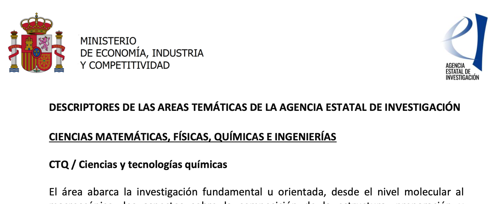
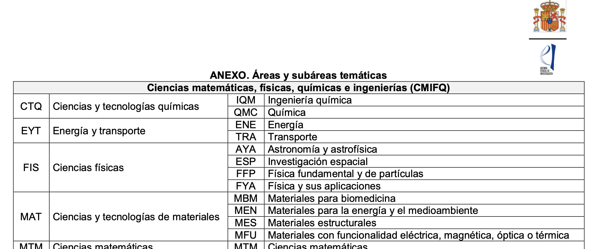
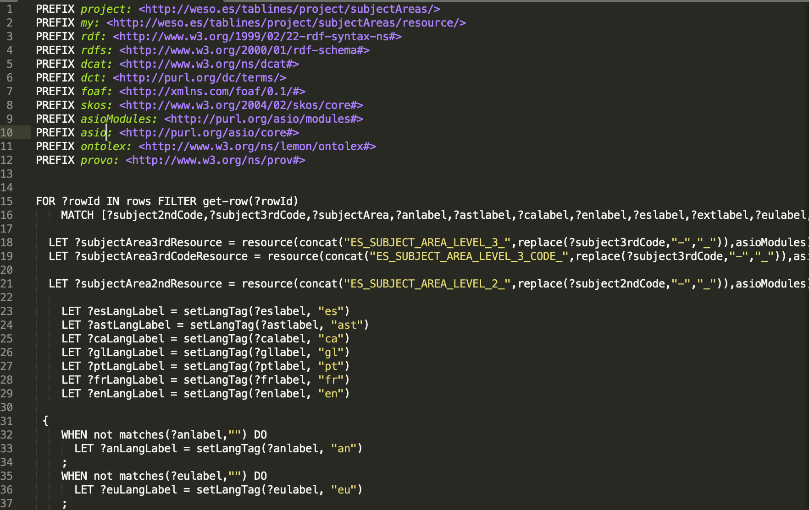

# Herramientas de conversión de recursos a OWL/RDF

## 0. sobre este documento

Este documento enumera someramente las herramientas consideradas y utilizadas para la conversión de recursos desestructurados (documentos, PDFs, etc.) a formatos estructurados y reparovechables en los módulos verticales de la ontología ASIO, que ya han sido descritos con detalle en el documento de la especificación de la ontología.

## 1. introducción

Con el fin de convertir a formatos semánticos recursos interesantes de ser incluídos en la ontología, sobre todo vocabularios cuyas fuentes venían en formatos desestructurados, se llevó a cabo una búsqueda de herramientas que facilitaran la labor.

## 2. herramientas consideradas

El equipo de desarrollo ya conocía dos herramientas candidatas, desarrolladas con la participación de  miembros del grupo de investigación WESO.

La primera de ellas, [ShExML](http://shexml.herminiogarcia.com/), explota Shape Expressions Mapping Language, un lenguaje heterogéneo para el mapeo de datos basado en Shape Expressions (ShEx), cuyo objetivo es permitir a usuarios mapear y conglomerar fuentes de datos heterogéneas en un medio de representación unificado en RDF.

Sin embargo, para esta fase inicial del proyecto se desestimó el uso de esta herramienta debido al formato de partida de muchos de los recursos propuestos por el cliente y la urgencia en su conversión.

La segunda herramienta, [Tablines](https://bitbucket.org/alfonso_noriega/tablines/src/default/), fue originalmente desarrollada en la Fundación CTIC, en Asturias, con la participación de uno de los integrantes actuales del grupo WESO, y fue la que finalmente se utilizó, sobre todo por el conocimiento del lenguaje necesario para crear los programas de transformación de ese integrante.

## 3. ejemplo de conversión

Uno de los ejemplos más representativos de conversión de datos se utilizan en el módulo vertical de las áreas temáticas, que proceden de la Agencia Estatal de Investigación del ministerio. Este documento es un PDF, formato poco procesable, en el que se incluye rudimentariamente como anexo una tabla que se convirtió a datos tabulares desde el PDF y a continuación a RDF, bajo el formato SKOS-Core.

El documento ofrece este aspecto en su cabecera:

Y ya en su anexo incluye la tabla de interés de la que partimos para generar el RDF:

Que es exportado a formato CSV manualmente:

Y que finalmente es *explotado* y convertido a SKOS-Core después de escribir un pequeño programa de transformación que ofrece este aspecto:

El resultado final es el módulo vertical subject areas, que se utiliza para asignar a una propuesta de proyecto el área de investigación exigida por el ministerio.

Cabe decir que procesos equivalentes se llevaron a cabo para el diseño e implementación de los módulos verticales geopolítico, dominios científicos, universidades y subdivisiones de universidades, tal como explicamos más detalladamente en el documento de la especificación de la ontología.