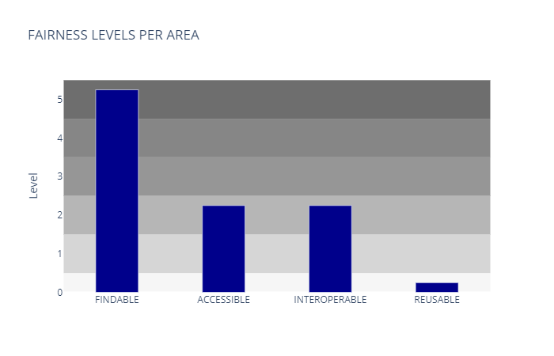
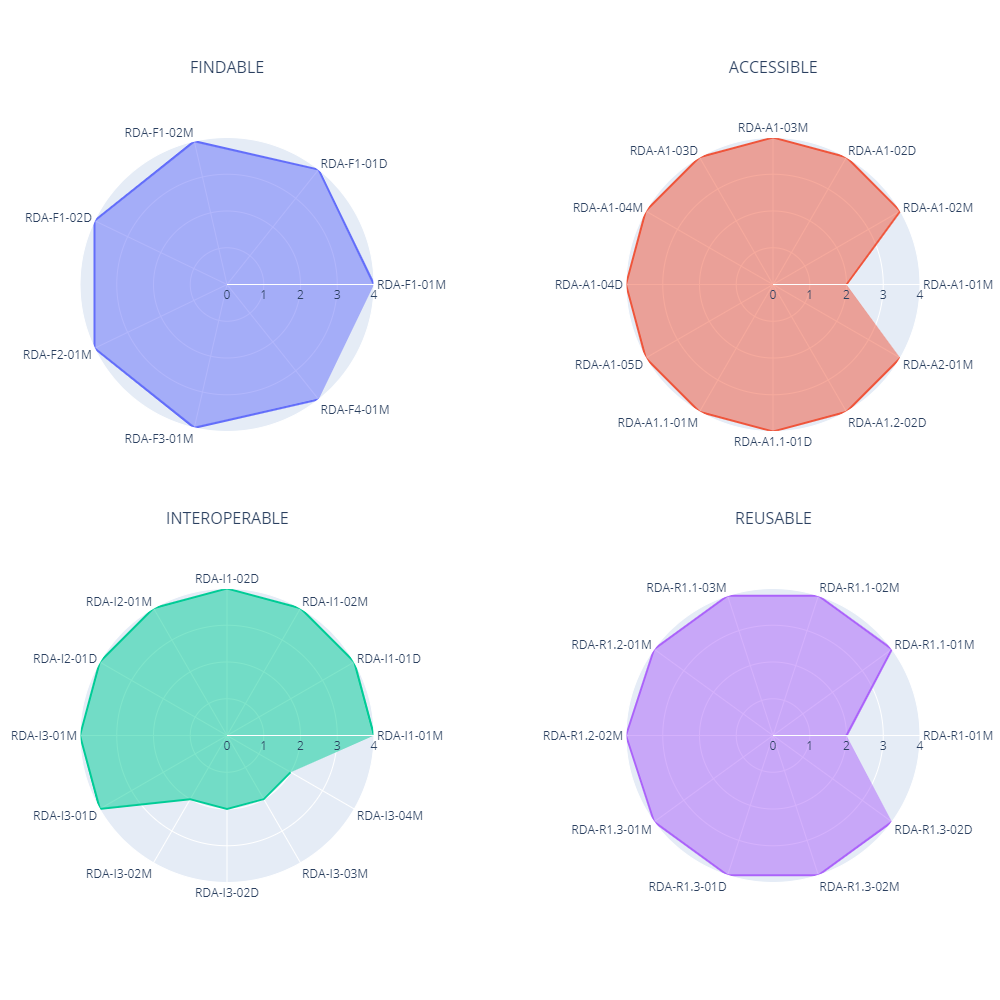

| Entregable     | Métricas FAIR                                                |
| -------------- | ------------------------------------------------------------ |
| Fecha          | 19/06/2020                                                   |
| Proyecto       | [ASIO](https://www.um.es/web/hercules/proyectos/asio) (Arquitectura Semántica e Infraestructura Ontológica) en el marco de la iniciativa [Hércules](https://www.um.es/web/hercules/) para la Semántica de Datos de Investigación de Universidades que forma parte de [CRUE-TIC](http://www.crue.org/SitePages/ProyectoHercules.aspx) |
| Módulo         | Infraestructura Ontológica                                   |
| Tipo           | Software y resultados                                        |
| Objetivo       | Evaluar el cumplimiento de las métricas FAIR definidas en el documento de [Análisis de métodos FAIR](https://github.com/HerculesCRUE/ib-asio-docs-/blob/master/entregables_hito_1/05-An%C3%A1lisis_de_m%C3%A9todos_FAIR/ASIO_Izertis_AnalisisDeMetodosFAIR.md) sobre el proyecto ASIO, tanto a nivel de ontología como de conjuntos de datos. A partir de dicha evaluación se generan gráficas de nivel de cumplimiento por áreas e indicadores individuales de forma automática para su posterior integración en páginas web y/o informes. |
| Estado         | **80%** La evaluación de los indicadores se ha realizado completamente y el software permite generar las gráficas necesarias, incluyendo pruebas unitarias pertinentes. La automatización actualmente cubre un 70,73% de las métricas y se prevé poder llegar hasta un 92,68%. |
| Próximos pasos | A la finalización del proyecto se volverán a evaluar las métricas sobre el despliegue final, con previsión de obtener un nivel máximo de cumplimiento en todos los indicadores. Adicionalmente, queda abierta la posibilidad de desarrollar nuevos índices o KPIs mejorados, para la presentación de resultados por áreas y/o un índice global FAIR mediante ponderación de indicadores FAIR por prioridad. |
| Documentación  | [Manual de usuario](manual_usuario.md) [Manual de despliegue](manual_despliegue.md) [Documentación técnica](manual_tecnico.md) |

## Métricas FAIR

La evaluación de indicadores de realiza de forma individual y se agrupa por áreas FAIR (FINDABLE, ACCESIBLE, INTEROPERABLE y REUSABLE).

El resultado de la evaluación por indicadores individuales se muestra a continuación:

El resultado de la evaluación por áreas sería el siguiente:

De forma general, la conclusión de la evaluación FAIR es bastante positiva, dado que por la naturaleza del proyecto ASIO, la mayoría de indicadores se cumplen de-facto, por el uso de tecnologías de linked data 5 estrellas (OWL, SKOS, HTTP, RDF, etc).

Sólo en algunos casos, dado que el proyecto aún se encuenta en un estado parcial, algunos indicadores no se cumplen por falta de referencias explicitas a recursos externos, pero que se espera queden cubiertos sin gran complejidad para el hito 2.

En los siguientes apartados se detalla la evaluación de cada uno de los indicadores.

### Control de versiones

**Versión de la evaluación**: 1.0

**Sello de tiempo:** 19/06/2020 12:43:23.000

### Automatización de métricas

La automatización actualmente cubre un 70,73% de las métricas y se prevé poder llegar hasta un 92,68%.

Para cada indicador descrito en los siguientes apartados se especifica los siguientes niveles:

​	0 – No automatizable

​	1 – En proceso de automatización

​	2 – Automatizada

### FINDABLE

A continuación se describen los criterios de evaluación y resultados de los 7 indicadores FINDABLE, todos ellos de prioridad *essential*. 

Casi todos los criterios se cumplen, por lo que la evaluación de este área sería de nivel 5 en momento en que el criterio RDA-F2-01M quede totalmente implementado.

#### RDA-F1-01M - Metadata is identified by a persistent identifier

**Equivalencia FAIR**: F1

**Prioridad RDA**: Essential

**Evaluación**: 4 – Cumple totalmente

Todos los datos y metadatos están identificados mediante URIs PURL ([http://purl.org](http://purl.org))

**Automatización**: 2 – Automatizada

#### RDA-F1-01D - Data is identified by a persistent identifier

**Equivalencia FAIR**: F1

**Prioridad RDA**: Essential

**Evaluación**: 4 – Cumple totalmente

Todos los datos y metadatos están identificados mediante URIs PURL ([http://purl.org](http://purl.org))

**Automatización**: 2 – Automatizada

#### RDA-F1-02M - Metadata is identified by a globally unique identifier

**Equivalencia FAIR**: F1

**Prioridad RDA**: Essential

**Evaluación**: 4 – Cumple totalmente

Todos los datos y metadatos están identificados mediante URIs PURL ([http://purl.org](http://purl.org))

**Automatización**: 2 – Automatizada

#### RDA-F1-02D - Data is identified by a globally unique identifier

**Equivalencia FAIR**: F1

**Prioridad RDA**: Essential

**Evaluación**: 4 – Cumple totalmente

Todos los datos y metadatos están identificados mediante URIs PURL ([http://purl.org](http://purl.org))

**Automatización**: 2 – Automatizada

#### RDA-F2-01M - Rich metadata is provided to allow discovery

**Equivalencia FAIR**: F2

**Prioridad RDA**: Essential

**Evaluación**: 3 – En proceso de implementación

Se proveen metadatos tanto a nivel de ontología como de los datos importados (OWL/SKOS, Wikibase, Trellis y Memento), si bien es necesario mejorar aspectos menores que mejoren la capacidad de descubrimiento.

**Automatización**: 2 – Automatizada

#### RDA-F3-01M - Metadata includes the identifier for the data

**Equivalencia FAIR**: F3

**Prioridad RDA**: Essential

**Evaluación**: 4 – Cumple totalmente

Los metadatos incluyen referencias expícitas a los datos que describen.

**Automatización**: 2 – Automatizada

#### RDA-F4-01M - Metadata is offered in such a way that it can be harvested and indexed

**Equivalencia FAIR**: F4

**Prioridad RDA**: Essential

**Evaluación**: 4 – Cumple totalmente

Los datos y metadatos están publicados mediante un grafo linked data 5 estrellas (HTTP/LDP).

**Automatización**: 0 – No automatizable

Los datos y metadatos insertados en cualquier triple store, están indexados por diseño del triple store. No es viable un método automatizable para comprobar la existencia de dichos indices en cualquier triple store.

### ACCESIBLE

A continuación se describen los criterios de evaluación y resultados de los 12 indicadores ACCESIBLE, de los cuales son 8 *essential*, 3 *important* y 1 *useful*. 

Se cumplen todos los indicadores, por lo que el nivel de este área es 5.

#### RDA-A1-01M - Metadata contains information to enable the user to get access to the data

**Equivalencia FAIR**: A1

**Prioridad RDA**: Important

**Evaluación**: 4 – Cumple totalmente

Se describe a nivel de metadatos el mecanismo de autenticación y autorización para poder tener acceso a los datos.

**Automatización**: 2 – Automatizada

#### RDA-A1-02M - Metadata can be accessed manually (i.e. with human intervention)

**Equivalencia FAIR**: A1

**Prioridad RDA**: Essential

**Evaluación**: 4 – Cumple totalmente

Los datos y metadatos están publicados mediante un grafo linked data 5 estrellas (HTTP/LDP).

**Automatización**: 0 – No automatizable

El requisito especifica que los metadatos pueden ser accedidos de forma manual (con intervención humana), por lo tanto es necesaria una evaluación manual, y la UI (aun no desarrollada) para acceder a dichos metadatos. Es posible que en futuro, una vez desarrollada la UI, se pueda automatizar algún tipo de test que determine si esos metadatos son accesibles.

#### RDA-A1-02D - Data can be accessed manually (i.e. with human intervention)

**Equivalencia FAIR**: A1

**Prioridad RDA**: Essential

**Evaluación**: 4 – Cumple totalmente

Los datos y metadatos están publicados mediante un grafo linked data 5 estrellas (HTTP/LDP).

**Automatización**: 0 – No automatizable

El requisito especifica que los datos pueden ser accedidos de forma manual (con intervención humana), por lo tanto es necesaria una evaluación manual, y la UI (aun no desarrollada) para acceder a dichos datos. Es posible que en futuro, una vez desarrollada la UI, se pueda automatizar algún tipo de test que determine si esos datos son accesibles.

#### RDA-A1-03M - Metadata identifier resolves to a metadata record

**Equivalencia FAIR**: A1

**Prioridad RDA**: Essential

**Evaluación**: 4 – Cumple totalmente

Los datos y metadatos están publicados mediante un grafo linked data 5 estrellas (HTTP/LDP).

**Automatización**: 2 – Automatizada

#### RDA-A1-03D - Data identifier resolves to a digital object

**Equivalencia FAIR**: A1

**Prioridad RDA**: Essential

**Evaluación**: 4 – Cumple totalmente

Los datos y metadatos están publicados mediante un grafo linked data 5 estrellas (HTTP/LDP).

**Automatización**: 2 – Automatizada

#### RDA-A1-04M - Metadata is accessed through standardised protocol

**Equivalencia FAIR**: A1

**Prioridad RDA**: Essential

**Evaluación**: 4 – Cumple totalmente

Los datos y metadatos están publicados mediante un grafo linked data 5 estrellas (HTTP/LDP).

**Automatización**: 2 – Automatizada

#### RDA-A1-04D - Data is accessible through standardised protocol

**Equivalencia FAIR**: A1

**Prioridad RDA**: Essential

**Evaluación**: 4 – Cumple totalmente

Los datos y metadatos están publicados mediante un grafo linked data 5 estrellas (HTTP/LDP).

**Automatización**: 2 – Automatizada

#### RDA-A1-05D - Data can be accessed automatically (i.e. by a computer program)

**Equivalencia FAIR**: A1

**Prioridad RDA**: Important

**Evaluación**: 4 – Cumple totalmente

Los datos y metadatos están publicados mediante un grafo linked data 5 estrellas (HTTP/LDP).

**Automatización**: 2 – Automatizada

#### RDA-A1.1-01M - Metadata is accessible through a free access protocol

**Equivalencia FAIR**: A1

**Prioridad RDA**: Essential

**Evaluación**: 4 – Cumple totalmente

Los datos y metadatos están publicados mediante un grafo linked data 5 estrellas (HTTP/LDP).

**Automatización**: 2 – Automatizada

#### RDA-A1.1-01D - Data is accessible through a free access protocol

**Equivalencia FAIR**: A1

**Prioridad RDA**: Important

**Evaluación**: 4 – Cumple totalmente

Los datos y metadatos están publicados mediante un grafo linked data 5 estrellas (HTTP/LDP).

**Automatización**: 2 – Automatizada

#### RDA-A1.2-02D - Data is accessible through an access protocol that supports authentication and authorisation

**Equivalencia FAIR**: A1

**Prioridad RDA**: Useful

**Evaluación**: 4 – Cumple totalmente

Los datos y metadatos están publicados mediante un grafo linked data 5 estrellas (HTTP/LDP).

**Automatización**: 2 – Automatizada

#### RDA-A2-01M - Metadata is guaranteed to remain available after data is no longer available

**Equivalencia FAIR**: A2

**Prioridad RDA**: Essential

**Evaluación**: 4 – Cumple totalmente

La combinación de Trellis y Memento permite llevar un registro histórico de modificaciones que garantiza que los metadatos pervivan más allá del ciclo de vida del dato asociado.

**Automatización**: 2 – Automatizada

### INTEROPERABLE

A continuación se describen los criterios de evaluación y resultados de los 12 indicadores INTEROPERABLE, de los cuales son 7 *important*, 5 *useful* y ninguno *essential*.

Se cumplen todos menos 1 indicador de tipo *important* y 4 *useful*, por lo que la evaluación de este área sería de nivel 3, la cual aumentaría a nivel 5 a la finalización del hito 2, tras resolver dichos indicadores.

#### RDA-I1-01M - Metadata uses knowledge representation expressed in standardised format

**Equivalencia FAIR**: I1

**Prioridad RDA**: Important

**Evaluación**: 4 – Cumple totalmente

Los datos y metadatos están expresado mediante tecnología linked data (OWL, SKOS, DC, RDF, etc).

**Automatización**: 2 – Automatizada

#### RDA-I1-01D - Data uses knowledge representation expressed in standardised format

**Equivalencia FAIR**: I1

**Prioridad RDA**: Important

**Evaluación**: 4 – Cumple totalmente

Los datos y metadatos están expresado mediante tecnología linked data (OWL, SKOS, DC, RDF, etc).

**Automatización**: 2 – Automatizada

#### RDA-I1-02M - Metadata uses machine-understandable knowledge representation

**Equivalencia FAIR**: I1

**Prioridad RDA**: Important

**Evaluación**: 4 – Cumple totalmente

Los datos y metadatos están expresado mediante tecnología linked data (OWL, SKOS, DC, RDF, etc).

**Automatización**: 2 – Automatizada

#### RDA-I1-02D - Data uses machine-understandable knowledge representation

**Equivalencia FAIR**: I1

**Prioridad RDA**: Important

**Evaluación**: 4 – Cumple totalmente

Los datos y metadatos están expresado mediante tecnología linked data (OWL, SKOS, DC, RDF, etc).

**Automatización**: 2 – Automatizada

#### RDA-I2-01M - Metadata uses FAIR-compliant vocabularies

**Equivalencia FAIR**: I2

**Prioridad RDA**: Important

**Evaluación**: 4 – Cumple totalmente

Los datos y metadatos están expresado mediante tecnología linked data (OWL, SKOS, DC, RDF, etc).

**Automatización**: 1 – En proceso de automatización

Seria posible automatizarlo en un futuro cuando las ontologias esten completas, y exista unión entre la infraestructura ontologia y la arqutectura semantica.

#### RDA-I2-01D - Data uses FAIR-compliant vocabularies

**Equivalencia FAIR**: I2

**Prioridad RDA**: Useful

**Evaluación**: 4 – Cumple totalmente

Los datos y metadatos están expresado mediante tecnología linked data (OWL, SKOS, DC, RDF, etc).

**Automatización**: 1 – En proceso de automatización

Seria posible automatizarlo en un futuro cuando las ontologias esten completas, y exista unión entre la infraestructura ontologia y la arqutectura semantica.

#### RDA-I3-01M - Metadata includes references to other metadata

**Equivalencia FAIR**: I3

**Prioridad RDA**: Important

**Evaluación**: 4 – Cumple totalmente

La ontología referencia otras ontologías, como por ejemplo [PROV-O](https://www.w3.org/TR/prov-o/).

**Automatización**: 2 – Automatizada

#### RDA-I3-01D - Data includes references to other data

**Equivalencia FAIR**: I3

**Prioridad RDA**: Useful

**Evaluación**: 3 – En proceso de implementación

Se referencian datos externos, como por ejemplo el uso de DOIs para enlazar documentos y artículos de investigación.

**Automatización**: 2 – Automatizada

#### RDA-I3-02M - Metadata includes references to other data

**Equivalencia FAIR**: I3

**Prioridad RDA**: Useful

**Evaluación**: 2 – Planificado o bajo consideración

*This indicator is about the way metadata is connected to other data, for example linking to previous or related research data that provides additional context to the data. Please note that this is not about the link from the metadata to the data it describes; that link is considered in principle F3 and in indicator RDA-F3-01M.*

**Automatización**: 1 – En proceso de automatización

De cara a la automatización requiere la integración de infraestructura ontologica y arquitectura semántica.

#### RDA-I3-02D - Data includes qualified references to other data

**Equivalencia FAIR**: I3

**Prioridad RDA**: Useful

**Evaluación**: 2 – Planificado o bajo consideración

*This  indicator is about the way data is connected to other data. The references  need to be qualified which means that the relationship role of the related  resource is specified, for example that a particular link is a specification  of a unit of measurement, or the identification of the sensor with which the  measurement was done.*

**Automatización**: 1 – En proceso de automatización

De cara a la automatización requiere la integración de infraestructura ontologica y arquitectura semántica.

#### RDA-I3-02M - Metadata includes qualified references to other metadata

**Equivalencia FAIR**: I3

**Prioridad RDA**: Important

**Evaluación**: 2 – Planificado o bajo consideración

*This  indicator is about the way metadata is connected to other metadata, for  example to descriptions of related resources that provide additional context  to the data. The references need to be qualified which means that the  relationship of the related resource is specified, for example person Y is  the author of dataset X.*

**Automatización**: 1 – En proceso de automatización

De cara a la automatización requiere la integración de infraestructura ontologica y arquitectura semántica.

#### RDA-I3-04M - Metadata include qualified references to other data

**Equivalencia FAIR**: I3

**Prioridad RDA**: Useful

**Evaluación**: 2 – Planificado o bajo consideración

*This  indicator is about the way metadata is connected to other data. The  references need to be qualified which means that the relationship role of the  related resource is specified, for example dataset X is derived from dataset  Y.*

**Automatización**: 1 – En proceso de automatización

De cara a la automatización requiere la integración de infraestructura ontologica y arquitectura semántica.

### REUSABLE

A continuación se describen los criterios de evaluación y resultados de los 10 indicadores REUSABLE, de los cuales son 5 *essential*, 4 *important y 1 useful*.

Se cumplen todos los indicadores, por lo que la evaluación de este área sería de nivel 5.

#### RDA-R1-01M - Plurality of accurate and relevant attributes are provided to allow reuse

**Equivalencia FAIR**: R1

**Prioridad RDA**: Essential

**Evaluación**: 4 – Cumple totalmente

*The  indicator concerns the quantity but also the quality of metadata provided in  order to enhance data reusability. This indicator can be evaluated with the  help of standards registries such as the RDA-endorsed [FAIR Sharing](https://fairsharing.org/standards/?q=/format&selected_facets=type_exact:reporting%20guideline).*

Se prevé ampliar este indicador mediante el mapeo de las áreas científicas y temáticas de la UNESCO que tiene publicadas la Universidad de Murcia.

**Automatización**: 2 – Automatizada

#### RDA-R1.1-01M - Metadata includes information about the licence under which the data can be reused

**Equivalencia FAIR**: R1

**Prioridad RDA**: Essential

**Evaluación**: 4 – Cumple totalmente

Uso de licencia [Creative Commons](https://creativecommons.org/publicdomain/zero/1.0/).

**Automatización**: 1 – En proceso de automatización

Es necesario previamente definir tipo de licencia de las ontologías y añadir los metadatos adecuados para publicar la información de dicha licencia

#### RDA-R1.1-02M - Metadata refers to a standard reuse licence

**Equivalencia FAIR**: R1

**Prioridad RDA**: Important

**Evaluación**: 4 – Cumple totalmente

Uso de licencia [Creative Commons](https://creativecommons.org/publicdomain/zero/1.0/).

**Automatización**: 1 – En proceso de automatización

Es necesario previamente definir tipo de licencia de las ontologías y añadir los metadatos adecuados para publicar la información de dicha licencia

#### RDA-R1.1-03M - Metadata refers to a machine-understandable reuse licence

**Equivalencia FAIR**: R1

**Prioridad RDA**: Important

**Evaluación**: 4 – Cumple totalmente

Uso de licencia [Creative Commons](https://creativecommons.org/publicdomain/zero/1.0/).

**Automatización**: 1 – En proceso de automatización

Es necesario previamente definir tipo de licencia de las ontologías y añadir los metadatos adecuados para publicar la información de dicha licencia

#### RDA-R1.2-01M - Metadata includes provenance information according to community-specific standards

**Equivalencia FAIR**: R2

**Prioridad RDA**: Important

**Evaluación**: 4 – Cumple totalmente

Uso de [PROV-O](https://www.w3.org/TR/prov-o/).

**Automatización**: 2 – Automatizada

#### RDA-R1.2-02M - Metadata includes provenance information according to a cross-community language

**Equivalencia FAIR**: R2

**Prioridad RDA**: Useful

**Evaluación**: 4 – Cumple totalmente

Uso de [PROV-O](https://www.w3.org/TR/prov-o/).

**Automatización**: 2 – Automatizada

#### RDA-R1.3-01M - Metadata complies with a community standard

**Equivalencia FAIR**: R3

**Prioridad RDA**: Essential

**Evaluación**: 4 – Cumple totalmente

Los datos y metadatos están expresado mediante tecnología linked data (OWL, SKOS, DC, RDF, etc).

**Automatización**: 2 – Automatizada

#### RDA-R1.3-01D - Data complies with a community standard

**Equivalencia FAIR**: R3

**Prioridad RDA**: Essential

**Evaluación**: 4 – Cumple totalmente

Los datos y metadatos están expresado mediante tecnología linked data (OWL, SKOS, DC, RDF, etc).

**Automatización**: 2 – Automatizada

#### RDA-R1.3-02M - Metadata is expressed in compliance with a machine-understandable community standard

**Equivalencia FAIR**: R3

**Prioridad RDA**: Essential

**Evaluación**: 4 – Cumple totalmente

Los datos y metadatos están expresado mediante tecnología linked data (OWL, SKOS, DC, RDF, etc).

**Automatización**: 2 – Automatizada

#### RDA-R1.3-02D - Data is expressed in compliance with a machine-understandable community standard

**Equivalencia FAIR**: R3

**Prioridad RDA**: Important

**Evaluación**: 4 – Cumple totalmente

Los datos y metadatos están expresado mediante tecnología linked data (OWL, SKOS, DC, RDF, etc).

**Automatización**: 2 – Automatizada

# Fases del proyecto

El proyecto consta de tres fases

### Evaluación de métricas

Se realizara la evaluación de las métricas FAIR, sobre la arquitectura real usada en el proyecto ASIO, para ello el proyecto permite desplegar las partes relevantes de dicha arquitectura de forma local mediante el despliegue del [Sandbox](#Sandbox)

#### Sandbox

Para generar un nuevo conjunto de métricas es necesario desplegar un entorno que emula las partes relevantes del proyecto ASIO, que influyen en la evaluación de las métricas FAIR. Estas son:

- **Factoría de URIs:** Este componente software que genera los identificadores para los recursos, y añade un nivel de indirección que permite gestionar la persistencia (cambio de el contenido de un recurso, manteniendo su identificador publico, después de que el recurso haya cambiado), por lo que es relevante en todos aquellas métricas donde de una forma u otra, se evalúa la persistencia de los recursos y/o sus identificadores.
- **MariaDB:** Es la capa de persistencia usada por la factoría de URIs y por lo tanto es una dependencia de esta.
- **Trellis:** Es el servidor LDP que soporta el acceso a los recursos, soportando negociación de contenido tanto en formato como en versión, generando a su vez metadatos, orientados a la auditoria de datos, y versionado de recursos(Memento). Es de vital importancia para la evaluación de métricas FAIR ya que tanto los recursos y metadatos que serán evaluados, lo serán en el formato gestionado por Trellis.
- **Fuseki + TDB:** Fuseki actúa como EndPoint SPAPQL 1.1, y TDB es el Triple Store que soporta el almacenamiento. Aunque no será evaluado directamente, es el motor de almacenamiento y acceso a datos usado por Trellis, por lo que es un fuerte dependencia de este.

### Generación de datos

Sobre la arquitectura antes descrita, se generaran conjuntos de datos sintéticos de todos los tipos que estarán presentes en los datos reales, es decir se generan entidades, propiedades e instancias. Sobre dichos conjuntos de datos se realizará la evaluación de métricas FAIR.

### Representación de métricas y resultados finales

Las métricas evaluadas sobre los datos  generaran los KPIs y sus representaciones.