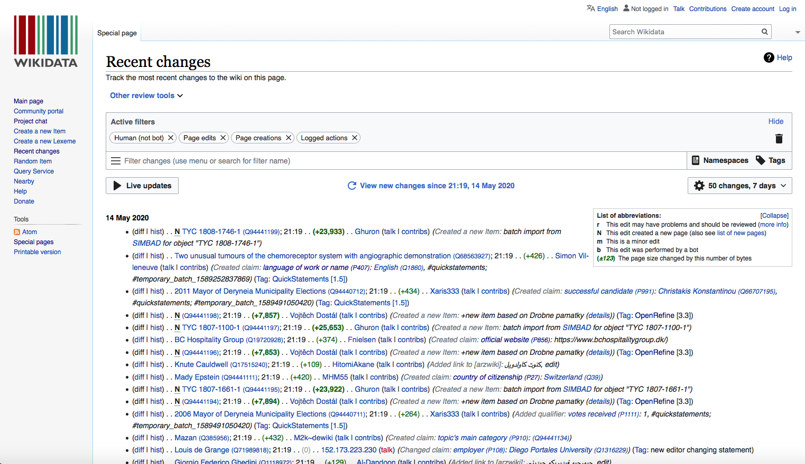
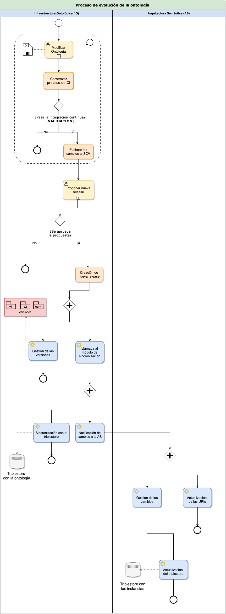
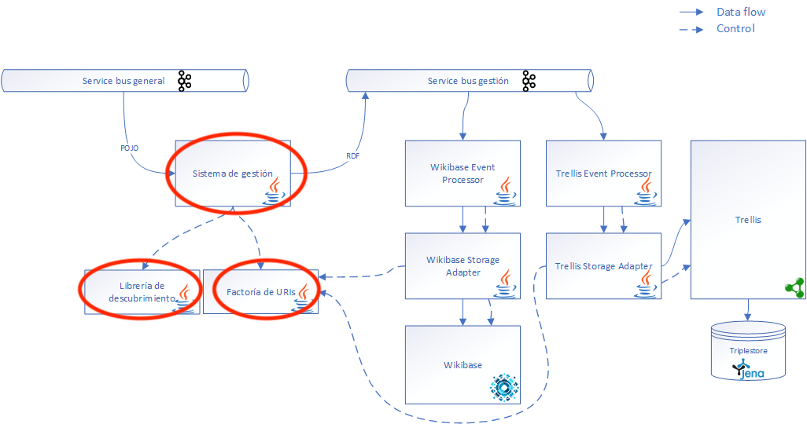

| Entregable     | Control de versiones sobre ontologías OWL                    |
| -------------- | ------------------------------------------------------------ |
| Fecha          | 17/06/2020                                                   |
| Proyecto       | [ASIO](https://www.um.es/web/hercules/proyectos/asio) (Arquitectura Semántica e Infraestructura Ontológica) en el marco de la iniciativa [Hércules](https://www.um.es/web/hercules/) para la Semántica de Datos de Investigación de Universidades que forma parte de [CRUE-TIC](http://www.crue.org/SitePages/ProyectoHercules.aspx) |
| Módulo         | Infraestructura Ontológica                                   |
| Tipo           | Método y Software |
| Objetivo       | El objetivo de este documento es la especificación de las decisiones tomadas para intentar solucionar los problemas que emergen cuando se intenta mantener un control de versiones efectivo durante el desarrollo de ontologías. |
| Estado         | **100%** Se han analizado y aplicado ya varias soluciones para los problemas que emergen al mantener un control de versiones sobre ontologías OWL. Se han definido 5 niveles de soluciones, de los cuales 3 se encuentran ya en funcionamiento, y cubren la funcionalidad propuesta para este entregable. También se han definido tanto un sistema de integración continua en el que se validan automáticamente los cambios producidos en la ontología a partir de una serie de Shape Expressions, como un sistema de sincronización de cambios de la ontología con un triplestore. Ambos sistemas se encuentran implementados y en funcionamiento. Por último, se detallan las medidas a llevar a cabo para controlar la propagación de cambios de una ontología a otros artefactos dependientes y, en especial, a la arquitectura semántica. |
| Documentación adicional | [Manual de usuario integración continua](01_ontology_continuous_integration/user_manual.md) [Especificación del sistema de integración continua](01_ontology_continuous_integration/system_specification.md) [Documentación del sistema de sincronización (incluye manuales y especificación del sistema)](02_hercules_synchronization/hercules_sync_doc.md) |

# Control de versiones sobre ontologías OWL.
Este documento se centra en explicar las decisiones tomadas para intentar solucionar los problemas que emergen cuando se intenta mantener un control de versiones efectivo durante el desarrollo de ontologías.

## Introducción
Una problemática conocida de las ontologías es su serialización no determinista. Esto implica que realizar un control de versiones efectivo sobre ellas sea imposible. En el siguiente [artículo](https://rd.springer.com/chapter/10.1007/978-3-319-99701-8_10) se puede ver más en detalle la problemática descrita.

Sin embargo existen distintas metodologías y procesos que se pueden aplicar para paliar este problema. De forma que se puede a llegar a desarrollar una ontología bajo un control de versiones en el que los cambios realizados queden registrados de forma unívoca.

## Solución planteada
A continuación describiremos la solución que hemos planteado para solucionar la problemática descrita previamente. Nuestra solución se divide en cinco niveles ortogonales y totalmente complementarios, con distintos niveles de completitud actualmente. La primera es una solución sintáctica, mientras que el resto serían soluciones a nivel semántico. Estos niveles se describirán a continuación.

### Nivel 1: Ontología
A nivel de la ontología, planteamos una solución sintáctica que es obligar el uso del editor [Protégé](https://protege.stanford.edu) por parte de los contribuidores de la ontología. En las últimas versiones de Protégé, basado en OWLAPI, se mantiene un orden determinista en la serialización de las ontologías que permite un mayor seguimiento de las diferencias entre versiones. Información adicional sobre el algoritmo implementado para mantener un orden determinista puede ser consultada a través del [siguiente issue](https://github.com/owlcs/owlapi/issues/273) del repositorio de OWLAPI. Además, en el [siguiente artículo](https://cgi.csc.liv.ac.uk/~valli/OWLED2015/OWLED_2015_paper_12.pdf) se especifica en detalle las optimizaciones llevadas a cabo en los algoritmos de serialización de ontologías.

### Nivel 2: Sistema de control de versiones
El propio sistema de control de versiones (en nuestro caso GitHub, basado en Git) también hay bastantes soluciones dispobibles para el problema presente.

Una de las soluciones que hemos llevado a cabo es el almacenamiento de forma independiente de cada una de las versiones de la ontología a traves de la rama donde ésta se encuentra publicada (gh-pages). Cada vez que se crea una nueva release en GitHub, se lanza un sistema de scripts que se encarga de mergear cada uno de los grafos procedentes de la ontología (core + módulos verticales + alignments) y de serializar el grafo mergeado en la rama gh-pages, junto con la información del día en el que se produjo esa versión. Esta serialización se lleva a cabo con la librería [rdflib](https://rdflib.readthedocs.io/en/stable/) de Python, y está implementada de forma determinista.

Por último, la organización de carpetas correspondientes a la publicación de la ontología sigue un criterio de nombrado ya utilizado por ejemplo en las [SPAR Ontologies](https://sparontologies.github.io/article/spar-iswc2018/), que facilita el acceso y uso de cada una de las versiones por parte de los consumidores.

### Nivel 3: Wikibase
A nivel de Wikibase, el propio software tiene un sistema de control de cambios que nos permite obtener información adicional sobre los cambios que se han realizado. Estos cambios incluyen un timestamp, información sobre la cuenta que los ha realizado, así como la opción de poder revertir los cambios que sean necesarios. En la siguiente imagen se puede observar a modo de ejemplo este sistema de versiones que ofrece Wikibase:

Aunque este sistema fue originalmente diseñado como medida para evitar posibles actos de vandalismo a nivel de datos por parte de contribuyentes externos, creemos que nos puede ofrecer una gran base para poder manejar el control de versiones y cambios que se realicen en la ontología, la cuál se encontrará publicada en este sistema.

### Nivel 4: Sincronización a wikibase
Actualmente Wikibase ya ofrece información sobre la evolución de los datos que guarda y por tanto se puede seguir el rastro de las distintas versiones de los componentes de una ontología. Sin embargo, el sistema de propagación de cambios diseñado permitiría enriquecer aún más esta información.

Desde este sistemas sería posible añadir metadatos adicionales en el momento de la sincronización de la ontología con Wikibase. Estos metadatos pueden incluir por ejemplo el fichero original a través del cual se realizó la sincronización, y otros datos procedentes del propio sistema de control de versiones, como puede ser el issue o el pull request relacionado con el cambio.

Actualmente este nivel todavía no se encuentra implementado en el sistema de sincronización, pero es algo que tenemos contemplado y nuestra idea es implementar este nivel de cara a futuras versiones del sistema de sincronización.

### Nivel 5: Sincronización desde Wikibase
Este nivel se correspondería con la sincronización de cambios que se produzcan en Wikibase al sistema de control de versiones donde se almacena la ontología (sincionización hacia atrás).

Por ejemplo, sería posible añadir metadatos a la propia ontología indicando la versión y la procedencia de estos cambios.

Dado que la sincronización hacia atrás todavía es una funcionalidad que no se encuentra disponible en el sistema de sincronización, este nivel todavía se encuentra en una fase de análisis y exploración por nuestra parte. A medida que se vaya avanzando en la funcionalidad, se irían concretando las medidas adicionales que podrían llevarse a cabo en este nivel.

## Validación de los cambios en el sistema de control versiones
Una vez se han producido cambios sobre la ontología y por tanto en el control de versiones es necesario validar que estos cambios no tienen un efecto negativo sobre las versiones ya existentes de la ontología. Esto es, que por ejemplo no se empleé un prefijo que no ha sido definido con anterioridad, algo que sintácticamente es posible pero semánticamente produciría un error en los sistemas que consuman la ontología en el futuro.

Para ver como se soluciona este problema se ha diseñado e implementado un sistema de integración continua que se ejecuta cada vez que se produce un cambio en la ontología dentro del sistema de control de versiones. Toda la documentación referente a este sistema se encuentra dentro de la carpeta `01_ontology_continuous_integration` de este mismo directorio.

## Sincronización de la ontología con un triplestore
Una vez los cambios en la ontología han pasado el proceso de validación, y los administradores de ésta consideran que se puede crear una nueva versión estable, se procederá a la sincronización de los cambios producidos en la ontología a Wikibase.

Estos cambios se realizarán de forma automática cada vez que se realice una nueva [release](https://help.github.com/en/enterprise/2.13/user/articles/creating-releases) en el repositorio donde la ontología se encuentra almacenada. Toda la documentación sobre este sistema se encuentra dentro de la carpeta `02_hercules_synchronization` de este directorio.

## Propagación de los cambios a otros artefactos dependientes
Las ontologías son entes dinámicos que evolucionan a lo largo de tiempo por diversos motivos:
* Cambios en el dominio que describen.
* Cambios en la especificación de la ontología.
* Cambios en la conceptualización.

En [[1]](#1), el proceso de evolución de una ontología se describe como "la adaptación a lo largo del tiempo de una ontología a los cambios surgidos, **y la propagación de estos cambios a los artefactos dependientes de forma consistente**".

La modificación de una parte de la ontología puede generar inconsistencias tanto en otras partes de la ontología como en otras ontologías y aplicaciones que dependan de ésta. Por lo tanto, es un proceso complejo que se debe considerar tanto desde un punto de vista técnico como organizacional.

Es diversa la literatura que trata sobre este tema. En [[2]](#2), se propone un sistema de versionado de ontología que permite realizar un seguimiento exhaustivo de los cambios realizados basado en sistemas de recuperación de la información. El método propuesto está compuesto por una serie de patrones de cambio: renombrado, borrado y movimiento. Sin embargo, no se contemplan operaciones más complejas en los patrones de cambio, como el añadido. 

El Ontology Engineering Group de la UPM ha realizado también otro estudio [[3]](#3) de cómo varias ontologías conocidas (DBpedia, Schema.org, PROV-O y FOAF) han evolucionado a lo largo de su ciclo de vida y los problemas que han surgido por algunos de los cambios. Con las conclusiones obtenidas se proponen el uso de herramientas que verifican la consistencia de una ontología tras los cambios, y añadir información de procedencia sobre cómo han evolucionado los términos. La primera de las propuestas se cumple con el proceso de validación de la ontología basado en Shape Expressions llevado a cabo en la integración continua, mientras que tanto el sistema de control de versiones como el servicio de publicación de ontologías proporcionan información que cubre la segunda propuesta.

En [[4]](#4), se propone un nuevo proceso de control de la evolución de ontología basado en patrones. Se proponen 4 fases para detectar los patrones de cambios y añadirlos a un catálogo. Sin embargo, no se tratan las fases de propagación de estos cambios a artefactos dependientes. Sobre este análisis se apoya el control de evolución de ontologías basado en usuarios [[5]](#5), en el que se proponen 6 fases generales que cubren todo el proceso desde la captura de nuevos cambios hasta su propagación y validación. Estas fases se van repitiendo indefinidamente a lo largo del ciclo de vida de la ontología, y las acciones de las que se componen son reversibles.

Otro tema presente y de bastante importancia es realizar una distinción adecuada entre la evolución y el versionado de una ontología. La distinción tradicional en bases de datos entre versionado y evolución no es aplicable a las ontologías.  En el caso de una ontología no siempre podemos distinguir entre la evolución, que permite el acceso a todos los datos a través del esquema más reciente, y el versionado, que permite el acceso a **todos** los datos a través de diferentes versiones de un esquema.

Múltiples versiones de la misma ontología están fijadas a existir y deben ser soportadas. Al no saber con certeza cómo una ontología es reutilizada, no siempre se puede “forzar” a que otras ontologías y aplicaciones cambien a una nueva versión. Idealmente, no solo se deberían mantener las distintas versiones de una ontología, sino también información sobre las diferencias entre cada versión y su compatibilidad. De esta manera algunas aplicaciones pueden seguir utilizando versiones antiguas e ir actualizándose a su propio ritmo (o no actualizarse directamente).

Por lo tanto, la gestión de cambios es un problema clave para poder soportar la evolución de ontologías. En [[1]](#1), se combinan los conceptos de evolución y versionado en un único concepto: “la habilidad de gestionar cambios en la ontología y sus efectos con la creación y mantenimiento de diferentes variantes de la ontología”.

A continuación, se procederá a proponer el esquema llevado a cabo para la propagación de cambios de la ontología a los artefactos dependientes, y en caso concreto a la arquitéctura semántica. La propuesta realizada se basa en toda la información presentada hasta el momento. 

En primer lugar, se mostrará el proceso general con el flujo de operaciones que se llevan a cabo cuando se produce un cambio en la ontología. A continuación, se hará una enumeración de los tipos de operaciones de modificación de la ontología planteados, y los posibles efectos que éstos tendrían en las instancias que dependen de ésta. Por último, se propondrán los puntos de comunicación entre la Infraestructura Ontológica y la Arquitectura Semántica para poder llevar a cabo estos cambios.

### Proceso general
En el siguiente diagrama de alto nivel se muestra el flujo de operaciones realizadas a lo largo del ciclo de vida de la evolución de la ontología:

Como podemos ver, este proceso comienza con la modificación de los ficheros de la ontología por parte de un ingeniero de ontologías. Una vez que se realizan los cambios, comienza el proceso de integración continua donde se validan estos cambios (para más información, se puede consultar la [documentación correspondiente](./01_ontology_continuous_integration/readme.md) del sistema de validación). Este es un proceso importante en el que nos aseguramos de la consistencia de la ontología tras realizar las modificaciones. En caso de que la integración continua pase correctamente, los administradores del repositorio tendrán la última palabra para poder permitir o denegar el pusheo de los cambios propuestos al propio repositorio, todo esto a través del sistema de pull requests de GitHub.

El subproceso descrito previamente se podrá repetir n veces más. Cuando los administradores lo consideren conveniente, podrán proponer una nueva release del sistema con los cambios previamente introducidos. Esta propuesta tendrá un componente humano de aprobación, que añadirá una capa más de protección ante cambios no deseados. En caso de que la propuesta se apruebe, se procederá a la creación de la nueva release.

Una vez que la nueva release es creada, se lanzarán dos nuevas actividades en paralelo:
* Por un lado, se lanzará el sistema de gestión de versiones, que se encargará de crear la nueva versión del sistema y actualizar la versión más reciente. Esta parte se corresponde con el versionado correcto de la ontología, que como hemos descrito previamente permite a los artefactos dependientes de ésta la utilización de una versión específica si es necesario.
* Por otra parte, se llamará al módulo de sincronización con los cambios de la nueva release.

El módulo de sincronización, una vez haya recibido y procesado los cambios, creará otras dos nuevas tareas en paralelo:
* Por un lado, se encargará de sincronizar los cambios recibidos con el triple store donde se encuentra almacenada la ontología. Este triple store será consumido por el servicio de publicación de ontologías.
* La otra tarea consistirá en notificar a la arquitectura semántica con los cambios que se han producido.

La notificación a la arquitectura semántica creará otras 2 nuevas actividades en paralelo, con las que terminará el proceso de evolución de la ontología:
* Se hará uso de la factoría de URIs para actualizar las URIs que sean necesarias en función de las modificaciones realizadas en la ontología.
* Se llamará al sistema de gestión de cambios con las modificaciones realizadas, y con esta información se actualizará el triplestore con las instancias para evitar inconsistencias con la última versión de la ontología.

### Tipos de operaciones de modificación
En la siguiente tabla se enumeran los tipos de cambios en la ontología posibles que se han planteado, junto con el efecto que tendrían en las instancias que hicieran uso de ésta:

| Operación | Efecto en las instancias |
| --- | --- |
| Creación de nueva clase C | No habría ningún tipo de problema para las instancias existentes. |
| Borrado de clase C | Las instancias de clase C quedarían en un estado inconsistente. |
| Crear una propiedad p | No habría ningún tipo de problema para las instancias existentes. |
| Eliminar la propiedad p | Los valores de la propiedad p para todas las instancias que la utilicen se perderían. |
| Eliminar una propiedad p de una clase C | Los valores de la propiedad p para las instancias que pertenecen a la clase C se perderían. |
| Añadir una relación de subclase-superclase entre la subclase SubC y la superclase SuperC | No habría ningún tipo de problema para las instancias existentes. |
| Eliminar una relación de subclase-superclase entre la subclase SubC y la superclase SuperC | SubC pierde las propiedades heredadas de SuperC. Los valores de las instancias de SubC para estas propiedades se perderían. |
| Declarar clases C1 y C2 como disjoint | Las instancias que pertenezcan a ambas clases serían inválidas. |
| Definir una propiedad p como transitiva o simétrica | Los valores de p que violen esta restricción serían inválidos. |
| Mover una propiedad p de una subclase a una superclase | No habría ningún tipo de problema para las instancias existentes. |
| Mover una propiedad p de una superclase a una subclase | La superclase ya no tiene esa propiedad. Los valores de las instancias de superC para esa propiedad se pierden. |
| Reducir las restricciones de una propiedad p | No habría ningún tipo de problema para las instancias existentes. |
| Añadir restricciones a una propiedad p | Existe la posibilidad de que los valores de algunas instancias para la propiedad p dejen de ser válidos. |
| Modificar la descripción de una clase (label, comment, alias) | No habría ningún tipo de problema para las instancias existentes. |

### Comunicación con la Arquitectura Semántica
El sistema de gestión de la arquitectura semántica será el punto clave que participará en la propagación de cambios de la ontología. Este sistema es el encargado de recoger los datos del service bus general, y procesarlos hasta su guardado en el triple store. Para ello, hace uso de los siguientes elementos:
* Librería de descubrimiento para validar si se trata de un nuevo recurso, uno ya existente que hay que actualizar o es necesario realizar un borrado.
* Factoría de URIs para apoyarse en la generación de RDF.

A continuación se muestra una imagen del módulo de gestión de eventos, con los servicios mencionados previamente resaltados:

La comunicación entre la infraestructura ontológica y la arquitectura semántica se llevará a cabo siguiendo el patrón arquitectónico event sourcing. Este patrón se basa en el modelado de cambios de estado como una secuencia inmutable o log de eventos. Estos eventos serán posteriormente consumidos por otras aplicaciones para realizar las acciones correspondientes.

La información sobre cada una de las operaciones mencionadas en la sección anterior se representaría como un evento que se insertaría en la cola de eventos del sistema. Desde esta cola los eventos se irían consumiendo para asegurar la consistencia de los datos tras las modificaciones producidas en la ontología.

Dado que el sistema de gestión de la arquitectura semántica ya sigue un patrón basado en eventos, la adaptación del sistema para procesar eventos sobre cambios en la ontología no implicaría realizar cambios mayores a la arquitectura.

Para más información a nivel de arquitectura sobre la solución planteada se puede consultar el Anexo A de este documento, que sigue el formato ARD (Architecture Decision Record) para justificar las decisiones tomadas.

## Anexo A: Propagación de cambios
En este anexo se ha documentado información sobre la propagación de cambios a artefactos dependientes, desde el punto de vista de la arquitectura, siguiendo el formato "Architecture Decision Record" (ADR) propuesto para la documentación de decisiones arquitectónicas. Se ha seguido la plantilla proporcionada por Michael Nygard, que es accesible a través de [este enlace](https://github.com/joelparkerhenderson/architecture_decision_record/blob/master/adr_template_by_michael_nygard.md).

### Estado
Propuesta

### Contexto
Las ontologías son entes dinámicos que sufren modificaciones a lo largo del tiempo por diversos motivos. Además, existen diversos artefactos dependientes de las ontologías que pueden quedar en un estado inconsistente si se producen modificaciones en éstas.

Es necesario, por lo tanto, proponer una solución para la propagación de cambios de una ontología a los artefactos dependientes, de tal manera que se puedan subsanar estos posibles problemas de consistencia de forma flexible.

En el marco de nuestro proyecto, nos centraremos en la propagación de cambios desde el sistema de la Infraestructura Ontológica hasta la Arquitectura Semántica donde se encuentran las instancias que dependen de la ontología.

Los siguientes atributos de calidad son tenidos en cuenta:

| Atributo | Descripción |
| -------- | ----------- |
| Consistencia | La solución deberá proveer mecanismos para asegurar la consistencia de las instancias tras una modificación de la ontología. |
| Flexibilidad | Se podrán modificar y añadir componentes a la solución propuesta de forma sencilla. |
| Reproducibilidad | Dada una secuencia de modificaciones a la ontología, se podrán reproducir las operaciones realizadas desde el origen de la modificación hasta su propagación a las instancias de forma sencilla. |
| Trazabilidad | Será posible verificar la historia de modificaciones realizadas, junto con metainformación adicional (p.ej. fecha de origen) |

### Decisión
Basándonos en el contexto y los atributos de calidad descritos anteriormente, junto con la información disponible sobre la infraestructura ontológica y la arquitectura semántica, hemos optado por el uso del patrón event sourcing para solucionar la problemática de la propagación de cambios de la ontología a las instancias que dependen de ésta.

Con el uso de este patrón, la solución es lo suficientemente flexible como para soportar componentes adicionales que no han sido pensados para la funcionalidad actual. Los eventos procesados por la infraestructura ontológica que contienen las modificaciones se enviarán a un bus de eventos, y luego podrán ser consumidos por otras aplicaciones y microservicios futuros con diversas funcionalidades.

La naturaleza del patrón event sourcing permite además la reversibilidad de los cambios realizados en todo momento. Al tener un log de los eventos producidos, tendremos control total sobre que eventos son necesarios revertir por un motivo u otro. Esto añadirá una capa más de protección en el sistema de evolución de la ontología ante cambios no esperados.

Por último, el hecho de que la arquitectura semántica siga un patrón basado en eventos también ha influido para favorecer esta solución frente a otras alternativas.

### Consecuencias
El uso del patrón basado en eventos tendría las siguientes desventajas:
* Normalmente los sistemas basados en eventos sufren al manejar instancias con vidas muy complejas. Siendo más específicos, aquellas instancias que tengan cambios frecuentes en el estado pueden causar problemas debido a la cantidad de eventos que se pueden producir. Sin embargo, debido al proceso definido para la evolución de la ontología (y a la propia dinámica de evolución de éstas) no se esperan llegar a tener este tipo de problemas, ya que serían necesarias cientos o miles de releases diarias para poder notar algún tipo de cuello de botella en el rendimiento de esta solución si la comparamos con otras.

Aunque también nos proporcionará las siguientes ventajas:
* Dado que el sistema de gestión arquitectura semántica ya se encuentra basado en eventos, la integración de esta funcionalidad será más simple y requerirá de menos modificaciones.
* El histórico de como una instancia llega a su estado actual permanece en los eventos almacenados. Con esto se mejora considerablemente tanto la consistencia como la trazabilidad de las instancias.
* Se añade la posibilidad de analizar el log de eventos e inferir nueva información del sistema, incluso aspectos que no se habían pensado cuando los eventos fueron diseñados. Esto permite por ejemplo que se puedan añadir nuevas vistas en el sistema sin aumentar la complejidad de éste.
* Los sistemas basados en eventos son más fáciles de probar y de debuguear. Los eventos pueden ser simulados para llevar a cabo pruebas. Además, el log de eventos contiene información útil para debuguear. Si se detecta un problema, se puede "relanzar" el log de eventos en un entorno controlado para entender como una instancia llegó a un estado no deseado.

## Referencias
<a id="1">[1]</a>
Noy, N. F., & Klein, M. (2004). Ontology evolution: Not the same as schema evolution. Knowledge and information systems, 6(4), 428-440.

<a id="2">[2]</a>
Dragoni, M., & Ghidini, C. (2012, November). Evaluating the Impact of Ontology Evolution Patterns on the Effectiveness of Resources Retrieval. In EvoDyn@ ISWC.

<a id="3">[3]</a>
Mihindukulasooriya, N., Poveda-Villalón, M., García-Castro, R., & Gómez-Pérez, A. (2016). Collaborative ontology evolution and data quality-an empirical analysis. In OWL: Experiences and Directions–Reasoner Evaluation (pp. 95-114). Springer, Cham.

<a id="4">[4]</a>
Javed, M., Abgaz, Y. M., & Pahl, C. (2013). Ontology change management and identification of change patterns. Journal on Data Semantics, 2(2-3), 119-143.

<a id="5">[5]</a>
Stojanovic, L., Maedche, A., Motik, B., & Stojanovic, N. (2002, October). User-driven ontology evolution management. In International Conference on Knowledge Engineering and Knowledge Management (pp. 285-300). Springer, Berlin, Heidelberg.