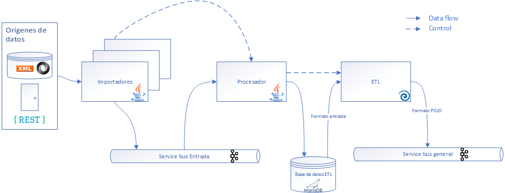
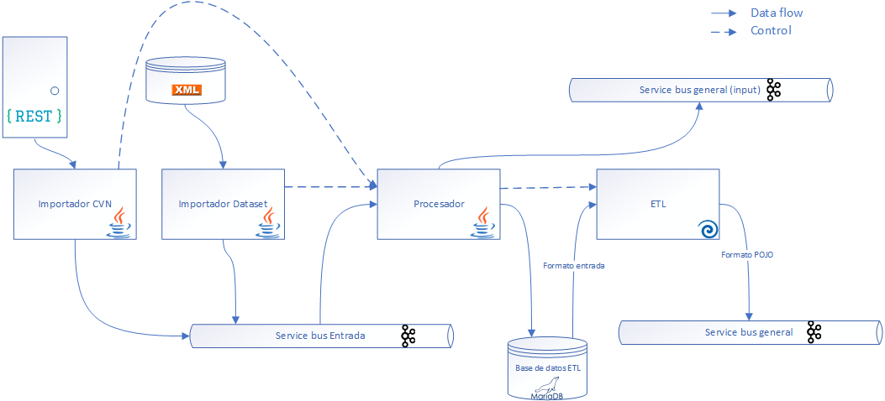

# Anexo - Arquitectura hito 1

En el presente documento se hará una comparativa entre la arquitectura planificada y la arquitectura implementada para este primer hito. Se hará un repaso por los diferentes bloques.

## Arquitectura backend

La arquitectura del backend se mantiene en lineas generales con la planificada.

Haciendo un repaso, los pasos que se seguiría serían los siguientes:

1. Existen n importadores de datos, uno por cada origen de datos, estos importadores se encargarán de leer la información del lugar en el que se encuentran los datos e insertarla en el sistema
2. La información pasará al topic de Kafka denominado *service bus general* para que sea procesada mediante una técnica de streaming
3. El sistema de gestión se encargará de procesar la información, transformarla en RDF y enviarla a la gestión de eventos
4. La gestión de eventos será la responsable de enviar los datos a aquellos sistemas de persistencia que se hayan seleccionado, inicialmente Trellis y Wikbase

Como se comentaba anteriormente, esta arquitectura se sigue manteniendo.

## Arquitectura entrada de datos

La entrada de datos se mantiene en líneas generales pero se han hecho pequeños ajustes de cara a este primer hito.

En la planificación se había establecido el siguiente flujo:

1. Los importadores se encargarán de leer los datos el origen e inserarlo en el topic de Kafka denominado "Service bus de entrada"
    * Harán uso de un endpoint del procesador para obtener la fecha de la última carga para saber desde qué momento de tiempo es preciso obtener los datos
2. El procesador se encargará de obtener la información del topic de Kafka mencionado en el punto anterior e insertarlo en una base de datos intermedia
3. Una vez terminada la importación, el procesador avisará al proceso ETL para que comience con la transformación
4. El proceso de ETL insertará los datos en formato POJO en el topic de Kafka "Service bus general"

De cara a este primer hito se han llevado a cabo unos ajustes que se pueden ver en el siguiente gráfico:

Como primer punto se han definido los importadores que estan disponibles para este hito:

- Importador de CVN: obtiene los datos mediante la invocación de servicios REST
- Importador de dataset: obtiene los datos de los XML proporcionados

También se ha añadido en el procesador, que además de enviar la información a la base de datos intermedia, se envíe directamente a un topic gemelo del "Service bus general" para que los datos de entrada sean procesados también como RDF y así añadir más información al sistema.

## Arquitectura Gestión de eventos

En cuanto a la gestión de eventos también se han realizado pequeños ajustes en la misma línea que para la entrada de datos.

Recordando la arquitectura planificada, el flujo sería el siguiente:

1. El sistema de gestión se encuentra consumiendo los eventos del topic "Service bus general"
2. Se hace uso de la librería de descubrimiento y generador de URIs para generar el RDF y se envía al topic "Service bus de gestión"
3. El procesador de eventos consumirá este último topic y delegará en un storage adapter la inserción de los datos en la capa de persistencia correspondiente. Existirá un conjunto de procesador de eventos y storage adapter por cada uno de los sistemas de almacenamiento que existan
4. El storage adapter hará uso de la factoría de URIs para poder adaptar correctamente los datos

Los cambios introducidos radican en que se introduce un nuevo topic gemelo del "service bus general" para enviar los datos de la entrada y que se pueda generar el RDF de los mismos.

