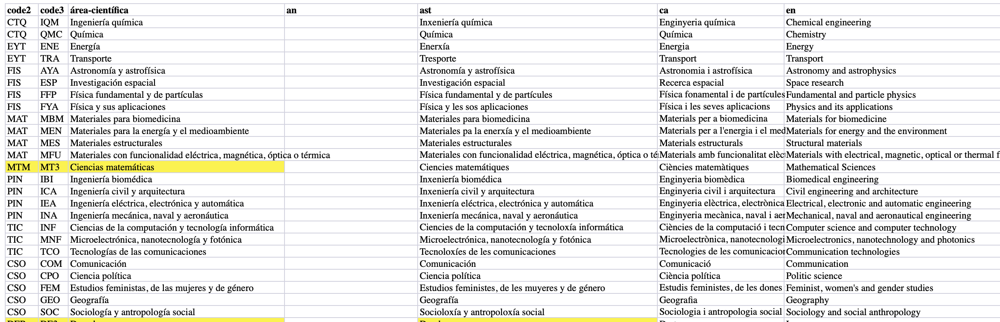

| Entregable     | Conversión de recursos a OWL                                 |
| -------------- | ------------------------------------------------------------ |
| Fecha          | 25/05/2020                                                   |
| Proyecto       | [ASIO](https://www.um.es/web/hercules/proyectos/asio) (Arquitectura Semántica e Infraestructura Ontológica) en el marco de la iniciativa [Hércules](https://www.um.es/web/hercules/) para la Semántica de Datos de Investigación de Universidades que forma parte de [CRUE-TIC](http://www.crue.org/SitePages/ProyectoHercules.aspx) |
| Módulo         | Infraestructura Ontológica                                   |
| Tipo           | Documento                                                    |
| Objetivo       | Este documento enumera las herramientas consideradas para la conversión de recursos a OWL y describe el candidato utilizado para este primer hito. |
| Estado         | **100%** El estado del documento se ajusta al 100% comprometido para el hito 1 del proyecto, si bien la utilización de otras herramientas para el hito 2 puede ser contemplada en el futuro. |
| Próximos pasos | En el caso de utilizar otras herramientas para estos mismos fines con vistas al hito 2, se documentará debidamente. |


# Herramientas de Conversión de Recursos a OWL/RDF

## Introducción
Este documento enumera las herramientas consideradas y utilizadas para la conversión de recursos desestructurados (documentos, PDFs, etc.) a formatos estructurados y re-aprovechables en los módulos verticales de la ontología Hércules, que ya han sido descritos con detalle en el documento de la especificación de la ontología.

Con el fin de convertir a formatos semánticos recursos interesantes de ser incluídos en la ontología, sobre todo vocabularios cuyas fuentes venían en formatos desestructurados, se llevó a cabo una búsqueda de herramientas que facilitaran la labor.

## Herramientas Consideradas
El equipo de desarrollo ya conocía algunas herramientas candidatas, desarrolladas con la participación de  miembros del grupo de investigación WESO.

La primera de ellas, [ShExML](http://shexml.herminiogarcia.com/), explota Shape Expressions Mapping Language, un lenguaje heterogéneo para el mapeo de datos basado en Shape Expressions (ShEx), cuyo objetivo es permitir a usuarios mapear y conglomerar fuentes de datos heterogéneas en un medio de representación unificado en RDF.

Sin embargo, para esta fase inicial del proyecto se desestimó el uso de esta herramienta debido al formato de partida de muchos de los recursos propuestos por el cliente y la urgencia en su conversión.

Otra posibilidad que se valoró fue [Open Refine](https://openrefine.org/) con la que también se contaba con alguna familiaridad.

La segunda herramienta, [Tablines](https://bitbucket.org/alfonso_noriega/tablines/src/default/), fue originalmente desarrollada en la Fundación CTIC, en Asturias, con la participación de uno de los integrantes actuales del grupo WESO, y fue la que finalmente se utilizó, sobre todo por el conocimiento del lenguaje necesario para crear los programas de transformación de ese integrante.

Sin embargo, esta decisión de utilizar Tablines se limita únicamente al primer hito del proyecto debido a la contingencia de los compromisos intermedios de evaluación.

Para la continuación del proyecto la apuesta sigue siendo ShExML una herramienta propia del equipo.


## Ejemplo de Conversión
Uno de los ejemplos más representativos de conversión de datos se utilizan en el módulo vertical de las áreas temáticas, que proceden de la Agencia Estatal de Investigación del Ministerio de Economía Industria y Competitividad. Este documento es un PDF, formato poco procesable, en el que se incluye rudimentariamente como anexo una tabla que se convirtió a datos tabulares desde el PDF y a continuación a RDF, bajo el formato SKOS-Core.

El documento ofrece este aspecto en su cabecera:


Y ya en su anexo incluye la tabla de interés de la que partimos para generar el RDF:


Que es exportado a formato CSV manualmente:




Y que finalmente es *explotado* y convertido a SKOS-Core después de escribir un pequeño programa de transformación que ofrece este aspecto:


```
PREFIX project: <http://weso.es/tablines/project/subjectAreas/>
PREFIX my: <http://weso.es/tablines/project/subjectAreas/resource/>
PREFIX rdf: <http://www.w3.org/1999/02/22-rdf-syntax-ns#>
PREFIX rdfs: <http://www.w3.org/2000/01/rdf-schema#>
PREFIX dcat: <http://www.w3.org/ns/dcat#>
PREFIX dct: <http://purl.org/dc/terms/>
PREFIX foaf: <http://xmlns.com/foaf/0.1/#>
PREFIX skos: <http://www.w3.org/2004/02/skos/core#>
PREFIX asioModules: <http://purl.org/asio/modules#> 
PREFIX asio: <http://purl.org/asio/core#>
PREFIX ontolex: <http://www.w3.org/ns/lemon/ontolex#>
PREFIX provo: <http://www.w3.org/ns/prov#>

FOR ?rowId IN rows
    FILTER get-row(?rowId)
    MATCH [?subject2ndCode,?subject3rdCode,?subjectArea,?anlabel,?astlabel,?calabel,?enlabel,?eslabel,?extlabel,?eulabel,?frlabel,?gllabel,?oclabel,?ptlabel]
    IN horizontal 
    
        LET ?subjectArea3rdResource = resource(concat("ES_SUBJECT_AREA_LEVEL_3_",replace(?subject3rdCode,"-","_")),asioModules)
        LET ?subjectArea3rdCodeResource = resource(concat("ES_SUBJECT_AREA_LEVEL_3_CODE_",replace(?subject3rdCode,"-","_")),asioModules)
        LET ?subjectArea2ndResource = resource(concat("ES_SUBJECT_AREA_LEVEL_2_",replace(?subject2ndCode,"-","_")),asioModules)
        LET ?esLangLabel = setLangTag(?eslabel, "es")
        LET ?astLangLabel = setLangTag(?astlabel, "ast")
        LET ?caLangLabel = setLangTag(?calabel, "ca")
        LET ?glLangLabel = setLangTag(?gllabel, "gl")
        LET ?ptLangLabel = setLangTag(?ptlabel, "pt")
        LET ?frLangLabel = setLangTag(?frlabel, "fr")
        LET ?enLangLabel = setLangTag(?enlabel, "en")
            { 
                WHEN not matches(?anlabel,"") DO
                  LET ?anLangLabel = setLangTag(?anlabel, "an");
                WHEN not matches(?eulabel,"") DO
                  LET ?euLangLabel = setLangTag(?eulabel, "eu");
    ...
```


El resultado final es el módulo vertical subject areas, que se utiliza para asignar a una propuesta de proyecto el área de investigación exigida por el ministerio.

Cabe decir que procesos equivalentes se llevaron a cabo para el diseño e implementación de los módulos verticales geopolítico, dominios científicos, universidades y subdivisiones de universidades, tal como explicamos más detalladamente en el documento de la especificación de la ontología.

## Carga de datos

La carga de estos datos se realiza por medio de los módulos verticales de la ontología, sea creando un nuevo módulo (con sus correspondientes mapeos si aplicaren) sea creando un módulo complementario a los ya existentes con una nueva realidad nacional. En los entregables de la documentación de la ontología,  (dentro en la carpeta [Red de ontologías Hércules](../01-Red_de_Ontologías_Hércules)) y en el entregable de especificación de ontologías (dentro de la carpeta [Especificación de las ontologías Hércules](../02-Especificación_Ontologías_Hércules)), se describen en inglés y en español respectivamente, tanto la fuente de los datos, la generación de los recursos en OWL y la inserción en el modelo ontológico.