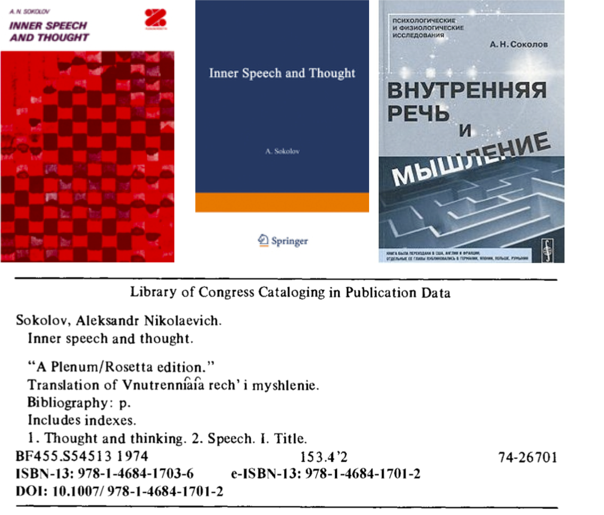

| Entregable     | Modelo Multilingüismo                    |
| -------------- | ------------------------------------------------------------ |
| Fecha          | 25/05/2020                                                   |
| Proyecto       | [ASIO](https://www.um.es/web/hercules/proyectos/asio) (Arquitectura Semántica e Infraestructura Ontológica) en el marco de la iniciativa [Hércules](https://www.um.es/web/hercules/) para la Semántica de Datos de Investigación de Universidades que forma parte de [CRUE-TIC](http://www.crue.org/SitePages/ProyectoHercules.aspx) |
| Módulo         | Infraestructura Ontológica                                   |
| Tipo           | Documento                                                    |
| Objetivo       | Este documento recoge el modelo de multilingüismo aplicado a la infraestructura ontológica en sus dos primeras fases, a saber la creación de la ontología en OWL por un lado y, por el otro, su adaptación a la infraestructura de WikiBase/WikiMedia. No recoge, por tanto, el tratamiento posterior del multilingüismo una vez las URIs son pasadas por el tamiz de la [Factoría de URIs](https://github.com/HerculesCRUE/ib-uris-generator), tratamiento que se describe en el documento de [Buenas prácticas para URIs Hércules](https://github.com/HerculesCRUE/ib-asio-docs-/blob/master/entregables_hito_1/09-Buenas_pr%C3%A1cticas_para_URIs_H%C3%A9rcules/ASIO_Izertis_BuenasPracticasParaURIsHercules.md) y el [Esquema de URIs Hércules](https://raw.githubusercontent.com/HerculesCRUE/ib-asio-docs-/master/entregables_hito_1/08-Esquema_de_URIs_H%C3%A9rcules/ASIO_Izertis_ArquitecturaDeURIs.md). |
| Estado         | **100%** El estado del documento se ajusta al 100% comprometido para el hito 1 del proyecto. |
| Próximos pasos | Como se apunta al final del documento, algunos casos extremos de sistemas de escritura que no se han podido resolver en este hito 1, se estudiarán a lo largo del hito 2 y serán debidamente documentados entonces. |


# Modelo Multilingüismo 

Este informe documenta los casos de uso y contextos que se utilizarán en el proyecto Hércules para poner a prueba modelos multilingües (y de multiescriptalismo).
La primera parte del informe se centra en el tratamiento dado a los recursos respecto a esos 3 aspectos en el ámbito estrictamente de la Web semántica con ejemplos relevantes del caso de estudio del proyecto.

La segunda parte o final describe las dificultades que nos estamos encontrando ahora mismo para trastaladar esas reglas de modelo al universo de Wikibase.

La apuesta principal que se hace con el modelo de multilingüismo es [SKOS-Core](https://www.w3.org/TR/swbp-skos-core-spec/) como base, sin excluir completamente propiedades del modelo [Lemon](https://lemon-model.net/), que utilizamos en algún ejemplo ilustrado a lo largo del documento (sección **Multiescriptalismo**). No se ha contemplado en principio el uso de [SKOS-XL](https://www.w3.org/TR/skos-reference/skos-xl.html), cuya distinción entre etiquetas literales y de recurso no nos parece de demasiada aplicabilidad en nuestro modelo.

No obstante, si en futuros avances de la ontología detectásemos otras necesidades, no se descarta explotar las posibilidades formales de otros vocabularios.


# Reglas del modelo de multilingüismo (*multilocalismo* y *multiescriptalismo*) en las ontologías ASIO

Todas las ontologías que se desarrollen estarán planteadas bajo un modelo de multilingüismo. Algunas de las reglas de este modelo se aplican a los siguientes aspectos:

- URIs
- Etiquetas léxicas
- Propiedades de documentación
- Otros metadatos lingüísticos

que analizaremos con algo más de detalle en las subsecciones siguientes.


URIs
----

**El conjunto de [Buenas prácticas para URIs Hércules](https://github.com/HerculesCRUE/ib-asio-docs-/blob/master/entregables_hito_1/09-Buenas_pr%C3%A1cticas_para_URIs_H%C3%A9rcules/ASIO_Izertis_BuenasPracticasParaURIsHercules.md) tiene aplicación únicamente las URIs externas, para las cuales se define el [Esquema de URIs Hércules](https://raw.githubusercontent.com/HerculesCRUE/ib-asio-docs-/master/entregables_hito_1/08-Esquema_de_URIs_H%C3%A9rcules/ASIO_Izertis_ArquitecturaDeURIs.md)**. En concreto no tienen aplicación en la definición de URIs privadas de este documento, basadas en el modelo de Wikibase, dado que son URIs internas.

Para dichas URIs privadas se establece preferencia por la utilización de URIs opacas[^1], especialmente para identificadores. Las URIs opacas permiten separar el identificador de la representación en lenguaje natural del recurso. Esta separación se
considera una mejor práctica en entornos multilingües dado que las representaciones textuales deberían obtenerse a partir de las etiquetas multilingües (`rdfs:label`) en lugar del identificador del recurso.

Un ejemplo concreto de URI opaca es el uso de códigos ISO para crear recursos que tienen que ver con países, lenguas o incluso áreas científicas.

Véamos un ejemplo concreto extraído de uno de los módulos verticales que describiremos en una sección posterior:

```
LET ?regionResource = resource(concat("ES_DIVISION_LEVEL_1_",replace(?regionCode,"-","_")),asioModules)
```

En este ejemplo, perteneciente a uno de los programas de transformación de datos tabulares a RDF, podemos *traducir* que el recurso de una comunidad autónoma cualquiera del Estado se crea a partir del [código ISO](https://www.iso.org/obp/ui/#iso:code:3166:ES) de tales entidades.

Así por ejemplo, en el caso de la Región de Murcia, el recurso se crearía a partir del código composicional **ES-MC**, cuya primera parte, **ES**, indica el país (España) y la segunda, **MC**, la subdivisión administrativa de primer nivel, en el caso español la *comunidad autónoma*: Región de Murcia.

Una vez creado el recurso a partir de ese código ISO, inserto en la URI y opaco respecto al lenguaje natural, ese recurso puede ya recibir un tratamiento multilingüe, sin causar problemas de codificación, por medio de etiquetas `xml:lang` o `skos:prefLabel`:

```turtle
skos:prefLabel "Región de Murcia"@es ;
skos:prefLabel "Região de Múrcia"@pt ;
skos:prefLabel "Region of Murcia"@en ;
skos:prefLabel "Région de Murcie"@fr ;
skos:prefLabel "Regió de Múrcia"@ca ;
skos:prefLabel "Región de Murcia"@gl ;
skos:prefLabel "Murtziako Eskualdea"@eu ;

skos:prefLabel "Мурсийский Регион"@ru ;

skos:prefLabel "Rexón de Murcia"@ast ;

skos:prefLabel "Регион Мурсија"@sr-Cyrl ;
skos:prefLabel "Region Mursija"@sr-Latn ;

skos:prefLabel "re'xjon̪ de 'muɾθja"@es-ES-fonipa ;

skos:prefLabel "ˈriːʤən ɒv ˈmʊərsiə"@en-GB-fonipa ;
skos:prefLabel "ˈriʤən ʌv ˈmɜːrʃ(i)ə"@en-US-fonipa ;
```

que son capas multilingües aplicadas sobre la URI opaca, *conceptualmente* *aséptica*.

Por otro lado, en este listado se puede observar una complejidad incremental en cuanto a los códigos de lengua, de *locale* y de sistema de escritura:

- los siete primeros ejemplos incluyen códigos de lengua de dos letras (`es`, `pt`, `en`, `fr`, `ca`, `gl`, `eu`).
- el octavo con código de dos letras (`ru`) y alfabeto cirílico por defecto (por lo que no es necesario especificar el sistema de escritura).
- el noveno ya con un código de tres letras (`ast`), hecho no trivial, dada la limitación a códigos de lenguas de dos dígitos implantada en algunos sistemas.
- el décimo y el décimo primero cuentan con códigos de lengua de dos letras (`sr`) y especificación del sistema de escritura empleado (`Latn` y `Cyrl`), ya que en la lengua serbia conviven los alfabetos latino y cirílico de manera bastante natural (al contrario que en ruso, por ejemplo).
- el décimo segundo incluyendo código de dos letras de lengua, seguido de código de dos letras de *locale* y seguido de un código de sistema de escritura bastante *sui generis* (`es-ES-fonipa`), en este caso correspondiente a la transcripción fonética, de acuerdo a la variedad del español hablado en españa, según el alfabeto fonético internacional o [IPA](https://www.internationalphoneticassociation.org/content/full-ipa-chart).
- el décimo tercero y el décimo cuarto incluyen el mismo caso de transcripción fonética anterior pero para la lengua inglesa especificando dos *locales* diferentes: inglés británico (`en-GB-fonipa`) e inglés norteamericano (`en-US-fonipa`).

El modelo de multilingüismo propuesto deberá poder lidiar de manera eficiente con todos esos aspectos multilingües, multi*locale*, multi*script* y multi*transliteración*, que serán puestos a prueba especialmente y de manera extensiva en los módulos verticales de la ontología ASIO, como comentaremos con detalles más adelante.

Por otra parte, esta característica de opacidad de las URIs se alinea con el modelo de datos de Wikibase en el cual las entidades, sean clases o propiedades, reciben un código numérico:

```
Q3918 -> University
P31 -> instance-of
```

garantizando también esa opacidad y asepsia de las URIs para luego recibir de manera más eficiente las etiquetas multilingües.


Etiquetas léxicas
-----------------

Si en un principio se pensó utilizar únicamente etiquetas `rdfs:label` para todas las URIs (según el patrón label everything[^2]) y con un valor literal en al menos 2 idiomas: español e inglés (de acuerdo al patrón multilingual labels[^3]) y recurrir a la propiedad de SKOS `skos:altLabel` para identificar alias o nombres alternativos.

Sin embargo, las etiquetas léxicas de rdfs (como `rdfs:label`) podrían no ser suficientes en todos los casos hacer una duplicación por medio de las etiquetas léxicas de SKOS (como `skos:prefLabel`) podría resultar útil, sobre todo por ponerla en relación con posibles etiquetas alternativas, explicitadas por medio de `skos:altLabel`  o, incluso, `skos:hiddenLabel` y así mantener una relación léxica de sinonimia más lógica y *modelada*.

Como decíamos en la introducción, en algún caso se utilizan propiedades del modelo de [Lemon](https://lemon-model.net/),   especialmente en algún ejemplo de multiescriptalismo. Asimismo, aunque no se ha contemplado en principio el uso de [SKOS-XL](https://www.w3.org/TR/skos-reference/skos-xl.html), cuya distinción entre etiquetas de *literalidad* y de *recursividad* resulta interesante y podría ser añadida a nuestro modelo en algún caso.


Propiedades de documentación
----------------------------

La arquitectura ontólogica, más allá de las etiquetas léxicas propiamente dichas, puede beneficiarse de otras representaciones en lenguaje natural de cada recurso mediante propiedades de documentación pertenecientes a vocabularios como el propio [RDFS](https://www.w3.org/2001/sw/wiki/RDFS), [Dublin Core](https://dublincore.org/) o [SKOS-Core](https://www.w3.org/TR/swbp-skos-core-spec/).

Recurrir a la etiqueta `rdfs:comment` para documentar y explicar las entidades es una buena práctica, así como tambén añadir metadatos a los archivos sobre autoría (`dc:creator`), descripciones (por ejemplo `dc:description`), dataciones, etc. Utilización de otras representaciones en lenguaje natural del recurso mediante las propiedades rdfs:comment, dc:description, etc.

También [SKOS-Core](https://www.w3.org/TR/swbp-skos-core-spec/) ofrece otras interesantes para nuestros intereses, sobre todo aplicables a los esquemas de conceptos que se explotarán en los módulos verticales de la ontología, como `skos:definition` o `skos:notation`.


Otros metadatos lingüísticos
----------------------------

Utilización de metadatos lingüísticos cuando sea necesario (patrón *linguistic metadata*[^4]). Aunque para muchos recursos, puede ser suficiente disponer de una representación en lenguaje natural ligera con
etiquetas como `rdfs:label`, `rdfs:comment`, etc. En algunos vocabularios puede ser interesante utilizar representaciones lingüísticas más ricas como puede ser el modelo Lemon[^5], que permite representar aspectos léxicos de forma semántica.

Sin embargo, Lemon puede no ser suficiente para representar todo el conocimiento léxico de forma semántica \[2\] y este tipo de representaciones es una línea de investigación activa. A modo de ejemplo, en el proyecto europeo Prêt-à-LLOD[^6] se está actualmente trabajando en la creación y representación de datos enlazados multilingües.

A la hora de seleccionar vocabularios para reutilizar, elegir vocabularios multilingües en la medida que sea posible[^7].


*Multiescriptalismo*
====================

Denominamos "multiescriptalismo", adaptando el neologismo en inglés "multiscriptalism" de Coulmas (1996), a la faceta múltiple de las lenguas que tiene que ver no con la lengua propiamente dicha, sino con
el sistema o sistemas de escritura que una lengua puede utilizar, es decir, para referirnos a la diversidad de sistemas de escritura (alfabetos, silabarios, sistemas logográficos, etc.) que se pueden encontrar en las lenguas naturales y en otros tipos de lenguajes, como por ejemplo las notaciones fonéticas.

Aunque las ontologías de ASIO en principio solamente contemplan el español y el inglés como lenguas *de trabajo*, una estructura ontológica rigurosa y bien diseñada siempre debería considerar e incluir un modelo
de *internacionalización* (i18n) preparatorio para todas las localizaciones (l10n) que fueran necesarias.

Tener en mente estas características en las fases fundacionales del proyecto y crear una infraestructura ad hoc de antemano suele ahorrar mucho trabajo futuro, aparte de garantizar una reutilización mucho más
global, que es uno de los leitmoif de la Web Semántica.

En una infraestructura ontológica como ASIO, preparada para el multilingüismo, este aspecto no debería ser desdeñado, por lo que se intentará poner un especial énfasis desde el principio en facilitar la
inclusión de todas las variedades de sistemas de escritura utilizados en lenguas naturales y artificiales que sean relevantes.

Cabe destacar que para algún caso extremo de multiescriptalismo, sí se recurre al modelo [Lemon](https://lemon-model.net/). Éste es el caso de las trancripciones fonéticas en el [IPA](https://www.ipachart.com/
) (alfabeto fonético internacional). Veamos algunos ejemplos complejos en los que se combinan un sistema de escritura exótico como el del IPA con lengua y con *locale*:


```turtle
asioModules:ESscientificDomains3rdList
      a       asioModules:scientificDomains ;
      rdfs:label "Dominis científics de tercer nivell"@ca , "Third-level scientific domains"@en , "θɜrd ˈlɛvəl ˌsaɪənˈtɪfɪk doʊˈmeɪnz"@en-US-fonipa , "Áreas científicas de terceiro nível"@pt , "Árees científiques de terceru nivel"@ast , "Áreas scientificas de tresen nivel"@oc , "duˈminis siənˈtifikz ðə tərˈse niˈβeʎ"@ca-CA-fonipa , "Hirugarren mailako arlo zientifikoak"@eu , "Áreas científicas de terceiro nivel"@gl , "Áreas scientificas de tercer nivel"@an , "Áreas científicas de tercer nivel"@es , "ˈaɾeas θjen̪ˈtifikas ðe terˈθer niˈβ̞el"@es-ES-fonipa , "θɜːd ˈlɛvl ˌsaɪənˈtɪfɪk dəʊˈmeɪnz"@en-GB-fonipa , "Domains scientifiques de troisième niveau"@fr ;
      skos:prefLabel "Dominis científics de tercer nivell"@ca , "Third-level scientific domains"@en , "θɜrd ˈlɛvəl ˌsaɪənˈtɪfɪk doʊˈmeɪnz"@en-US-fonipa , "Áreas científicas de terceiro nível"@pt , "Árees científiques de terceru nivel"@ast , "Áreas scientificas de tresen nivel"@oc , "duˈminis siənˈtifikz ðə tərˈse niˈβeʎ"@ca-CA-fonipa , "Áreas científicas de terceiro nivel"@gl , "Hirugarren mailako arlo zientifikoak"@eu , "Áreas scientificas de tercer nivel"@an , "Áreas científicas de tercer nivel"@es , "ˈaɾeas θjen̪ˈtifikas ðe terˈθer niˈβ̞el"@es-ES-fonipa , "θɜːd ˈlɛvl ˌsaɪənˈtɪfɪk dəʊˈmeɪnz"@en-GB-fonipa , "Domains scientifiques de troisième niveau"@fr ;
      ontolex:phoneticRep "θɜrd ˈlɛvəl ˌsaɪənˈtɪfɪk doʊˈmeɪnz"@en-US-fonipa , "ˈaɾeas θjen̪ˈtifikas ðe terˈθer niˈβ̞el"@es-ES-fonipa , "θɜːd ˈlɛvl ˌsaɪənˈtɪfɪk dəʊˈmeɪnz"@en-GB-fonipa , "duˈminis siənˈtifikz ðə tərˈse niˈβeʎ"@ca-CA-fonipa .

```

Como vemos en algunos casos que aislaremos a continuación, sin renunciar a las propiedades de SKOS ni de RDFS, duplicamos esas etiquetas de acuerdo a la propiedad del modelo Lemon:

```turtle
asioModules:ESscientificDomains3rdList
      a       asioModules:scientificDomains ;
rdfs:label "θɜrd ˈlɛvəl ˌsaɪənˈtɪfɪk doʊˈmeɪnz"@en-US-fonipa
skos:prefLabel "θɜrd ˈlɛvəl ˌsaɪənˈtɪfɪk doʊˈmeɪnz"@en-US-fonipa
ontolex:phoneticRep "θɜrd ˈlɛvəl ˌsaɪənˈtɪfɪk doʊˈmeɪnz"@en-US-fonipa

```

Donde vemos la etiqueta "Áreas científicas de tercer nivel", propuestas por el ministerio, traducidas al inglés (idioma) norteamericano (*locale*) y transcritas según el alfabeto IPA (sistema de escritura).


Personal
--------

Imaginemos que la Universidad de Murcia contrata a 4 investigadores europeos como profesores:

-   Un griego: Ilias Koubarakis - Ηλίας Κουμπαράκης

-   Un serbio: Aleksandar Karađorđević - Александар Карађорђевић

-   Un búlgaro: Grigor Batinkov - Григор Батинков

-   Un ruso: Ivan Uvarov - Иван Уваров

Todos ellos tienen una carrera académica previa en sus países de origen, donde han participado en proyectos nacionales y han publicado en sus lenguas de origen. Pero obviamente muchas veces, esa trayectoria previa aparece codificada no solamente en su lengua de origen, también en el alfabeto que usa esa lengua.

De acuerdo con la filosofía multilingüe que opera en la Unión Europea, resultaría integrador e interesante disponer de esas referencias en la lengua y alfabeto originales y, también, mantener un mapeo directo de las referencias ya no solo multilingüe propiamente dicho, sino también multiscript.

Veamos algún ejemplo de como las URIs deberían

Para el caso griego,

```turtle
rdfs:label "Ηλίας Κουμπαράκης"@el ;
rdfs:label "Ilias Koubarakis"@el-Latn ;
skos:prefLabel "Ηλίας Κουμπαράκης"@el ;
skos:prefLabel "Ilias Koubarakis"@el-Latn ; si priorizamos por ejemplo
la romanización ELOT[^8].
skos:altLabel "Ilias Koubarakis"@el-Latn ; o como label alternativo en
la romanización ISO[^9].
```


Para el caso búlgaro,

```turtle
rdfs:label "Григор Батинков"@bg ;
rdfs:label "Grigor Batinkov"@bg-Latn ;
skos:prefLabel "Григор Батинков"@bg ;
skos:altLabel "Гришо Батинков"@bg ;
skos:prefLabel "Grigor Batinkov"@bg-Latn ;
```


Para el caso serbio,

```turtle
rdfs:label \"Александар Карађорђевић\"\@sr
rdfs:label "Aleksandar Karađorđević"@sr-Latn ;
skos:prefLabel "Александар Карађорђевић"@sr ;
skos:altLabel "Саша Карађорђевић"@sr ;
skos:prefLabel "Aleksandar Karađorđević"@sr-Latn ;
skos:altLabel "Aleksandar Karadjordjević"@sr-Latn ;
```


Para el caso ruso,

```turtle
rdfs:label "Иван Уваров"@ru
rdfs:label "Ivan Uvarov"@ru-Latn
skos:prefLabel "Иван Уваров"@ru
skos:prefLabel "Ivan Uvarov"@ru-Latn
skos:altLabel "Aleksandar Karadjordjević"@ru-Latn
```


Obviamente el contexto del proyecto es Murcia, en España y en Europa occidental, donde el alfabeto latino es el predominante y nos interesa sobre todo garantizar, en principio, únicamente el multilingüismo basado en *Latin-script*. Sin embargo también el *multiescriptalismo* resultaría no solamente un detalle de cortesía para con nuestros nuevos integrantes de la platilla, sino también un perfeccionamiento del modelo de datos subyacente, que internacionalizaríamos tambén a nivel de sistemas de escritura como paso previo a cualquier localización *ad hoc* posterior.


Publicaciones
-------------

Como comentábamos en la sección anterior, con el ejemplo ficticio de nuestras nuevas incorporaciones extranjeras al personal docente, éstas traen consigo indefectiblemente un CV investigador en sus países de origen en el cual constan publicaciones científicas en sus lenguas nativas y, por ende, en el alfabeto o sistema de escritura habitual de esas lenguas de origen.

El caso de la obra del autor ruso A. N. Sokolov, *Inner speech and thought*, publicada en su versión en inglés por la editorial Plenum Press/Rosetta y más tarde reeditada por Springer, nos puede servir como ejemplificación.

En los *metadatos* de la publicación americana, nos encontramos esta latinización: 

​										Sokolov, A. N. *Vnutrenniaia rech’ i myshlenie*. Moscow, 1968.

que nos dejaría en la inopia incluso utilizando todas las habilidades y trucos explotables en cualquier buscador de internet (startpage, duckduckgo, google) a la hora de recuperar el título original en alfabeto cirílico.

Un tratamiento cuidadoso y *consciente* del multiescriptalismo como el que mostramos a continuación:

```turtle
#author:
rdfs:label "Александр Николаевич Соколов"@ru
rdfs:label "Aleksandr Nikolaevich Sokolov"@ru-Latn

skos:prefLabel "Александр Николаевич Соколов"@ru
skos:altLabel "Александр Н. Соколов"@ru
skos:altLabel "А. Н. Соколов"@ru
skos:altLabel "А. Соколов"@ru

skos:prefLabel "Aleksandr Nikolaevich Sokolov"@ru-Latn
skos:altLabel "Aleksandr N. Sokolov"@ru-Latn
skos:altLabel "A. N. Sokolov"@ru-Latn
skos:altLabel "A. Sokolov"@ru-Latn

#publication:
rdfs:label "Внутренняя речь и мышление"@ru
rdfs:label "Vnutrenniaia rech' i myshlenie"@ru-Latn

skos:prefLabel "Внутренняя речь и мышление"@ru
skos:prefLabel "Vnutrenniaia rech' i myshlenie"@ru-Latn
```

enriquecería nuestros datasets facilitando una recuperación eficiente y perfeccionada de información sobre investigadores y publicaciones científicas y, en el caso ejemplificador que nos compete, recogería a la perfección la *variación referencial* de la obra, tal como se puede reparar en una búsqueda del autor/obra en cualquier buscador.

Veámoslo ejemplificado de manera práctica por medio de esta ilustración *ad hoc* que hemos preparado nosotros mismos para la ocasión reuniendo distintas portadas de la obra citada de Sokolov y la ficha de la obra de la Library of the Congress que se incluye en la traducción al inglés de la primera edición:




La portada de la parte superior izquierda, correspondiente a la primera edición en inglés de la obra de Sokolov, de la editorial Plenum/Rosetta, incluye como nombre de autor las dos iniciales y el apellido (A. N. Sokolov), mientras que la portada de la parte superior central de la imagen recoge únicamente la primera inicial y el apellido (A. N. Sokolov). Ambas inscriben, como es obvio, el título completo de la obra traducido al inglés (*Inner speech and thought*). 

La imagen de la parte superior derecha, original en ruso, incluye las dos iniciales y el apellido del autor, obviamente en alfabeto cirílico (А. Н. Соколов), y el título original de la obra en el mismo alfabeto (*Внутренняя речь и мышление*).

Finalmente, en la parte inferior de la imagen vemos la ficha bibliográfica de la Library of the Congress, que propone una transliteración al alfabeto latino de la obra de Sokolov (*Vnutrenniaia rech' i myshlenie*) tal como aparece en la primera edición de la traducción de la obra por parte de la editorial Plenum/Rosetta.

Como se puede observar, un tratamiento incompleto del multiescriptalismo perjudicaría cualquier recuperación de información: la ficha es completamente *escripto-latino-céntrica* y solo incluye información del autor en alfabeto latino (transliteración), al menos completa y sin iniciales (Sokolov, Aleksandr Nikolaevich), y la latinización del título original ruso de la obra (*Vnutrennȋaȋa rech' i myshlenie*).

El uso de algunos diacríticos algo extravagantes (¿y tal vez añadidos en una segunda pasada de imprent), que recogemos de manera aproximada en nuestra transcripción como ⟨ȋ⟩ y que podrían ser problemáticos en la recuperación, no deja de ponernos sobre la pista de una dificultad clásica en la transliteración del grafema ruso ⟨я⟩, que se suele transliterar habitualmente en lenguas occidentales por medio de los dígrafos ⟨ya⟩ o ⟨ja⟩ para recoger tanto el valor semiconsonántico del primer elemento "y" o "j" como el valor plenamente vocálico del segundo elemento "a". 

Así, lo más normal actualmente sería encontrar una transliteración como "Vnutrennjaja" o "Vnutrennyaya", evitando soluciones poco fieles, como sería la *hiatizante* "Vnutrenniaia", o el uso de diacríticos no consolidados en la norma actual de transliteración del ruso al inglés, como el caso de la ficha de la Library of Congress, que evidentemente es bastante antigua y data de 1972.

En definitiva, con este ejemplo hemos querido demostrar la relevancia del multiescriptalismo, como complemento del multilingüismo, en aquellos casos en que a la diversidad lingüística se le suma la diversidad de sistemas de escritura.

*Multilocalismo*
====================

Denominamos "multilocalismo", basándonos en el concepto de *locale* en internacionalización y localización, a la asignación de locales diferentes a las lenguas.

Así, por poner un ejemplo, lenguas globales como el español, el francés, el portugués o el inglés muestran una variación terminológica importante en cuanto a la nomenclatura de los títulos académicos o programas de estudios y no es lo mismo la denominación de "máster", usada predominantemente en español de España, frente a la de "maestría", usada en *locales* del español en América latina.


Los módulos verticales de la ontología ASIO como campo de pruebas
========================================================

Recuérdese que el modelado ontológico de ASIO es, inspirándonos remotamente en la propuesta de Fodor (1983) para la mente humana, modular y, aparte del módulo central o core, se lleva acabo una implementación por módulos verticales que, sin dejar de estar conectados a la ontología *core*, modelan verticalmente áreas ontológicas específicas de interés de una manera semiautónoma.

En los módulos verticales de la ontología ASIO se incluyen modelizaciones de dominios específicos que quedan fuera del _core_ de la ontología propiamente dicho pero que son complementarios a él y lo enriquecen.

En esta fase inicial de desarrollo de contempla un número de módulos verticales que exigen tratamiento multiligüe en mayor o menor medida. 

Estos módulos verticales suponen el patio de recreo ideal, así como el caldo de cultivo idóneo, para hacer pruebas de concepto y evaluar limitaciones y alcance del modelo multilingüe del modelo ontológico, ya que incluyen frecuentemente entidades susceptibles de ser tratadas en base a diversas lenguas naturales.


## Entidades geopolíticas

El otro módulo vertical ya avanzado en diseño aunque aún no totalmente implementado es el correspondiente al modelo geopolítico.

En una primera fase, el módulo se limitará a España y sus niveles administrativos (nación, comunidad autónoma, provincia y municipio), con futuras implementaciones que incluirán en principio países limítrofes (Andorra, Francia, Portugal) y, tal vez, alguno más cuyas etiquetas lingüísticas incluyan otros sistemas de escritura dentro de la Unión Europea, como Grecia o Bulgaria, estos últimos con el fin de testear el citado *multiescriptalismo*.

También se eligió SKOS para la modelización de este módulo dado el modelo jerárquico obvio de las entidades geopolíticas.


## Áreas científicas y áreas temáticas

La [Agencia Estatal de Investigación](http://www.ciencia.gob.es/portal/site/MICINN/menuitem.8d78849a34f1cd28d0c9d910026041a0/?vgnextoid=664cfb7e04195510VgnVCM1000001d04140aRCRD), dependiente del [Ministerio de Ciencia, Innovación y Universidades](http://www.mineco.gob.es/), es autora de un documento que establece una lista jerárquica de [**áreas científicas**](http://www.ciencia.gob.es/stfls/MICINN/Ayudas/PE_2013_2016/PE_Promocion_e_Incorporacion_Talento_y_su_Empleabilidad/FICHEROS/SE_Incorporacion/Ayudas_contratos_RYC_2016/Clasificacion_areas_cientificas_2016_AEI.pdf) de referencia en proyectos de investigación y que nos fue propuesto como referencia en el documento de preguntas de competencia suministrado por la Universidad de Murcia.

Ese documento, que ofrece una estructura jerárquica clara de dominios y subdominios está siendo actualmente modelado como vocabulario controlado de acuerdo al estándar del W3C [SKOS-Core](https://www.w3.org/TR/swbp-skos-core-spec/), que no solo es la solución más idónea para la estructura por niveles de tipo tesauro, en base a las clases `skos:Concept` (para aglutinar conceptos) y `skos:ConceptScheme` (para ordenar esos conceptos en esquemas de conceptos), sino que también proporciona medios para recoger modelos densamente multilingües, como demuestra el hecho de que suele ser la solución empleada en los tesauros multilingües de la Unión Europea, como [GEMET]([ttps://www.eionet.europa.eu/gemet/en/about/](https://www.eionet.europa.eu/gemet/en/about/)) o [EuroVoc](https://data.europa.eu/euodp/en/data/dataset/eurovoc).

De este modo, estas 'Áreas científicas' han sido *mejoradas* respecto a la versión ofrecida por el ministerio en diversos aspectos:

- el primer paso ha sido su procesamiento desde un formato de solo lectura, como es el PDF, que se catalogaría simplemente como [*datos enlazados*](https://www.w3.org/DesignIssues/LinkedData.html) de baja calidad o "1 estrella" ("Available on the web (whatever format) *but with an open licence, to be Open Data*"), a un formato de datos abiertos de máxima calidad o "5 estrellas" ("non-proprietary format (e.g. CSV instead of excel), open standards from W3C (RDF and SPARQL) to identify things and link your data to other people’s data to provide context").

- el segundo paso fue explotar plenamente las posibilidades de multilingüismo de SKOS con el fin de internacionalizar y localizar el *dataset*, entendiendo *internacionalizar* y *localizar* como los procesos de diseñar recursos informáticos de manera tal que puedan adaptarse a diferentes idiomas y regiones sin la necesidad de realizar cambios de ingeniería ni en el código porteriores. De esta forma, las etiquetas lingüísticas de las áreas científicas, en el original únicamente disponibles en español, han sido adaptadas un contexto multilingüe que incluye el inglés como *lingua franca*, dos lenguas en contacto con el español por frontera directa, el portugués y el francés, lenguas cooficiales de España como el catalán, el vasco y el gallego, y otras variedades con cierto reconocimiento a nivel regional, como el occitano, el aragonés o el asturiano, estas últimas con un menor desarrollo.

Además de las posibilidades de explotación ontológica que proporciona SKOS, que no deja de ser una ontología a su vez, con respecto al *core* de ASIO, las etiquetas multilingües suponen una materia prima interesante para llevar a cabo muchas pruebas *lingüísticas*.

La misma [Agencia Estatal de Investigación](http://www.ciencia.gob.es/portal/site/MICINN/menuitem.8d78849a34f1cd28d0c9d910026041a0/?vgnextoid=664cfb7e04195510VgnVCM1000001d04140aRCRD), publica otro documento en PDF similar en formato y contenidos aunque ligeramente matiado incluyendo unas áreas temáticas que se utilizan para especificar la temática de un proyecto en una convocatoria de ayuda.

Este documento fue sometido a un tratamiento similar al que acabamos de describir para obtener otro módulo vertical dentro de la ontología.

Multilingüismo, *multilocalismo* y *multiescriptalismo* usando Wikidata/Wikibase
========================================================

El modelo de datos que subyace a los enlaces de Wikibase se basa en "entidades" que incluyen elementos individuales, etiquetas o identificadores para describirlos y *declaraciones* *semánticas* que atribuyen "propiedades" a cada elemento.

En principio, las etiquetas o identificadores de Wikibase soportan potencialmente el tratamiento multilingüe, aunque se han detectado algunos problemas, a saber:

- *Locales* no presentes
- Sistemas de escritura no presentes

Wikibase no incluye por defecto todos los locales existentes para las lenguas y solamente los de las comunidades más activas se suelen encontrar [disponibles](https://www.wikidata.org/wiki/Help:Wikimedia_language_codes/lists/all). En caso de necesitar incluir nuevos *locales*, los usuarios deben crear un *issue* específico con el que solicitar su inclusión. El proceso de aceptación de *locales* nuevos se somete a la opinión de un comité que analiza si es idóneo para el entorno de Wikimedia.

Algo parecido sucede con los sistemas de escritura, incluídos ejemplos más extremos como el del [IPA](https://www.ipachart.com/
), que utilizamos en la ontología para testar límites y que no ha sido posible trasladar a Wikibase aún. Durante el desarrollo del segundo hito se investigarán e implementarán prácticas para incluir estos ejemplos extremos en el modelo.


# Multilingüismo en la arquitectura semántica

Este documento describe exclusivamente el modelo de multilingüismo en la fase ontológica (OWL) y fase WikiBase. El resultado son por tanto URIs completamente opacas siguiendo el modelo de WikiBase para ser manipuladas de manera interna y que serán la materia prima de la factoría de URIs descrita en los entregables 8 y 9:

- 08-Esquema_de_URIs_Hércules
- 09-Buenas_prácticas_para_URIs_Hércules

En estos entregables se describe la *reposición* de ese multilingüismo desde una URIs opacas tipo WikiBase dentro de la factoría de URIs.

Referencias Web
===========

[^1]: http://www.weso.es/MLODPatterns/Opaque_URIs.html

[^2]: http://www.weso.es/MLODPatterns/Label_everything.html

[^3]: http://www.weso.es/MLODPatterns/Multilingual_labels.html

[^4]: http://www.weso.es/MLODPatterns/Linguistic_metadata.html

[^5]: http://lemon-model.net/lemon#

[^6]: https://www.pret-a-llod.eu/

[^7]: http://www.weso.es/MLODPatterns/Multilingual_vocabularies.html

[^8]: Ελληνικός Οργανισμός Τυποποίησης \[Ellīnikós Organismós Typopoíīsīs, \"Hellenic Organization for Standardization\"\]. ΕΛΟΤ 743

    Typopoíīsīs, \"Hellenic Organization for Standardization\"\]. ΕΛΟΤ
    743, 2η Έκδοση \[ELOT 743, 2ī Ekdosī, \"ELOT 743, 2nd ed.\"\]. ELOT
    (Athens), 2001.

[^9]: United Nations Group of Experts on Geographical Names, Working Group on Romanization Systems (2003). *Report on the Current Status of United Nations Romanization Systems for Geographical Names: Greek*. United Nations, New York.

# Referencias bibliográficas

Coulmas, F. (1996). *The Blackwell Encyclopedia of Writing Systems*. Oxford, U.K.: Blackwell Publishers.

Fodor, J. A. (1983). *The modularity of mind*. Bradford/MIT Press, Cambride, Mass. 

Sokolov, Aleksandr Nikolaevich (1972). *Inner Speech and Thought*. Plenum, New York [traducción al inglés de: Соколов, Александр Николаевич. *Внутренняя речь и мышление*]

United Nations Group of Experts on Geographical Names, Working Group on Romanization Systems (2003). *Report on the Current Status of United Nations Romanization Systems for Geographical Names: Greek*. United Nations, New York.

