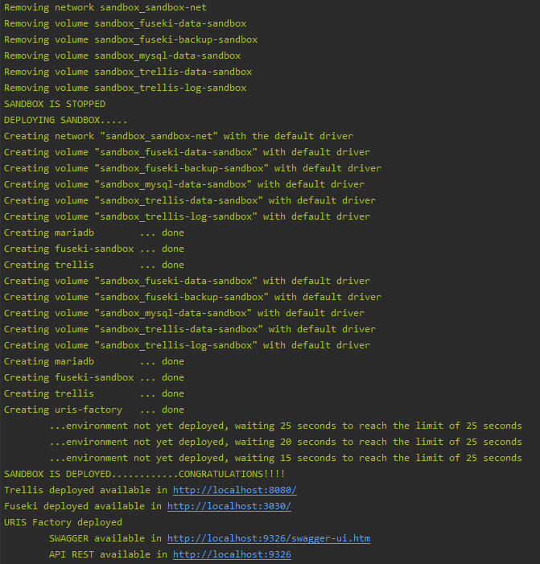
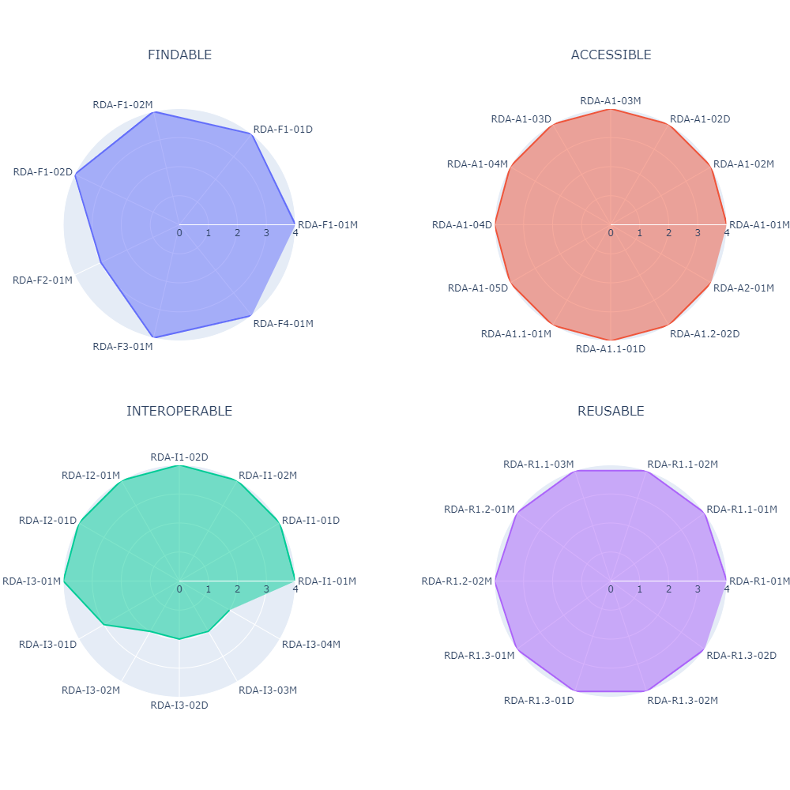

| Documento | [Métricas FAIR](README.md) - Manual de despliegue            |
| --------- | ------------------------------------------------------------ |
| Fecha     | 25/05/2020                                                   |
| Proyecto  | [ASIO](https://www.um.es/web/hercules/proyectos/asio) (Arquitectura Semántica e Infraestructura Ontológica) en el marco de la iniciativa [Hércules](https://www.um.es/web/hercules/) para la Semántica de Datos de Investigación de Universidades que forma parte de [CRUE-TIC](http://www.crue.org/SitePages/ProyectoHercules.aspx) |
| Módulo    | Infraestructura Ontológica                                   |
| Tipo      | Manual de despliegue                                         |

# Métricas FAIR - Manual de despliegue

El presente documento describe en detalle el proceso de instalación del software para la generación de  métricas y resultados gráficos del análisis de métricas FAIR.

## Instalación de software

Para ejecutar el software es necesario tener instalado Python en el equipo. La versión de Python con la que el software se ha desarrollado y probado es [Python v3.6](https://www.python.org/downloads/release/python-360/)

Para el entorno de desarrollo se recomienda la instalación de [PyCharm](https://www.jetbrains.com/pycharm/download/)

No existen requisitos específicos de hardware.

## Despliegue de Sandbox

Para generar un nuevo conjunto de métricas es necesario desplegar un entorno que emula las partes relevantes del proyecto ASIO, que influyen en la evaluación de las métricas FAIR. Estas son:

- **Factoría de URIs:** Este componente software que genera los identificadores para los recursos, y añade un nivel de indirección que permite gestionar la persistencia (cambio de el contenido de un recurso, manteniendo su identificador publico, después de que el recurso haya cambiado), por lo que es relevante en todos aquellas métricas donde de una forma u otra, se evalúa la persistencia de los recursos y/o sus identificadores.
- **MariaDB:** Es la capa de persistencia usada por la factoría de URIs y por lo tanto es una dependencia de esta.
- **Trellis:** Es el servidor LDP que soporta el acceso a los recursos, soportando negociación de contenido tanto en formato como en versión, generando a su vez metadatos, orientados a la auditoria de datos, y versionado de recursos(Memento). Es de vital importancia para la evaluación de métricas FAIR ya que tanto los recursos y metadatos que serán evaluados, lo serán en el formato gestionado por Trellis.
- **Fuseki + TDB:** Fuseki actúa como EndPoint SPAPQL 1.1, y TDB es el Triple Store que soporta el almacenamiento. Aunque no será evaluado directamente, es el motor de almacenamiento y acceso a datos usado por Trellis, por lo que es un fuerte dependencia de este.

 Todo lo necesario  para desplegar el entorno se puede encontrar en la ruta (desde la raíz del proyecto) **./docker-env/sandbox**.

Desde dicha ruta podemos desplegarlo mediante el comando 

~~~bash
docker-compose up -d
~~~

También es posible que el propio Script de ejecución, realice el auto-despliegue del Sandbox, usando el parámetro -s con el siguiente comando 

~~~bash
python main.py -s
~~~

## Ejecución del proyecto

### Ejecución de generación de métricas FAIR

El punto de entrada de el Sprint de evaluación de métricas es el fichero **main.py**, que se puede ejecutar mediante el comando

~~~bash
python main.py -s -d -v
~~~

La ejecución es controlable mediante los siguientes parámetros:

- **-s** : Despliega el entorno Sandbox. Es necesario que el entorno este desplegado, bien manualmente,  bien implícitamente mediante el comando -s. Con cada despliegue los datos disponibles en el entorno en la anterior ejecución, serán eliminados.

   

- **-d** : Genera los datos necesarios para evaluar las métricas. 

- **-v **: Genera y abre la visualización de los KPIs .

  		

  

### Ejecución de visualización de KPIs y métricas FAIR

Podemos generar los HTMLs de visualización de forma independiente mediante el comando

~~~bash
python fairviz.py ./data/FAIR_evaluation_out.csv
~~~

donde el parámetro indica la ubicación del fichero de métricas generadas en los pasos anteriormente descritos

## Instalación de dependencias

Adicionalmente es necesario instalar varias librerías Python definidas en el fichero [requirements.txt](requirements.txt):
```
requests==2.23.0
cryptography==2.9.2
numpy==1.18.4
pandas==1.0.3
more-itertools
rdflib==5.0.0
validators==0.15.0
plotly==4.7.1
```
Para la instalación de las dependencias se debe ejecutar el siguiente comando en la consola del equipo destinado a realizar el proceso de generación de resultados gráficos FAIR:

```
pip install -r requirements.txt
```