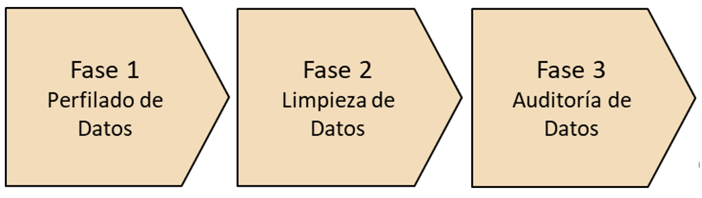

# Plan de Gobierno de Datos

A medida que las organizaciones fundamentan sus decisiones e iniciativas en datos, surgen preguntas como ¿de dónde provienen los datos? ¿tienen la calidad necesaria? ¿qué metadatos están disponibles? ¿quién es el responsable? ¿quién debería tener acceso? ¿están estos datos alineados las políticas de la organización? ¿tienen todas las áreas de la organización la misma visión sobre los datos?

Llevar a buen puerto iniciativas de inteligencia de negocio, analítica de datos, Data Warehouse, Big Data y/o Linked Data requiere tener un **enfoque holístico respecto al dato** y poder responder a las preguntas anteriores.

Para dar respuesta a dichas necesidades, emerge la disciplina de **Gobierno del Dato**, que permite a una organización administrar de forma más eficiente y eficaz el dato. De hecho, esta iniciativa aúna personas, procesos y tecnología para cambiar la forma en que los datos son adquiridos, gestionados, mantenidos, transformados en información, compartidos como conocimiento común público o privado y sistemáticamente obtenidos por la organización para mejorar los procesos y su rentabilidad.

> *Aunque el gobierno del dato se apoya sobre soluciones de tecnología, el desarrollo del plan se fundamenta en procedimientos y marcos de actuación dentro de una organización.*

Como concepto, el Gobierno del Dato ha existido desde hace décadas, y ha pasado por diferentes épocas. Desde los inicios de las tecnologías de la información, hasta finales de los años ochenta, las organizaciones fueron adoptando progresivamente múltiples sistemas de información, de cara a soportar procesos de negocio y reducir las tareas manuales. Sin embargo, **el dato era considerado como un subproducto de poco valor, con poca necesidad de ser compartido y gestionado**. 

En las pocas organizaciones en las que se identificó la necesidad, trataron de gobernar el dato mediante el **modelado de datos corporativos**, pero con escaso éxito, debido principalmente a dos motivos: la falta de soporte en un ámbito corporativo, ya que solo el departamento de informática estaba implicado en estas tareas, y la rigidez de las aplicaciones disponibles en la época. En esta época el Gobierno del Dato era considerado principalmente un ejercicio meramente académico.

Durante las siguientes dos décadas, muchas organizaciones empezaron a reconocer que el valor del dato iba más allá de las transacciones. Se inició en muchas organizaciones el largo proceso de **tomar decisiones fundamentadas en datos**. Poco a poco, también se empezó a identificar la necesidad de cruzar los datos de diferentes unidades de negocio y departamentos.

En la actualidad, se está empezando a tener clara la necesidad de gestionar **el dato como un activo con valor diferencial y estratégico **para la organización. Hay una proliferación de más y más regulaciones vinculadas con el dato. Conjuntamente con la explosión de la complejidad del dato, la transformación digital empuja a considerar formas más sofisticadas de explotar los procesos de negocio y los datos (por ejemplo, mediante Inteligencia Artificial). 

Este escenario empuja a las organizaciones a **replantearse cómo gestionar el dato**, al necesitar nuevas estructuras de almacenamiento, de procesamiento y de análisis, y cómo afectan estas a los modelos de datos, a la calidad, a la seguridad y al ciclo de vida. Esto ha llevado a la aparición de plataformas integrales de Gobierno del Dato, en las que se definen políticas de datos en un ámbito global, e incluso permiten la publicación de los mismos en formato Linked Data, como es el caso de la iniciativa Hércules.

El cambio actual también se fundamenta en que estas iniciativas ya **no son solo responsabilidad del departamento de TI**, que aporta consistencia y control, sino también del negocio, que incrementa su responsabilidad sobre el dato y el reconocimiento del valor que puede aportar. En alguna de ellas, incluso existe un rol especializado en el consejo de dirección, el denominado *Chief Data Officer* (CDO).

Como definición estandarizada de qué es Gobierno del Dato nos acogeremos a la propuesta de la [Global Data Management Comunity (DAMA)](https://dama.org/):

> Se  entiende como **Gobierno  del Dato** (en  inglés, *Data Governance*) el ejercicio de autoridad, control y toma de  decisiones compartida (planificación, vigilancia y aplicación) sobre la  gestión de los activos de datos.  

Así pues, es un conjunto de normas y prácticas bien definidas para asegurar que el dato sea:

**Accesible**

- El usuario puede acceder a los datos que necesita y estos están disponibles.
- El formato del dato coincide con el que el usuario demanda.

**Seguro**

- Solo pueden acceder al dato los usuarios autorizados.
- Se impide el acceso al dato a los usuarios no autorizados.

**Consistente**

- La información es la misma cuando distintos usuarios acceden al mismo dato.

**Alta calidad**

- El dato es riguroso y certero.
- Cumple con los estándares preestablecidos.

**Auditable**

- La trazabilidad del dato es clara.
- El departamento de TI sabe quién usa el dato y para qué propósitos.

La recomendación de Izertis para el proyecto Hércules es el seguimiento de la [segunda edición del Data Management Body of Knowledge (DMBOK)](https://technicspub.com/dmbok/) de DAMA.

## Objetivos

El objetivo final del Gobierno del Dato no es solucionar todos los problemas de TI de la organización, sino centrarse en todos los aspectos vinculados con el dato. Por ello, los principales objetivos incluyen:

- Definir, validar y comunicar estrategias, normas, estándares, arquitectura, procedimientos y métricas.
- Monitorizar las políticas del dato, estándares, arquitectura y procedimientos.
- Patrocinar y supervisar la entrega de proyectos de gestión de datos y servicios.
- Gestionar y resolver conflictos relacionados.
- Entender y promocionar el valor del activo del dato.

En este sentido, supone trabajar en los siguientes puntos:

- **Estrategia**. Desarrollar una estrategia, es decir, decidir qué datos se van a gestionar, identificar los datos maestros. Determinar el valor del dato basado en el coste de la captura, mantenimiento, valor de negocio, riesgo de pérdida o certeza del dato.

- **Comisión**. Establecer una comisión de las líneas de negocio que están en la posición de entender el dato, entender el negocio y ser capaces de tomar una decisión.
- **Normas**. Establecer un conjunto de normas para definir la integridad de datos, calidad, seguridad y utilización del dato.

- **Estándares**. Establecer un conjunto de estándares para controlar la implementación de las normas, modelado de datos, herramientas, tecnologías y metodologías.

- **Procedimientos**. Definir procedimientos para tratar conflictos de calidad del dato y de seguridad.

- **Conflictos**. Gestionar los conflictos y su resolución.

- **Supervisión**. Ofrecer una supervisión continuada de la gestión del proyecto.

- **Incumplimiento**. Establecer penalizaciones por incumplimiento de los estándares y procedimientos.
- **Documentación**. Proporcionar documentación relativa al dato y requisitos de metadatos.

## Plan de trabajo

El diseño de un programa de Gobierno del Dato no es necesariamente una secuencia lineal. De hecho, es probable que se tomen decisiones sobre cada una de las fases del programa a partir de otras fases.

El ciclo de vida de Gobierno del Dato consta de siete fases:

1. Desarrollo de una descripción de valor
2. Preparación y hoja de ruta
3. Planificación y financiación
4. Diseño
5. Implementación
6. Gobierno
7. Monitorización 

**El presente documento tiene por objetivo establecer las bases para el correcto desarrollo de una estrategia de Gobierno del Dato**. En una fase posterior deberá realizarse el desarrollo de una descripción de valor, la preparación y creación de la hoja de ruta, y la definición del diseño, implementación, gobierno y monitorización del programa.

Quedaría pendiente la **planificación y presupuestación** de la implementación del resto de áreas analizadas y la integración de una herramienta de Gobierno del Dato, si así se cree oportuno. Estudiando en cada caso qué partes del programa quedarían cubiertas en el alcance del presente proyecto, y cuáles deberían abordarse en otros proyectos.

### Preparación y hoja de ruta
En esa fase, se planifican los detalles sobre los eventos en torno a la fecha de lanzamiento del Gobierno del Dato, momento en el cual los activos de una organización pasan de no estar gobernados, a estarlo. 

A menudo, la hoja de ruta implica un plan que se desarrolla durante varios años, e **integra actividades con otros proyectos o iniciativas que se ejecutan dentro de la organización**. Es necesario incluir frecuentes puntos de control y espacios para recoger críticas constructivas a lo largo del plan, y de este modo, modificarlo si fuera necesario y no llegar a un estado de bloqueo durante la ejecución del plan.

En el caso concreto de la iniciativa Hércules, esto implica **coordinación entre los diferentes proyectos** en ejecución (ASIO y SGI) y otros proyectos futuros (análisis y enriquecimiento de datos).

### Orígenes de información 

Existen diferentes orígenes de información donde se almacenan los datos según el área donde se esté gestionando la actividad y estos aplicativos transaccionales también se encuentran en diferentes ubicaciones físicas y diferentes tipologías de creación de información.

Para el proyecto ASIO se han identificado al menos las siguientes fuentes de información:

1. Dataset de la Universidad de Murcia
2. CVN (Currículum Vitae Normalizado)
3. Proyecto SGI Hércules
4. Otras fuentes de información

### Importación de datos

La importación de datos es el proceso en el que recuperaremos los datos de los orígenes de información y combinaremos con una forma y estructura incorporada. La integración de datos nos permitirá que diferentes tipos de datos (como conjuntos de datos, documentos y tablas) sean combinados por usuarios y aplicaciones, para su uso como procesos y funciones personales o de negocios. Es el proceso que permite a las organizaciones:

- Mover datos desde múltiples fuentes
- Reformatearlos y limpiarlos
- Cargarlos en otras bases de datos
- Ponerlos en valor y analizarlos

Habitualmente es la parte más compleja del programa, de manera que los mayores esfuerzos recaerán en la creación del modelo de datos necesario para que la construcción del proyecto, esté soportado por una sólida calidad de datos.

Este proceso divide en 4 subprocesos: extracción, calidad, transformación e integración.

#### Extracción

Este proceso recupera los datos físicamente de las diferentes fuentes de información. Se ha definido que los procesos de extracción de información sobre los orígenes de datos transaccionales se realicen mediante **volcados (*dumps*) y/o servicios web (APIs)**.

Estos servicios web serán diseñados por el equipo del proyecto ASIO y desarrollados por cada equipo IT responsable de los sistemas de información locales. Existirán diferentes servicios web según la información requerida y el área funcional que requiera la información, los cuales serán ejecutados automáticamente y con la periodicidad requerida en cada caso mediante la herramienta ETL (Extract, Transform and Load) seleccionada y los datos resultantes serán procesados, validados y transformados siguiendo el flujo de proceso.

El detalle de cada uno de los servicios web se documentará en el apartado del diccionario de datos.

#### Calidad

Este proceso recupera los datos en bruto y comprueba su calidad, elimina los duplicados y, cuando es posible, corrige los valores erróneos y completa los valores vacíos. Es decir, se transforman los datos, siempre que sea posible, para **reducir los errores de carga**.

Para que el dato pueda considerarse un activo de valor y  tomar mejores decisiones, mejorar procesos, reducir costes y crear nuevas fuentes de financiación e ingresos, es necesario que, a lo largo de su ciclo de vida, el dato no tenga problemas que afecten a su calidad.

La calidad de datos es el grado en el que los datos cumplen un conjunto de características y/o dimensiones como son: 

- **Completitud**: proporción de datos almacenados respecto al conjunto total.
- **Unicidad**: el dato debe guardarse de forma única para evitar inconsistencias
- **Atemporalidad**: grado en que el dato representa la realidad en un momento temporal específico
- **Validez**: el dato presenta conformidad (formato, tipo, rango) respecto a su definición
- **Precisión/exactitud**: grado en el que el dato describe la realidad (con independencia del tiempo)
- **Consistencia**: diferencias entre representaciones del mismo dato, evitando información contradictoria.

Las tres fases principales en la calidad del dato son:

             

##### Fase 1: Perfilado de Datos

También conocido como *Data Profiling*,  implica el análisis de contenido, estructura y anomalías de los datos. El resultado de esta tarea son perfiles de datos, lo que proporciona un medio metódico, repetible, consistente y basado en métricas para evaluar sus datos:

- **Análisis de completitud**: ¿Con qué frecuencia un atributo tiene valores, está vacío o es nulo?
- **Análisis de unicidad**: ¿Cuántos valores únicos encontramos en un atributo? ¿Hay duplicados? ¿Este fenómeno es esperado y normal?
- **Análisis de distribución**: ¿Cuál es la distribución de frecuencias de los valores para un determinado atributo? ¿Existen valores anómalos?
- **Análisis de rangos**: ¿Cuáles son los valores mínimos, máximos, la media y el promedio para los valores de un determinado atributo?
- **Análisis de patrones**: ¿Qué formatos encontramos para un atributo? ¿Cómo se distribuyen los valores en dichos formatos?

Del mismo modo, para la corrección de datos se definirá una plantilla para cada corrección y se parametrizará según el área. Se considerarán, entre otras, las siguientes correcciones de datos: 

- **Fechas y timestamps**: separar las horas de las fechas en 2 campos, uno solo para la fecha y el otro para las horas. Comprobar rango de fechas válidas, en formato y valor. El formato debe ser dd/mm/yyyy para fechas y hh24:mi:ss(.ff3) para las horas (milisegundos según precisión requerida). El valor de las fechas no puede ser demasiado antiguo ni, para determinados campos, futuro. En el caso determinado de fechas futuras por ejemplo, fechas de entrega, la fecha futura debe estar en un plazo de 5 años para ser considerada fecha válida. Todas las fechas y horas serán considerados en UTC, por lo que será necesario transformar las fechas y horas a UTC. 
- **Importes**: los importes se definen 12 dígitos para la parte entera y 2 para la parte decimal.
- **Decimales**: los demás valores decimales, como medidas, se definirán con 6 dígitos para la parte entera y 3 para los decimales. Siempre deberá especificar la unidad en un campo adicional. ¿Normalización de unidades? ¿Hay que unificar medidas para que todo esté, por ejemplo, en pulgadas?
- **Documentos de identidad y números de identificación fiscal**: formato compuesto por un total de 9 dígitos compuesto por números y caracteres. Puesto que en cada país el formato es distinto, no se puede detallar más su formato.
- **Teléfonos**: formato compuesto por un máximo de 15 dígitos y opcionalmente empezar con +. Se eliminarán espacios, guiones o cualquier otro carácter de separación.
- **Nombres de personas**: solo habrá un solo campo para nombre formado con nombre y apellido(s) separados por espacio y capitalizados (la primera letra de cada palabra en mayúsculas).
- **Nombres de organizaciones**: los nombres de organizaciones se incluirán en mayúsculas.
- **Direcciones**: se separarán en 3 campos: dirección, código postal, población y país. La dirección contendrá información de calle, número, edificio, etc. Se permitirá un máximo de 100 caracteres. El código postal estará compuesto por un máximo de 6 caracteres.

##### Fase 2: Limpieza de Datos

Una vez conocidos los problemas que tienen los datos, es necesario aplicar acciones para corregir dichos problemas con el proceso de arreglar, borrar datos que son incorrectos, incompletos, con un formato incorrecto o duplicados.

El proceso de eliminación de duplicados, primero comprobará si hay registros duplicados y luego procederá a eliminarlos si los hubiera. Esta comprobación se realizará siempre con las claves definidas para cada tabla.

##### Fase 3: Auditoría de Datos

Tiene como objetivo el comprender el grado en el que los problemas de calidad de los datos existen, es decir, la extensión y la gravedad de los defectos de los datos. Los informes de auditoría pueden crearse para medir el progreso en el logro de los objetivos de calidad.

#### Transformación

Este proceso recupera los datos pre-procesados y de alta calidad, y los estructura en los diferentes modelos de dominio. El resultado de este proceso es la obtención de datos limpios, consistentes y útiles.

Se redactará un **documento de catalogación de datos** que contenga toda la información referente a las validaciones, campos críticos, transformaciones, etc. Este documento se deberá mantener con todas las modificaciones que se vayan produciendo durante el transcurso del proyecto.

#### Integración

Este proceso **verifica que los datos que se almacenen en la Arquitectura Semántica sean consistentes con las definiciones y formatos de la Infraestructura Ontológica** y el modelo de dominio (POJOs) generado a partir de ella.

Algunas de las capacidades que se deben tener en cuenta a la hora de integrar una solución que tiene como objeto racionalizar el Gobierno de Datos son:

- **Visualización** del flujo de procesos en la ingesta de información con la posibilidad de visualizar los resultados intermedios de las validaciones y transformaciones realizadas en cada uno de los procesos.
- **Control de versiones** a través de herramientas de calidad de datos, también se utiliza la información de versión para supervisar los resultados de las actualizaciones y, si es necesario, restaurar los valores originales según lo establecido para el mismo.
- **Registros históricos** para realizar un seguimiento de las modificaciones de datos y la fuente de esas modificaciones. Esto permite ajustar los parámetros para una futura consulta formulada sobre el histórico de modificaciones.
- **Gestión de metadatos** para la gobernabilidad efectiva de los datos, en especial aspectos como la forma en que se puede monitorizar el uso del almacenamiento de datos centralizado con captura de     datos distribuida y datos archivados para su posterior utilización. 
- **Perfilado de datos** para asegurar que los modelos de  datos representan con precisión el contenido de los datos así como los requisitos funcionales y los requerimientos de los datos. Perfilar datos      ayuda a evaluar si un extracto de datos de origen cumple con los estándares de calidad.
- **Resolución de duplicados**, que surge cuando hay conflictos de representación de la misma entidad en diferentes fuentes. En el caso de ASIO, esta labor la realiza la librería de descubrimiento.

Una vez analizadas las diferentes alternativas se ha considerado que para el proyecto ASIO se utilizará la **herramienta de ETL de Pentaho Data Integrator**, mientras que para la catalogación y gestión de metadatos se utilizarán herramientas ofimáticas y los recursos desarrollados en la Infraestructura Ontológica.

Pentaho Data Integration, cuyo nombre clave es Kettle, es una herramienta de la suite de Pentaho de tipo ETL (Extract – Transform – Load). Es decir, una herramienta de extracción de datos de una fuente, transformación de esos datos y carga en otro sistema de almacenamiento. El uso de Kettle permite evitar grandes cargas de trabajo manual frecuentemente difícil de mantener y desplegar.

Todos estos procesos se realizan con la herramienta Pentaho Data Integrator a partir de los siguientes elementos:

- **Spoon:** diseño de transformaciones ETL usando el entorno gráfico.
- **PAN:** ejecución de transformaciones diseñadas con Spoon.
- **CHEF:** creación de flujos de trabajo.
- **Kitchen:** ejecución de flujos de trabajo. 

### Diccionario de datos

Un **diccionario de datos** es un conjunto de definiciones que contiene las características lógicas y puntuales de los datos que se van a utilizar en el sistema de Gobierno de Datos, incluyendo nombre, descripción, alias, contenido y organización.

Identifica los procesos donde se emplean los datos y los sitios donde se necesita el acceso inmediato a la información, se desarrolla durante el **análisis de flujo de datos** y auxilia a los analistas que participan en la determinación de los requerimientos del sistema, su contenido también se emplea durante el diseño.

En un diccionario de datos se encuentra la **lista de todos los elementos** que forman parte del flujo de datos de todo el sistema. Los elementos más importantes son flujos de datos, almacenes de datos y procesos. El diccionario de datos guarda los detalles y descripción de todos estos elementos.

Este diccionario se generará a partir de las fuentes de datos previstas para el hito 1 (dataset UM y CVN) y se ampliará con el resto durante la ejecución del hito 2.

### Master Data Management (MDM)

Sin una estrategia de Gobierno del Dato adecuada, se generan silos de información que conforman una visión dispersa, fragmentada e incoherente de investigadores, universidades, publicaciones, proyectos, etc.

Para dar respuesta a la necesidad de gestionar esta complejidad se recomienda la **gestión de datos maestros**, que permite limpiar, racionalizar e integrar los datos en un sistema de registro global, para dar soporte a todas las funciones básicas de la organización.

> El desarrollo de una solución MDM queda fuera del alcance del presente proyecto, siendo previsiblemente contemplada durante el desarrollo del proyecto SGI.

## Política de Gobierno del Dato

Es necesario un enfoque coherente, repetible y sostenible para el gobierno de datos a fin de proteger la seguridad e integridad de los activos de la iniciativa **Hércules**.

La política de Gobierno del Dato es un conjunto documentado de pautas para garantizar la gestión adecuada de la información digital de una organización. Dichas pautas pueden incluir políticas para la gestión de procesos, así como la seguridad, la calidad de los datos y la privacidad.

Se debe describir formalmente cómo se debe llevar a cabo el monitoreo de la actividad referente a los datos de valor, garantizando que estos sean precisos, accesibles, consistentes y protegidos. La política establece quién es responsable de la información en diversas circunstancias y especifica qué procedimientos deben usarse para administrarla.

Una política de Gobierno del Dato es un documento vivo, lo que significa que es flexible y se puede cambiar rápidamente en respuesta a las necesidades cambiantes. Para que sea efectiva requiere un enfoque interdisciplinario para la gestión de la información y la contribución del liderazgo ejecutivo, las finanzas, la tecnología de la información y otros administradores de datos dentro de la organización.

Se recomienda que se sigan los siguientes principios, que deberán ser aprobadas por el órgano de gobierno del dato y transmitidos a todos los usuarios:

- Cada fuente de datos debe tener un propietario (*data owner*), que sea responsable de la calidad e integridad, implementación y cumplimiento de la gestión de datos. Es necesario garantizar la existencia de protocolos locales efectivos para guiar el uso apropiado de los datos.
- El propietario administra el acceso y el uso de los datos. En caso de haberse determinado la categoría de los datos como confidenciales, aprobará el acceso en función de la idoneidad de la función del usuario y el uso previsto. Cuando sea necesario, puede requerirse la aprobación del órgano de gobierno del dato antes de la autorización de acceso.
- Los usuarios de los datos deben garantizar que se sigan los procedimientos adecuados para mantener la calidad e integridad de los datos a los que acceden.
- Los registros de datos deben mantenerse actualizados en todas las etapas del flujo de trabajo y de manera auditable y rastreable.
- Los datos solo deben recopilarse para usos legítimos y para agregar valor. La extracción, manipulación e informe de datos debe hacerse solo para usos autorizados.
- Cuando sea apropiado, antes de que cualquier información (que no sea pública) se use o se comparta fuera del ámbito interno de la organización, se requiere verificación con el propietario para garantizar que la calidad, integridad y seguridad de los datos no se vea comprometida.
- Los datos almacenados en un formato electrónico deben estar protegidos por salvaguardas electrónicas apropiadas y/o controles de acceso físico que restrinjan el acceso solo a usuarios autorizados. Del mismo modo, los datos en formato impreso también deben almacenarse de manera que restrinja el acceso solo a usuarios autorizados.
- Deben cumplirse en todo momento las medidas de seguridad de datos adecuadas para garantizar la seguridad, la calidad y la integridad de los datos.
- La definición y los términos utilizados para describir los diferentes tipos de datos deben consensuarse de manera coherente en toda la organización.
- Los datos se conservarán y eliminarán de manera apropiada de acuerdo con la política de registros y archivos.

> Al igual que la gestión de datos maestros, la definición de una política integral del Gobierno del Dato queda fuera del alcance del presente proyecto.

## Research Data Management Plan (DMP)

De forma específica se ha evaluado adicionalmente la recomendación del [Directorate-General for Research & Innovation](https://ec.europa.eu/info/departments/research-and-innovation_en) de la Comisión Europea, a petición de la Universidad de Murcia, concretamente el documento [Guidelines on FAIR Data Management in Horizon 2020](https://ec.europa.eu/research/participants/data/ref/h2020/grants_manual/hi/oa_pilot/h2020-hi-oa-data-mgt_en.pdf).

El citado documento estable las recomendaciones y ofrece una plantilla para que los proyectos Horizon 2020 publiquen **datos de investigación siguiendo los principios FAIR** (*findable, accessible, interoperable and reusable*). La gestión adecuada de datos de investigación no se considera un objetivo en sí mismo, si no que es el factor clave que permite el descubrimiento e integración de conocimiento, la  innovación colaborativa y la reutilización de datos y resultados científicos.

Un DMP incluye la siguiente información:

- política de gestión de datos y resultados de la investigación durante y después del proyecto
- catálogo de datos van a recogerse, procesarse y/o generarse (diccionario y modelo de dominio)
- metodologías y estándares que van a emplearse (normas, estándares y procedimientos)
- especificación de datos públicos y privados (propietarios y usuarios)
- procesamiento y preservación de los datos (importación y ETL)

De forma general, estos aspectos quedarían **cubiertos por el plan de Gobierno de Datos** descrito en el presente documento, salvo aquellos que se han identificado como fuera del alcance del proyecto ASIO.

### Ciclo de vida

En los proyectos H2020 que se acogen a esta iniciativa, la norma es que se entregue una **primera versión del DMP durante los 6 primeros meses del proyecto**. Este DMP se considera un documento en constante evolución, siendo necesario actualizarlo siempre que aparezcan nuevos orígenes de datos, cambien las políticas del consorcio u otros factores externos.

El DMP deber ser un documento único, **especificando las incidencias concretas que pueda presentar cada origen o conjunto de datos**. Por ejemplo, con respecto a criterios de accesos público/privado.

### Alineamiento con FAIR

En términos generales, **los datos de investigación debe publicarse siguiendo los principios FAIR**. Teniendo en cuenta que estos principios no requieren tecnologías, estándares o soluciones específicos.

> Aunque la plantilla propuesta por la Comisión Europea se inspira por FAIR como concepto global, no se considera una implementación estricta de dichos principios.

### Estructura de la plantilla

La plantilla consiste en un **conjunto de preguntas a responder**, con el nivel de detalle que sea adecuado al proyecto. La norma no establece que haya que responder a todas las preguntas en la primera versión del DMP entregado en el sexto mes, si no que se presupone que evolucionará con el desarrollo del propio proyecto.

A continuación, a modo de referencia, se detallan las preguntas incluidas en la plantilla para la valoración de su inclusión en la evaluación de principios LDP y FAIR del proyecto ASIO.

#### *Data Summary*

- *What is the purpose of the data collection/generation and its relation to the objectives of the project?* 
- *What types and formats of data will the project generate/collect?* 
- *Will you re-use any existing data and how?* 
- *What is the origin of the data?* 
- *What is the expected size of the data?* 
- *To whom might it be useful ('data utility')?*

#### *Making data findable, including provisions for metadata*

- *Are the data produced and/or used in the project discoverable with metadata, identifiable and locatable by means of a standard identification mechanism (e.g. persistent and unique identifiers such as Digital Object Identifiers)?* 
- *What naming conventions do you follow?* 
- *Will search keywords be provided that optimize possibilities for re-use?*
- *Do you provide clear version numbers?* 
- *What metadata will be created? In case metadata standards do not exist in your discipline, please outline what type of metadata will be created and how.*

#### ***Making data openly accessible***

- *Which data produced and/or used in the project will be made openly available as the default? If certain datasets cannot be shared (or need to be shared under restrictions), explain why, clearly separating legal and contractual reasons from voluntary restrictions.*
- *Note that in multi-beneficiary projects it is also possible for specific beneficiaries to keep their data closed if relevant provisions are made in the consortium agreement and are in line with the reasons for opting out.*
- *How will the data be made accessible (e.g. by deposition in a repository)?* 
- *What methods or software tools are needed to access the data?* 
- *Is documentation about the software needed to access the data included?*
- *Is it possible to include the relevant software (e.g. in open source code)?*
- *Where will the data and associated metadata, documentation and code be deposited? Preference should be given to certified repositories which support open access where possible.* 
- *Have you explored appropriate arrangements with the identified repository?*
- *If there are restrictions on use, how will access be provided?* 
- *Is there a need for a data access committee?* 
- *Are there well described conditions for access (i.e. a machine readable license)?* 
- *How will the identity of the person accessing the data be ascertained?*

#### *Making data interoperable*

- *Are the data produced in the project interoperable, that is allowing data exchange and re-use between researchers, institutions, organisations, countries, etc. (i.e. adhering to standards for formats, as much as possible compliant with available (open) software applications, and in particular facilitating re-combinations with different datasets from different origins)?*
- *What data and metadata vocabularies, standards or methodologies will you follow to make your data interoperable?* 
- *Will you be using standard vocabularies for all data types present in your data set, to allow inter-disciplinary interoperability?* 
- *In case it is unavoidable that you use uncommon or generate project specific ontologies or vocabularies, will you provide mappings to more commonly used ontologies?* 

#### ***Increase data re-use (through clarifying licences)***

- *How will the data be licensed to permit the widest re-use possible?* 
- *When will the data be made available for re-use? If an embargo is sought to give time to publish or seek patents, specify why and how long this will apply, bearing in mind that research data should be made available as soon as possible.*
- *Are the data produced and/or used in the project useable by third parties, in particular after the end of the project? If the re-use of some data is restricted, explain why.* 
- *How long is it intended that the data remains re-usable?*
- *Are data quality assurance processes described?*

#### *Allocation of resources*

- *What are the costs for making data FAIR in your project?* 
- *How will these be covered? Note that costs related to open access to research data are eligible as part of the Horizon 2020 grant (if compliant with the Grant Agreement conditions).*
- *Who will be responsible for data management in your project?* 
- *Are the resources for long term preservation discussed (costs and potential value, who decides and how what data will be kept and for how long)?*

#### *Data security*

- *What provisions are in place for data security (including data recovery as well as secure storage and transfer of sensitive data)?* 
- *Is the data safely stored in certified repositories for long term preservation and curation?*

#### *Ethical aspects*

- *Are there any ethical or legal issues that can have an impact on data sharing? These can also be discussed in the context of the ethics review. If relevant, include references to ethics deliverables and ethics chapter in the Description of the Action (DoA).*
- *Is informed consent for data sharing and long term preservation included in questionnaires dealing with personal data?* 

#### *Other issues*

- *Do you make use of other national/funder/sectorial/departmental procedures for data management? If yes, which ones?*

### DMPTool

Adicionalmente se incluye la plantilla de preguntas que integra la herramienta [DMPTool](https://libraries.mit.edu/data-management/plan/write/) del [MIT](http://web.mit.edu/), la cual contempla cuestiones no cubiertas por la propuesta de la Comisión Europea.

#### *Project, experiment, and data description*

- *What’s the purpose of the research?*
- *What is the data? How and in what format will the data be collected? Is it numerical data, image data, text sequences, or modeling data?*
- *How much data will be generated for this research?*
- *How long will the data be collected and how often will it change?*
- *Are you using data that someone else produced? If so, where is it from?*
- *Who is responsible for managing the data? Who will ensure that the data management plan is carried out?*

#### *Documentation, organization, and storage*

- *What documentation will you be creating in order to make the data understandable by other researchers?*
- *Are you using metadata that is standard to your field? How will the metadata be managed and stored?*
- *What file formats will be used? Do these formats conform to an open standard and/or are they proprietary?*
- *Are you using a file format that is standard to your field? If not, how will you document the alternative you are using?*
- *What directory and file naming convention will be used?*
- *What are your local storage and backup procedures? Will this data require secure storage?*
- *What tools or software are required to read or view the data?*

#### *Access, sharing, and re-use*

- *Who has the right to manage this data? Is it the responsibility of the PI, student, lab, MIT, or funding agency?*
- *What data will be shared, when, and how?*
- *Does sharing the data raise privacy, ethical, or confidentiality concerns?  Do you have a plan to protect or anonymize data, if needed?*
- *Who holds intellectual property rights for the data and other information created by the project? Will any copyrighted or licensed material be used? Do you have permission to use/disseminate this material?*
- *Are there any patent- or technology-licensing-related restrictions on data sharing associated with this grant? The Technology Licensing Office (TLO) can provide this information.*
- *Will this research be published in a journal that requires the underlying data to accompany articles?*
- *Will there be any embargoes on the data?*
- *Will you permit re-use, redistribution, or the creation of new tools, services, data sets, or products (derivatives)? Will commercial use be allowed?*

#### *Archiving*

- *How will you be archiving the data? Will you be storing it in an archive or repository for long-term access? If not, how will you preserve access to the data?*
- *Is a discipline-specific repository available?*
- *How will you prepare data for preservation or data sharing? Will the data need to be anonymized or converted to more stable file formats?*
- *Are software or tools needed to use the data? Will these be archived?*
- *How long should the data be retained? 3-5 years, 10 years, or forever?*

